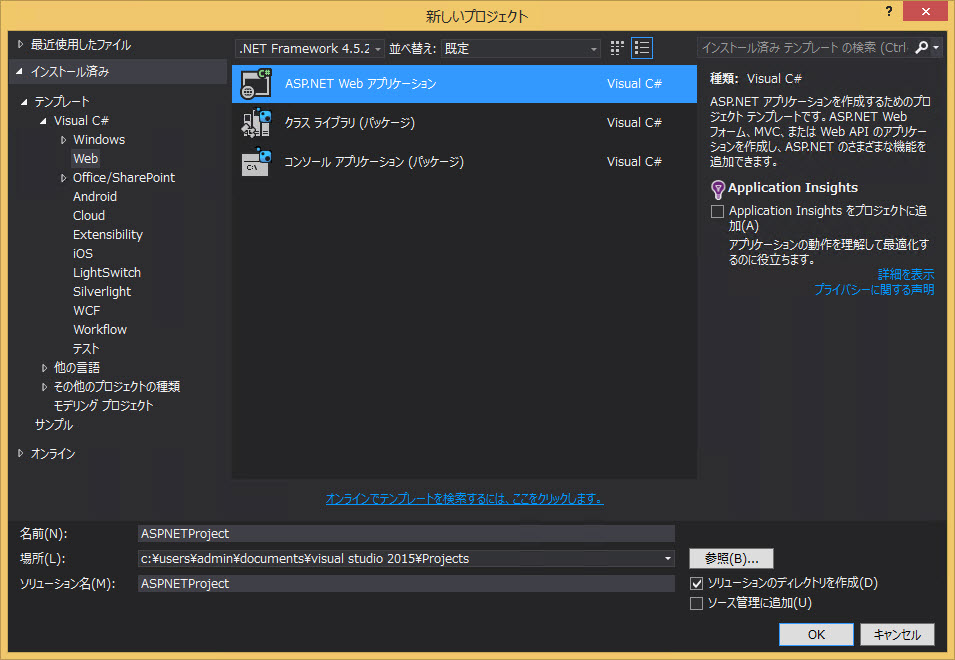
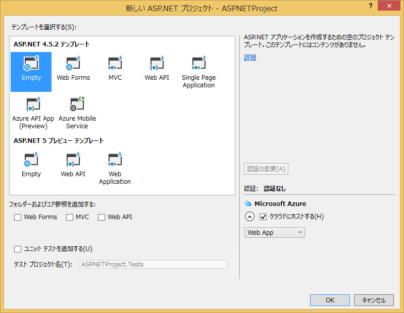
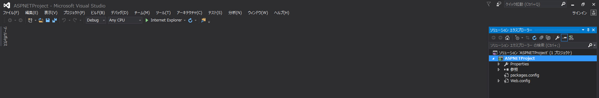
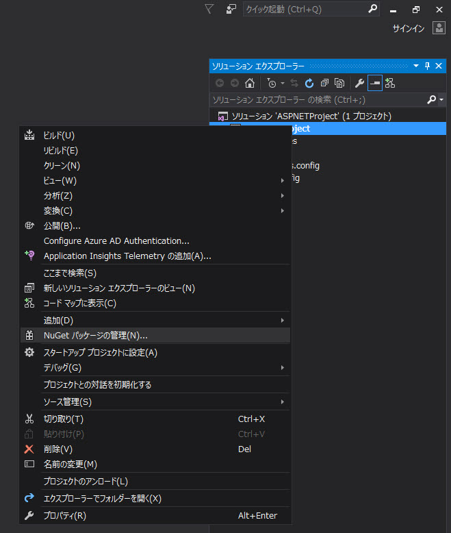
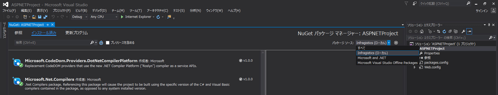
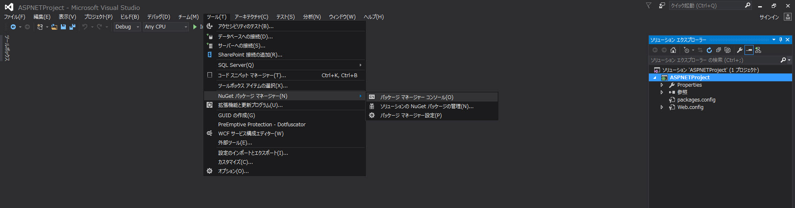
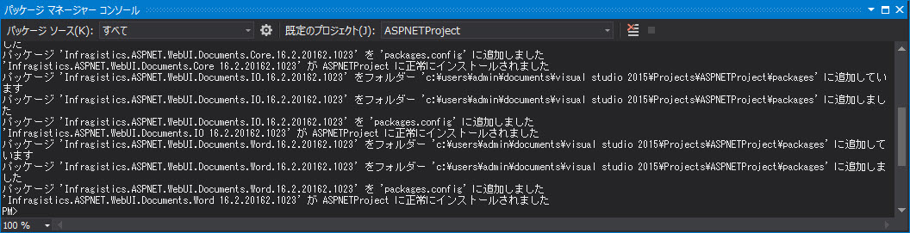
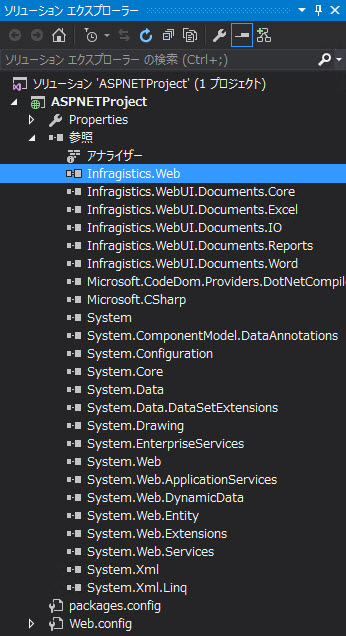
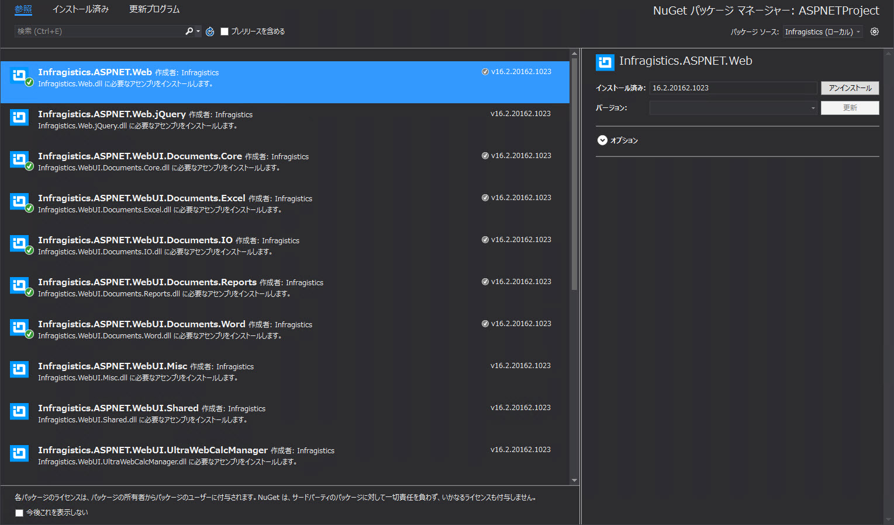
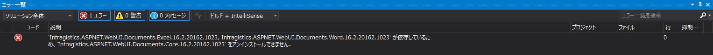

////

|metadata|
{
    "name": "aspnet-nuget",
    "controlName": [],
    "tags": ["NuGet"],
    "guid": "",  
    "buildFlags": [],
    "createdOn": "2016-10-07T07:12:19.9589688Z"
}
|metadata|
////

= ASP.NET Nuget パッケージの使用

NuGet はツールおよびサービスを提供するパッケージ マネージャーです。 2010 年に .NET などの Microsoft 開発プラットフォームのオープンソース パッケージ マネージャーとして公開されました。  NuGet は、開発を向上し、自動化することができます。

NuGet でパッケージをインストールすると、ライブラリ ファイルがソリューションにコピーされ、プロジェクトを自動的に更新します。 つまり、参照を追加、構成ファイルを変更、更に以前のバージョンのスクリプト ファイルを置き換えます。

NuGet は Visual Studio 2010 以後で利用可能ですが、Visual Studio 2012 以後デフォルトで含まれます。使用方法の詳細については、 link:http://docs.nuget.org/ndocs/guides/install-nuget[Nuget ヘルプ^]を参照してください。

{ProductName} コントロールは NuGet パッケージとして公開されます。この NuGet パッケージは、プロジェクトの必要な Infragistics アセンブリをすばやく簡単にインストールできる方法です。 

ASP.NET Nuget パッケージを使用するには NuGet インストーラーを実行してローカルにインストールします。インストーラーは、利用可能なASP.NET NuGet パッケージをすべて表示する「Infragistics (ローカル)」と呼ばれるローカル インストールで [製品キー] フィールドが空の場合、インストーラーはパッケージのトライアル版をインストールします。この方法では、使用するアセンブリを最新バージョンに更新する場合、パッケージの次のバージョンを手動でインストールする必要があります。

== ローカル フィードから ASP.NET パッケージをインストール

ASP.NET NuGet パッケージをプロジェクトにインストールは、GUI またはコンソールを使用できます。以下は使用方法です。 すべての手順およびスクリーンショットは Visual Studio 2015 に基づいていますが、Visual Studio の以前のバージョンもほとんど同じです。 このトピックで詳細に説明するため、NuGet を使用した経験がない場合も作業をすぐに開始できます。

1. 新しい ASP.NET Web アプリケーション プロジェクトを作成します。名前は ASPNETProject にします。
+

2. 空のプロジェクトを選択します。
+

3. プロジェクト作成後、ソリューション エクスプローラーは以下のようになります:
+

プロジェクトはプロパティ、参照、および Web.config の 3 つのデフォルト ノードを含みます。.

=== GUI を使用した ASP.NET パッケージのインストール

ASP.NET NuGet パッケージを GUI からインストールするには、プロジェクト名を右クリックし、「NuGet パッケージの管理」をコンテキスト メニューから選択します。

これは *NuGet パッケージの管理* ビューを開きます。このビューは、プロジェクトに利用可能なすべてのパッケージを表示します。

パッケージ ソースを *Infragistics (Local)* に変更します。

「参照」タブに移動し、利用可能な {ProductName} NuGet パッケージのリストが表示されます。

パッケージを選択すると、右パネルに詳細情報が表示されます。 ここに選択したパッケージの依存関係のリストがあります。 これらのアセンブリは自動的にプロジェクトにインストールされます。 

*インストール* ボタンをクリックして、選択したパッケージはプロジェクトに追加されます。

=== ASP.NET パッケージをパッケージ マネージャー コンソールでインストール

ASP.NET パッケージをパッケージ マネージャー コンソールを使用して追加する方法を説明します。コンソールではインストールするパッケージを検索する必要がないため、すばやく追加できます。

コンソールを表示するには、Visual Studio の *ツール* メニューを選択し、*NuGet パッケージ マネージャー* の *パッケージ マネージャー* コンソール を選択します。

*パッケージ マネージャー コンソール*は画面の下部に表示されます。インストールを開始するには、「Install-Package パッケージ名」を入力するだけです。たとえば、“Infragistics.Web.dll のインストールは、「Install-Package Infragistics.ASPNET.Web」と入力すると、マネージャーがこのアセンブリおよびすべての依存関係をインストールします。コンソールでパッケージ ソース ドロップダウンから Infragistics (local) を選択することに注意してください。

インストールが完了した後、コンソールに ASP.NET パッケージがプロジェクトに正常に追加されましたというメッセージが表示されます。

== ASP.NET NuGet パッケージのインストール ファイル

新しいアセンブリへの参照がプロジェクトに追加されます。また packages.config ファイルも追加パッケージに含まれるよう更新されます。 

== ASP.NET パッケージのアンインストール

パッケージによりインストールされるアセンブリをアンインストールできます。 GUI またはパッケージ マネージャー コンソールで行うことができます。インストール方法に関係なく、いずれかの方法を使用できます。 

アセンブリを解除するには、プロジェクトを右クリックして *NuGet パッケージの管理を選択します*。すべてのインストールされたアセンブリが表示されます。アンインストールするアセンブリを選択して [アンインストール] ボタンをクリックします。

これは選択したアセンブリのみをアンインストールします。パッケージで依存関係としてインストールされるアセンブリが保持されることに注意してください。 

また、アセンブリにその他のアセンブリと依存関係がある場合、アンインストールできません。たとえば、*Infragistics.ASPNET.Web* をプロジェクトにインストール後、依存関係としてインストールされた IgniteUI をアンインストールしようとすると、依存関係があるためアンインストールできませんというエラー メッセージが表示されます。アンインストールするには、依存関係のアセンブリを最初にすべてアンインストールする必要があります。

コンソールでアセンブリをアンインストールするには、「Uninstall-Package パッケージ名」を入力します。たとえば、「Uninstall-Package Infragistics.ASPNET.WebUI.Documents.Excel」となります。

ASP.NET NuGet パッケージを使用すると、高パフォーマンスアプリケーションの開発を簡単にすばやく開始できます。