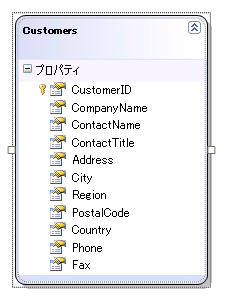
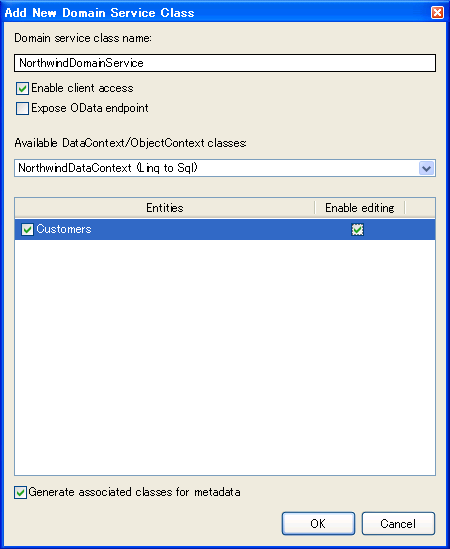
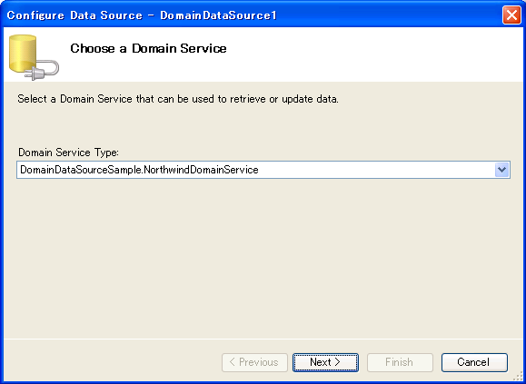
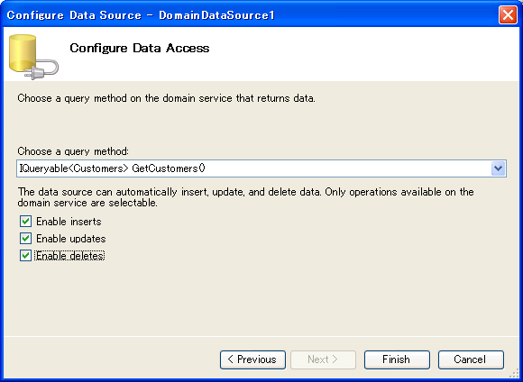

////

|metadata|
{
    "name": "binding-to-domaindatasource",
    "controlName": [],
    "tags": ["Data Binding","How Do I"],
    "guid": "c48117fb-adaa-4362-8f2f-6f2fea0fae40",  
    "buildFlags": [],
    "createdOn": "2010-06-01T14:44:16.6014186Z"
}
|metadata|
////

= DomainDataSource へのバインディング

== 始める前に

DomainDataSource コントロール コンポーネントは、すべての ASP.NET {ProductName} AJAX ベースのコントロールによって完全にサポートされます。階層データを取得するために直接バインドするか WebHierarchicalDataSource™ コンポーネントを使用できます。データをバインドするために WebHierarchicalDataSource コンポーネントを使用する詳細は、 link:webhierarchicaldatasource-getting-started-with-webhierarchicaldatasource.html[「WebHierarchicalDataSource で開始」]を参照してください。

== 達成すること

Northwind Customers テーブルを使用して、WebDataGrid を DomainDataSource コンポーネントにバインドする方法を学習します。

== 以下の手順を実行します

[start=1]
. Visual Studio 2010 を開き、新しい ASP.NET Web アプリケーションを作成して、データ モデルをそれに追加します。このチュートリアルでは、LINQ to SQL モデルを使用します。

次のステップを続行する前に、プロジェクトをビルドする必要があります。そうすれば、データ クラスおよびデータ コンテキストが生成され、Domain Service に公開できます。
[start=2]
. 新しい項目を Web アプリケーションに追加し、Web カテゴリーの下の Domain Service Class テンプレートを選択します。名前に NorthwindDomainService と入力し、[追加] をクリックします。

image::images/Binding_to_DomainDataSource_02.png[]

[start=3]
. Domain Service ダイアログ ウィンドウから NorthwindDataContext を選択し、Customer エンティティを選択します。[編集を有効にする] チェックボックスをクリックします。

[OK] をクリックすることによって、ドメイン サービスは NorthwindDomainService クラスに以下のコードを生成します。

*C# の場合：*

----
public class NorthwindDomainService : LinqToSqlDomainService
    {
        public IQueryable GetCustomers()
        {
            return this.DataContext.Customers;
        }
        public void InsertCustomer(Customer customer)
        {
            this.DataContext.Customers.InsertOnSubmit(customer);
        }
        public void UpdateCustomer(Customer currentCustomer)
        {
            this.DataContext.Customers.Attach(currentCustomer, this.ChangeSet.GetOriginal(currentCustomer));
        }
        public void DeleteCustomer(Customer customer)
        {
            this.DataContext.Customers.Attach(customer);
            this.DataContext.Customers.DeleteOnSubmit(customer);
        }
    }
----

[start=4]
. aspx ページで、ツールボックスから DomainDataSource コンポーネントをドラッグします。[デザイン] から DomainDataSource を右クリックして、[データ ソースを構成] を選択します。

*注：* コントロールがリストされていない場合、[ツール] メニューをクリックし、[ツールボックス項目を選択] を選択します。[ツールボックス項目を選択] ダイアログボックスで、[.NET Framework コンポーネント] タブをクリックし、[DomainDataSource] チェックボックスを選択し、[OK] をクリックします。[次へ] をクリックします。[データ アクセスの構成] 画面で IQueryable GetCustomers() メソッドを選択します。[挿入を有効]、[更新を有効]、および [削除を有効] チェックボックスを選択します。

以下のマークアップが DomainDataSource コンポーネントに表示されます。

*HTML の場合:*

----
    <asp:DomainDataSource ID="DomainDataSource1" runat="server" 
        DomainServiceTypeName="DomainDataSourceApplication.NorthwindDomainService" 
        QueryName="GetCustomers">
    </asp:DomainDataSource>
----

[start=5]
. ツールボックスから WebScriptManager および WebDataGrid をドラッグします。
[start=6]
. WebDataGrid の DataSourceID プロパティを DomainDataSource1、そして DataKeyFields を CustomerID に設定します。
[start=7]
. アプリケーションを実行します。WebDataGrid は顧客テーブルにバインドしてデータを表示します。

image::images/Binding_to_DomainDataSource_06.png[]