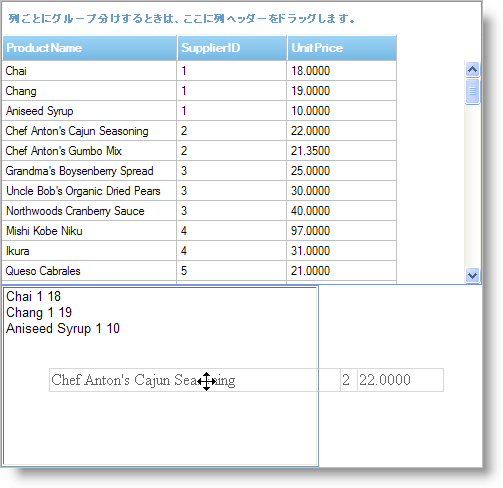

////

|metadata|
{
    "name": "draganddropframework-using-drag-and-drop-framework",
    "controlName": ["WebDragandDropFramework"],
    "tags": ["Extending","How Do I","Patterns and Practices"],
    "guid": "{7F38DFE5-F4C9-4803-AA45-FBD3E62E4083}",  
    "buildFlags": [],
    "createdOn": "0001-01-01T00:00:00Z"
}
|metadata|
////

= Drag and Drop Framework の使用

このセクションは、Drag and Drop Framework の重要な概念および機能を効果的に使用するためのタスク ベースの情報について説明します。

== ソースとターゲットに個別のドラッグ アンド ドロップ チャネルを設定

アプリケーションに複数のドラッグ アンド ドロップのソースおよびターゲットがあるが、特定のソースしか特定のターゲットにドロップできない場合、Drag and Drop Framework を使用してこの区別を指定できます。たとえば、アプリケーションにショッピング カート、項目リスト、ごみ箱が含まれる場合、エンドユーザーが項目を項目リストからショッピング カートに、また項目をショッピング カートからゴミ箱に限ってドラッグし、その他の組み合わせを制限するように、ドラッグ アンド ドロップ動作を設定できます。

これを実行するには、一意のドラッグ アンド ドロップ操作ごとにドラッグ アンド ドロップ チャネルを作成する必要があります。チャネルはキーで作成されます。チャネルが指定されたら、ソース オブジェクトを同じチャネルでリッスンしているターゲット、またはチャネルでリッスンしていないターゲットにドラッグすることのみが許可されます。

以下のコードはソースとターゲットを差別化するために 2 つの一意のドラッグ アンド ドロップ チャネルを追加する方法を示します。

*JavaScript の場合*

----
// db1 からのソースとターゲットのみが互いにドラッグ アンド ドロップに参加できます 
// 同じルールが db2 に適用され、db1 および db2 ソース間でドラッグ アンド ドロップ 
// の組み合わせを一切実行できません
// ddb1 のソースは項目リストからの項目となることができ、ターゲットはショッピング カートです
var ddb1 = new $IG.DragDropBehavior();
// チャネルはキーを使用して作成されます
ddb1.addDragChannels(["cart"]);
ddb1.addDropChannels(["cart"]);
// ddb2 のソースはショッピング カートからの項目となることができ、そのターゲットはゴミ箱となることができます
var ddb2 = new $IG.DragDropBehavior();
ddb.addDragChannels(["trash"]);
ddb.addDropChannels(["trash"]);
----

== カスタム ドラッグ アンド ドロップの設定

== 次の手順を実行します

[start=1]
. AJAX 対応の ASP.NET Web サイトを作成します。
[start=2]
. Infragistics45.Web.v{ProductVersion} アセンブリを参照します。
[start=3]
. 必要なスクリプト参照をページに追加します。

*HTML の場合:*

----
<asp:ScriptManager ID="ScriptManager1" runat="server">
    <Scripts>
        <asp:ScriptReference Assembly="Infragistics45.Web.v{ProductVersion}, Version={ProductVersion}.{ProductVersionFull}.1000, Culture=neutral, PublicKeyToken=7dd5c3163f2cd0cb"  
Name="Infragistics.Web.UI.SharedScripts.igDragDrop.js" />
        <asp:ScriptReference Assembly="Infragistics45.Web.v{ProductVersion}, Version={ProductVersion}.{ProductVersionFull}.1000, Culture=neutral, PublicKeyToken=7dd5c3163f2cd0cb" 
Name="Infragistics.Web.UI.Scripts.5_igObjects.js" />
        <asp:ScriptReference Assembly="Infragistics45.Web.v{ProductVersion}, Version={ProductVersion}.{ProductVersionFull}.1000, Culture=neutral, PublicKeyToken=7dd5c3163f2cd0cb" 
Name="Infragistics.Web.UI.SharedScripts.igAnimation.js" />
    </Scripts>
</asp:ScriptManager>
----

[start=4]
. link:{ApiPlatform}web{ApiVersion}~infragistics.web.ui.gridcontrols.webdatagrid.html[WebDataGrid] コントロールをページに追加してデータに接続します。これを実行する詳細は、 link:webdatagrid-getting-started-with-webdatagrid.html[「WebDataGrid で開始」]を参照してください。
[start=5]
. ListBox コントロールをページに追加します。
[start=6]
. ページのロード イベントで、ドラッグ アンド ドロップ動作を設定するために Javascript を追加します。

.. DragDropBehavior オブジェクトをインスタンス化します。
.. ドラッグ アンド ドロップ操作でソースとなるように WebDataGrid のすべての行を設定します。ソースとして設定される行は WebDataGrid で GridRow オブジェクトの HTML 表現です。
.. ドラッグ アンド ドロップ操作のターゲットとして ListBox を設定します。
.. DragDropBehavior オブジェクトの Drop イベントを処理します。
.. DragStart イベントを処理します。

*JavaScript の場合*

----
function pageLoad() {
        var ddb = new $IG.DragDropBehavior();
        var grid = $util.findControl("WebDataGrid1");
        var rows = grid.get_rows();
        var count = rows.get_length();
        // ソースを設定します
        for (var i = 0; i < count; i++) {
                // WebDataGrid の HTML 行を取得します
                var row = rows.get_row(i).get_element();
                ddb.addSourceElement(row);
        }
        // ターゲットを設定します
        ddb.addTargetElement($get("ListBox1"), true);
        // イベントを処理します
        ddb.get_events().addDropHandler(dropHandler);
        ddb.get_events().addDragStartHandler(dragStartHandler);
}
----

[start=7]
. Drop イベント ハンドラーで、ドロップされた行値に基づいて項目を ListBox に追加するために Javascript を追加します。

.. ドロップされた行を取得します。
.. 行のセル値に基づいてテキスト文字列を作成します。
.. テキストをリスト項目として追加します。

*JavaScript の場合*

----
function dropHandler(sender, args) {
        // ドロップされた行を取得します
        var srcRow = args.get_manager().get_source().element;
        var grid = $util.findControl("WebDataGrid1");
        // 行をグリッド行に変換します
        var gridRow = grid.get_rows().get_row(srcRow.rowIndex - 1);
        var columns = grid.get_columns();
        // 行のセル値からリスト項目を作成します
        var listItem = document.createElement("option");
        var txt = "";
        for (var i = 0; i < columns.get_length(); i++) {
                if (!columns.get_column(i).get_hidden()) {
                        txt += gridRow.get_cell(i).get_value() + " ";
                }
        }
        listItem.text = txt;
        listItem.value = txt;
        // リスト項目を追加します
        var list = document.getElementById("ListBox1");
        list.options.add(listItem);
}
----

[start=8]
. DragStart ハンドラーで、ドラッグ アンド ドロップ動作をカスタマイズするために Javascript を追加します。HTML 行自体はページに表示されないため、ドラッグした時にソース行を表示するためにマークアップを作成する必要があります。

.. ソース行を取得します。
.. 行のクローンを作成します。
.. 行を TBODY HTML 要素に追加します。
.. TBODY 要素を HTML テーブルに追加します。
.. HTML テーブルとなるようにマークアップを設定します。
.. マークアップで不透明度を設定します。

*JavaScript の場合*

----
function dragStartHandler(sender, args) {
        // DragDropBehavior オブジェクトを取得します
        var ddb = sender;
        var grid = $util.findControl("WebDataGrid1");
        var rows = grid.get_rows();
        // ソース行を取得します
        var srcRow = args.get_manager().get_source().element;
        // 行のクローンを作成します
        var clonedRow = srcRow.cloneNode(true);
        clonedRow.className = "";
        // 行を配置するテーブルを作成します
        var table = document.createElement("table");
        table.id = "row_table";
        table.cellSpacing = 0;
        table.className = "row_table";
        // グリッド行からテーブルの正しい寸法を取得します
        table.style.width = rows.getRow(0).Element.clientWidth;
        table.style.height = rows.getRow(0).Element.clientHeight;
        // テーブルのボディを作成します
        var tbody = document.createElement("tbody");
        // 行をボディに追加し、ボディをテーブルに追加することによって行を追加します
        table.appendChild(tbody);
        tbody.appendChild(clonedRow);
        // 行がドラッグされる時に使用するためにテーブルを HTML マークアップとして設定します
        ddb.set_dragMarkup(table);
        ddb.set_dragMarkupOpacity(60);
}
----

[start=9]
. HTML マークアップがグリッド行のように見えるようにするために CSS スタイルを追加します。

*CSS の場合：*

----
.row_table
{
        border-right: solid 1px silver;
}
.row_table TBODY TR TD
{
        border: solid 1px silver; border-right: none; color: black;
}
.row_table TBODY TR TH
{
        display: none;
}
----

[start=10]
. アプリケーションを実行します。WebDataGrid の行を行の情報を表示する ListBox にドラッグ アンド ドロップできます。

