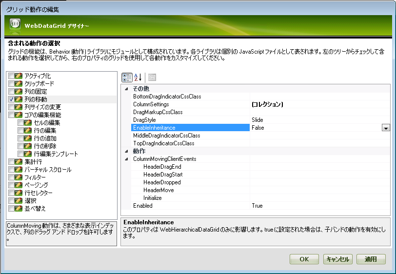

////

|metadata|
{
    "name": "gridmigrationcolumnmoving",
    "controlName": [],
    "tags": [],
    "guid": "4531db92-d23c-4dff-b168-e9c29122d312",  
    "buildFlags": [],
    "createdOn": "2016-03-01T11:29:39.292918Z"
}
|metadata|
////

= グリッドの移行 - 列の移動

== 列の移動

==== 説明:

列の移動を使用すると、デザイン タイムおよびソース コードで、グリッド列を再配置することができます。列の移行機能により、グリッドのカスタマイズが向上し、データのプレゼンテーションが改善されています。列の移動は、クライアント側とサーバー側の両方で実行できます。

WebGrid がデータのソースにバインドされている場合、列のデフォルトは、基になるデータの列コレクション内の順序です。デベロッパーは、「列コレクション エディター」または列の [Move] メソッドを持つコードにより、列を移動できます。

デベロッパーは、列コレクション デザイナーを使用して、デザイン タイムに列を移動できます。また、ユーザーが実行時に列を移動できるように、DisplayLayout.AllowColumnMovingDefault を「OnServer/OnClient」に設定することもできます。

image::images/ColumnMoving1.png[]

WebGrid には、[AllowColumnMovingDefault] プロパティに選択できる 3 つの主要なオプションがあります。

None (AllowColumnMovingDefault.None)- 列の移動を禁止し、すべての列を固定します。

On Server (AllowColumnMovingDefault.OnServer) - 列の移動すべてをサーバー上で処理します。新しいレイアウト取得で列が移動されるたびに、コントロールによりポストバックが実行されます。ただし、列の移動をサポートするために、ViewState のサイズが大きくなります。

On Client (AllowColumnMovingDefault.OnClient) - OnClient 設定は、グリッドの [Browser] プロパティを XML に設定する場合のみ使用できます。この場合、クライアント側の描画エンジンは、すでにクライアント上にある XML データを変換し、ユーザーが希望する列順序に一致させます。

WebDataGrid コントロールの列は、移動が可能です。列の移動を許可するには、「列の移動」動作を有効にします。列を移動するには、ヘッダーを左クリックし、ドラッグ インジケータに従って、希望の位置にドラッグする必要があります。

列の移動動作は、Visual Studio デザイン モードのスマート タグ コントロールを使用して、有効にできます。

または、.aspx ページ ソースを使用して設定できます（動作は、各列に設定できます）。

*ASPX の場合:*

[source,html]
----
<Behaviors>
<ig:ColumnMoving DragStyle="Slide">
      <ColumnSettings>
        <ig:ColumnMoveSetting EnableMove=" ColumnKey="CustomerID" />
        <ig:ColumnMoveSetting EnableMove="true" ColumnKey="CompanyName" />
        <ig:ColumnMoveSetting EnableMove="true" ColumnKey="Contact" />
        <ig:ColumnMoveSetting EnableMove="true" ColumnKey="Address" />
        <ig:ColumnMoveSetting EnableMove="true" ColumnKey="City" />
        <ig:ColumnMoveSetting EnableMove="true" ColumnKey="PostalCode" />
        <ig:ColumnMoveSetting EnableMove="true" ColumnKey="Country" />
      </ColumnSettings>
</ig:ColumnMoving>
</Behaviors>
----

アプリケーションが起動すると、マウスでドラッグして希望の位置にドロップすると、列を移動できます。

image::images/ColumnMoving3.png[]

==== クライアント側のコード スニペット:

サーバー側のコードスニペット:

UltraWebGrid の列移動:

InitializeLayout() イベントによる列の移動が推奨されています。

*C# の場合:*

[source,csharp]
----
// OrderID をグリッドの左側に移動する。
private void UltraWebGrid1_InitializeLayout(object sender, 
  Infragistics.WebUI.UltraWebGrid.LayoutEventArgs e)
{
     // クライアント マシンへの列の移動の実行を許可する。
         e.Layout.AllowColumnMovingDefault = AllowColumnMoving.OnClient; 
        // 別な方法として、e.Layout.AllowColumnMovingDefault = AllowColumnMoving.OnServer;
        // を設定し、サーバーで列の移動が実行できるように設定する。
        // OrderIDの列を列インデックス 0 に移動する。
    e.Layout.Bands[0].Columns.FromKey("OrderID").Move(0);
}
----

*注* : クライアントで列の移動を実行するには、グリッドのプロパティ [Browser] を「XML」に設定し、[SelectTypeColDefault] プロパティをデフォルト値に設定する必要があります。それ以外の場合、列の移動ではCtrl キーも使用する必要があります。

*C# の場合:*

[source,csharp]
----
using Infragistics.WebUI.UltraWebGrid;
...
this.UltraWebGrid1.Browser = BrowserLevel.Xml;
this.UltraWebGrid1.DisplayLayout.SelectTypeColDefault = SelectType.Single;
this.UltraWebGrid1.DisplayLayout.AllowColumnMovingDefault = AllowColumnMoving.OnClient;
----

==== WebDataGrid の列の移動:

WebDataGrid コントロールで列の移動を有効にするには、次のコードをイベント/メソッドに追加します。

*C# の場合:*

[source,csharp]
----
// グリッドの列の移動を有効にする。
WebDataGrid1.Behaviors.ColumnMoving.Enabled = true;
// ドラッグ スタイルを 「Follow」に設定する。ドラッグのマークアップはマウスをフォローする。
WebDataGrid1.Behaviors.ColumnMoving.DragStyle = Infragistics.Web.UI.GridControls.HeaderDragStyle.Follow;
// ID 列の新しい設定を追加し、この列を移動不可にする。
Infragistics.Web.UI.GridControls.ColumnMoveSetting mySetting = new Infragistics.Web.UI.GridControls.ColumnMoveSetting();
mySetting.ColumnKey = "ID";
mySetting.EnableMove = false;
WebDataGrid1.Behaviors.ColumnMoving.ColumnSettings.Add(mySetting);
----

グリッド内で列の位置を変更する場合は、次のコードを使用できます。

*C# の場合:*

[source,csharp]
----
// インデックス 1 を持つ列をインデックス"0"に表示し、2 番目の列を 1 番目にする。
WebDataGrid1.Columns[1].VisibleIndex = 0;
----

*注* : 列の位置を変更するには、グリッドの [AutoGenerateColumns] プロパティを「False」に設定し、マークアップで列を作成する必要があります。

==== WebHierarchicalDataGrid の列の移動:

利用できません（バージョン 11.1 で導入）