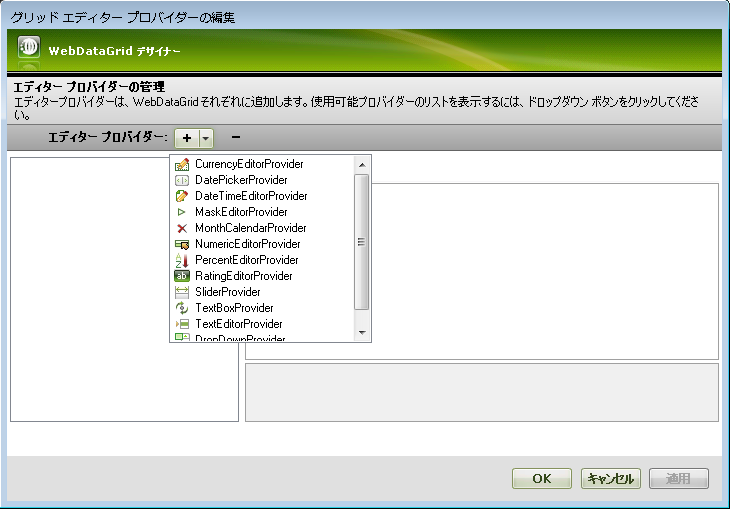
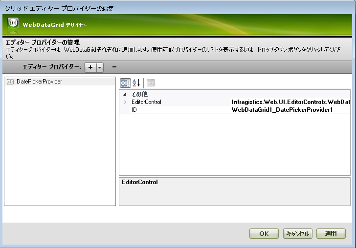
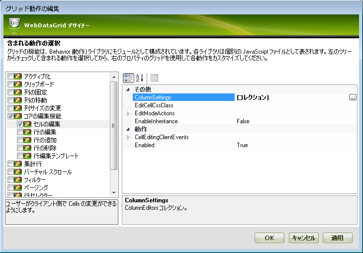
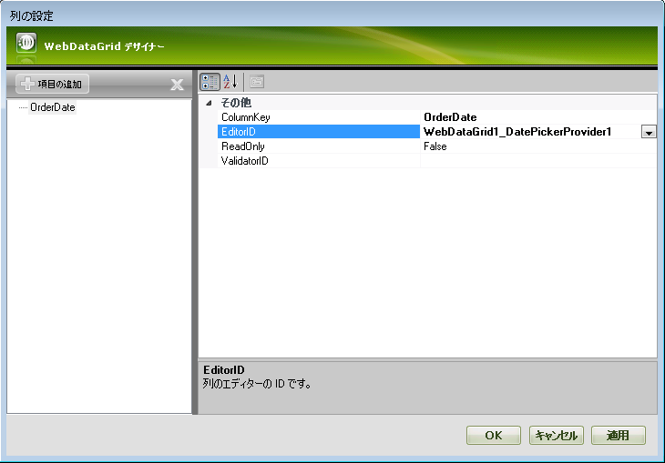
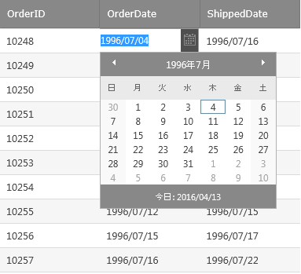

////

|metadata|
{
    "name": "gridmigrationeditorproviders",
    "controlName": [],
    "tags": [],
    "guid": "e99f11ca-920f-4d25-b6d1-9547f58e69b9",  
    "buildFlags": [],
    "createdOn": "2016-03-01T12:01:59.3733863Z"
}
|metadata|
////

= グリッドの移行 - エディター プロバイダー

エディター プロバイダーは、WebDataGrid (WebHierarchicalDataGrid) 内部で外部エディターを使用できるようにする特殊なオブジェクトです。各インフラジスティックス エディターには、グリッドの内部で使用できるエディター プロバイダーがあります。カスタム エディター プロバイダーは、インフラジスティックス以外のエディターに書き込むことができます。

エディター プロバイダーを追加するには、スマート タグから 「グリッドエディター プロバイダーを編集」を選択します。表示されるダイアログで「+」記号の隣の下矢印をクリックし、グリッドに追加するエディター プロバイダーのタイプを選択し、構成します。

プロバイダーを作成すると、右側のプロパティ ウィンドウで構成できます。[EditorControl] プロパティは、プロバイダが作成するエディター コントロールへの参照です。[ID] プロパティがこのプロバイダーをグリッドで識別します。

プロバイダーを削除するには、「-」記号をクリックします。

エディター プロバイダーは、動作ダイアログで列に関連付けることができます。スマートタグから「動作の編集」を選択し、「セル編集」動作を有効にします。

ColumnSettings コレクションに新しい項目を追加します。次に、その列の列キーとエディター プロバイダーの ID を選択します。

これらの設定を保存し、Web サイトを起動します。任意のセルで編集モードを開始すると、選択したエディターが表示されます。

