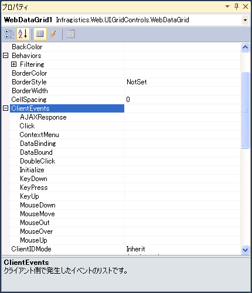
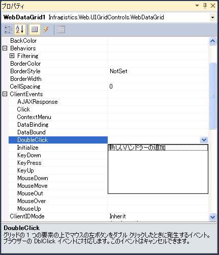
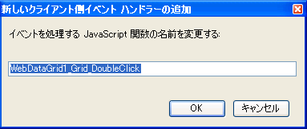

////

|metadata|
{
    "name": "javascript-intellisense-support",
    "controlName": [],
    "tags": ["Design Environment","How Do I"],
    "guid": "f9cb48ec-b94e-4c61-91a0-478eb17af14f",  
    "buildFlags": [],
    "createdOn": "2010-06-01T14:45:17.8879234Z"
}
|metadata|
////

= JavaScript IntelliSense のサポート

== VS 2008/2010 の JavaScript IntelliSense

2010 Vol. 2 リリースには、すべての ASP.NET AJAX コントロールでの JavaScript IntelliSense のサポートが付属します。これで、API ドキュメントを見なくても、すべてのクライアント側プロパティ、メソッド、イベントを簡単に使用することができます。

== JavaScript IntelliSense を有効にする方法

JavaScript IntelliSense を有効にするには、 link:{ApiPlatform}web{ApiVersion}~infragistics.web.ui.webscriptmanager.html[WebScriptManager] コンポーネントをページに追加するだけです。ASP.NET AJAX コントロールへの必要な参照および提供されるクライアント側機能を保持します。

image::images/JavaScript_IntelliSense_Support_01.png[]

== JavaScript IntelliSense を使用する方法

link:{ApiPlatform}web{ApiVersion}~infragistics.web.ui.webscriptmanager.html[WebScriptManager] を追加すれば、Infragistics AJAX コントロールへの参照を取得できます。これを行うには、$IG..find メソッドを使用します。これはキャストする必要があるコントロールのタイプです。このように IntelliSense は、プロパティ、メソッドおよびイベントを直接公開します。

*JavaScript の場合*

----
var grid = $IG.WebDataGrid.find("WebDataGrid1");var tree = $IG.WebDataTree.find("WebDataTree1");
----

== クライアント側イベントの追加

クライアント イベントの追加は非常に簡単になりました。デザイナーのプロパティ ウィンドウから追加できるようになりました。これを行う方法の例を次に示します。

[start=1]
. デザイン ビューで、Infragistics AJAX コントロールを Web フォームにドロップします。
[start=2]
. コントロールを右クリックし、[プロパティ] を選択します。[プロパティ] ウィンドウが表示されたら、Behavior プロパティの下に ClientEvents プロパティ ノードが見つかります。

[start=3]
. 候補ドロップダウン リストから [新しいハンドラーを追加] を選択します。

[start=4]
. クライアント側イベント名ハンドラーのダイアログが表示されます。ユーザー独自の JavaScript 関数名を入力するか、推奨されたものにすることができます。

[start=5]
. [OK] をクリックしてソース ビューに切り替え、クライアント側イベント ハンドラーを挿入します。生成された JavaScript コードは次のようになります。

*JavaScript の場合*

----

----