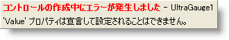
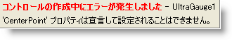
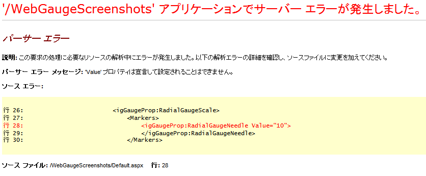
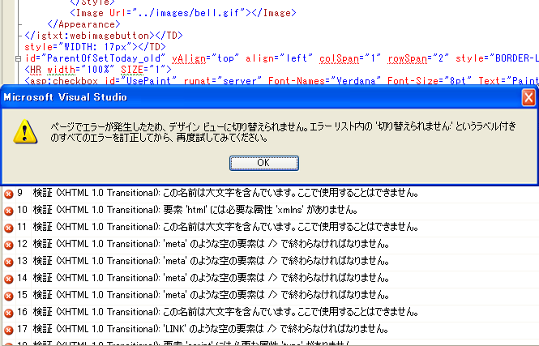

////

|metadata|
{
    "name": "known-issues-known-issues-and-breaking-changes-revision-history",
    "controlName": [],
    "tags": ["Known Issues"],
    "guid": "{96AF3FAE-F5CC-4603-9197-7DB68113E0FC}",  
    "buildFlags": [],
    "createdOn": "0001-01-01T00:00:00Z"
}
|metadata|
////

= 既知の問題と重大な変更

{ProductName} 製品を使用する時には、既知の問題と重大な変更点に注意してください。

以下のリストをクリックすると、既知の問題と重大な変更点を最初に紹介したさまざまなバージョンの {ProductName} のリストを参照できます。

== 2015 Volume 1

{ProductName} 製品の 2015.1 バージョンでは、以下のコントロールが製品、サンプル、およびヘルプから削除されます。

* WebSpellChecker
* WebSpellCheckerDialog

== ツールボックスから除外された ASP.NET コントロール

{ProductName} 製品の 2011.2 バージョンでは、以下のコントロールが製品、サンプル、ヘルプから除外されました。

* WebGrid
* WebCombo
* WebDateChooser
* WebPanel
* WebListBar
* WebCalendar
* WebNavBar
* WebToolbar
* UltraWebTab
* WebDataInput

** WebTextEdit
** WebMaskEdit
** WebNumericEdit
** WebDateTimeEdit
** WebPercentEdit
** WebCurrencyEdit

* WebMenu
* WebTree
* Web Async Refresh Panel (WARP)
* WebGridExcelExporter
* WebGridDocumentExporter

従来のコントロールは、{ProductName} AJAX フレームワーク上で再構築された新しいコントロールによって置き換えられています。上記コントロールに代わって使用するコントロールについては、 link:classic-control-migration-guide.html[{ProductName} クラシック コントロール マイグレーション ガイド] を参照してください。

== 2011 Volume 2

=== Infragistics Document Libraries

==== 問題/制限チャート

以下の各表は、各コントロールで未解決の制限事項や外因による制限事項をリストしたものです。

=== 凡例:

- image:images\workaround.png[alt="Workaround"] - 回避策
- image:images\noworkaround.png[alt="No Workaround"] - 既知の回避策はありません
- image:images\fix.png[alt="Fix Planned"] - 修正予定です

[cols="a,a,a"]
|====
|問題
|説明
|回避策

|<<aspnetjQuery,{ProductName} と Ignite UI® 両方からドキュメント エンジンを使用する>>
|{ProductName} と Ignite UI® 両方のドキュメント アセンブリを一緒に使用すると、名前空間の競合による例外が発生します。
|image::Images/workaround.png[]

|====

=== {ProductName} と Ignite UI® 両方からドキュメント エンジンを使用する

{ProductName} と Ignite UI® 両方のドキュメント アセンブリを一緒に使用すると、名前空間の競合による例外が発生します。競合するアセンブリの一覧です。

[cols="a,a"]
|====
|ASP.NET
|jQuery

|Infragistics.WebUI.Documents.Core.dll
|Infragistics.Web.MVC.Documents.Core.dll

|Infragistics.WebUI.Documents.IO.dll
|Infragistics.Web.MVC.Documents.IO.dll

|Infragistics.WebUI.Documents.Reports.dll
|Infragistics.Web.MVC.Documents.Reports.dll

|Infragistics.WebUI.Documents.Excel.dll
|Infragistics.Web.MVC.Documents.Excel.dll

|Infragistics.WebUI.Documents.Word.dll
|Infragistics.Web.MVC.Documents.Word.dll

|====

注*:* ASP.NET の場合、アセンブリの名前は、Infragistics2、Infragistics35、または Infragistics4 という文字列で始まります。ただし、バージョンのないアセンブリを使用している場合は別です。

=== 回避方法

この問題を解決するには、アプリケーションで {ProductName} のドキュメント アセンブリまたは Ignite UI® のドキュメントアセンブリのいずれかを参照します。こうしたアセンブリに含まれるドキュメントライブラリは同じものであるため、互いに代用可能です。

=== Aikido™ Touch Support

[cols="a,a,a"]
|====
|問題
|説明
|回避策

|*WebDataGrid、WebHierarchicalDataGrid、および WebDataTree は複数選択に対応していません*
|タッチ操作の場合、WebDataGrid、WebHierarchicalDataGrid、および WebDataTree は複数選択に対応していません。
|image::Images/noworkaround.png[]

|*WebDataGrid、WebHierarchicalDataGrid、および WebDataTree ではドラッグ アンド ドロップ機能がサポートされません*
|タッチ操作の場合、WebDataGrid、WebHierarchicalDataGrid、および WebDataTree はドラッグ アンド ドロップ機能に対応していません。これには、グリッド コントロール内での列移動など、ドラッグやドロップ操作に依存した機能も含まれます。
|image::Images/noworkaround.png[]

|*WebDataGrid および WebHierarchicalDataGrid Filtering はフォーカスを失います*
|Apple^®^Safari^®^ で Filtering 機能を使用する場合、このブラウザー自体にあるバグが原因で絞り込み条件ボックスがフォーカスを失います。
|image::Images/noworkaround.png[]

|====

==== 関連トピック

以下は、その他の役立つトピックです。

* link:touch-support-in-netadvantage-for-aspnet.html[{ProductName} でのタッチ サポート]

== WebDataGrid™

[cols="a,a,a"]
|====
|問題
|説明
|回避策

|*新規行の並べ替えとフィルター処理*
|行の追加操作を行っても、追加した行は、並べ替えられた状態またはフィルターされた状態でグリッドに追加されていくわけではありません。エンドユーザーが行を追加したあとに並べ替えまたはフィルターしなおす必要があります。
|image::Images/noworkaround.png[]

|*新規行とページング*
|行を追加していくと、クライアント側の行数がページ カウントで許容される行数を超えてしまう可能性があります。
|image::Images/noworkaround.png[]

|<<create_templated,クライアント側でテンプレート セルを作成します>>
|新規行をグリッドに追加しても、テンプレート セルはクライアント側に作成されません。
|image::Images/workaround.png[]

|*クライアント側でデータ キー フィールドが設定されていません*
|クライアント側でデータ キー フィールドが設定されていない場合、一時的なキーが自動的に生成され、「`emptyKeyIG_`」というプレフィックスが付けられます。自動生成キーで選択した行は、サーバー側で永続的に保持されることはありません。
|image::Images/noworkaround.png[]

|*Undo 機能*
|標準装備されている Undo 機能を有効にすると、エンドユーザーにのみ [元に戻す] ボタンが表示され、行の編集や追加に使用できるようになります。[元に戻す] ボタンは、削除された行に対してのみ使用できます。Activation が無効になっていても、開発者であれば、クライアント側の API を使用してこうした操作を元に戻すことができます。
|image::Images/noworkaround.png[]

|*ポストバックの所要時間*
|1 度に処理する操作の数が多い場合、ポストバックの処理に長い時間がかかることもあります。ポストバックの所要時間はサーバーの性能やネットワークの接続性による影響も受けます。
|image::Images/noworkaround.png[]

|*行追加操作のアニメーション*
|行の追加操作には、CSS アニメーションが使用されます。このアニメーションは、IE 9 またはそれ以前の IE では表示されません。ブラウザーがこの CSS 規格に対応していないためです。
|image::Images/noworkaround.png[]

|*テンプレート列のコピー*
|テンプレート列は、Clipboard の操作対象から除外されます。
|image::Images/noworkaround.png[]

|*Clipboard に関する各ブラウザーの対応状況*
|Web ページからの Clipboard の呼び出しがどこまでサポートされるかについては、ブラウザーごとに対応の度合が異なります。Adobe Flash® オブジェクトの利用によってあらゆるブラウザーから Clipboard を呼び出せるようにする方法の詳細については、以下をご覧ください。
|image::Images/workaround.png[]

|<<pasting_data,改行を含むデータの貼り付け>>
|<br/> タグを含むセル データを WebDataGrid または WebHierarchicalDataGrid からコピーして Excel® のスプレッドシートに貼り付けると、データが改行ごとに個別の行として貼り付けられてしまいます。
|image::Images/workaround.png[]

|====

== クライアント側でテンプレート セルを作成します

新規行をグリッドに追加しても、テンプレート セルはクライアント側に作成されません。

== 回避方法

行追加時のクライアント側イベントの中にそのテンプレート用のクライアント側コントロールを作成しておくことできます。次の postback.Clipboard ブラウザーサポートの後に、その行にサーバー コントロールが追加されます。

Web ページからの Clipboard の呼び出しがどこまでサポートされるかについては、ブラウザーごとに対応の度合が異なります。

[cols="a,a,a,a,a,a"]
|====
|機能
|Internet Explorer
|Firefox
|Chrome
|Safari
|Opera

|*はい*
|*いいえ*

|*対応済み* (セキュリティーが弱い)

|*いいえ*

|*いいえ*
|*いいえ*

|貼り付け
|*はい*
|*はい* (セキュリティーが弱い)
|*はい*
|*はい*
|*いいえ*

|====

== 回避方法

Adobe Flash® プラグインを利用すると、どのブラウザーにおいても Clipboard へのデータのコピーが可能になります。JavaScript ライブラリの入手先: link:http://zeroclipboard.org[http://zeroclipboard.org]。ここにあるライブラリを利用すると、Clipboard を呼び出せるようにすることができます。下の例では、このライブラリを利用して上記の方式を実装します。実行する前に、まず ZeroClipboard ライブラリをダウンロードして抽出してください。

== 例: Flash オブジェクトを利用した Clipboard の呼び出し

[cols="a"]
|====
|HTML と ASPX の場合:

|
```
<script type="text/javascript" src="ZeroClipboard/ZeroClipboard.js"></script> 
<style type="text/css"> 
    #d_clip_button { 
        text-align:center; 
        border:1px solid black; 
        background-color:#ccc; 
        margin:10px; padding:10px; 
    } 

    #d_clip_button.hover { background-color:#eee; } 
    #d_clip_button.active { background-color:#aaa; } 
</style> 

<script type="text/javascript" id="igClientScript"> 
    var clip; 
    var copyButton; 
    function onLoad() { 
        ZeroClipboard.setMoviePath('ZeroClipboard/ZeroClipboard.swf'); 
        clip = new ZeroClipboard.Client(); 
        clip.setText(""); 
        clip.glue('d_clip_button'); 

        copyButton = document.getElementById("d_clip_button"); 
        clip.hide(); 
        copyButton.style.display = "none"; 
        
        clip.addEventListener('complete', function (client, text) { 
            clip.hide(); 
            copyButton.style.display = "none"; 
        }); 
    } 

    function WebDataGrid1_Clipboard_Copied(sender, eventArgs) { 
        ///<summary> 
        /// 
        ///</summary> 
        ///<param name="sender" type="Infragistics.Web.UI.WebDataGrid"></param> 
        ///<param name="eventArgs" type="Infragistics.Web.UI.ClipboardEventArgs"></param>
        if (eventArgs.get_error()) { 
            eventArgs.set_exceptionHandled(true); 
            clip.setText(eventArgs.get_clipboardText()); 
            copyButton.style.display = ""; 
            clip.show(); 
        } 
    } 
</script> 

<div id="d_clip_button" >Copy To Clipboard</div> 

<ig:WebDataGrid ID="WebDataGrid1" runat="server" Height="350px" Width="400px" 
AutoGenerateColumns=" DataSourceID="SqlDataSource1" 
onrowupdating="WebDataGrid1_RowUpdating" DataKeyFields="ProductID"> 

<Behaviors> 

<ig:Clipboard> 
    <ClipboardClientEvents Copied="WebDataGrid1_Clipboard_Copied"/> 
</ig:Clipboard>
```

|====

== 改行を含むデータの貼り付け

<br/> タグを含むセル データを WebDataGrid または WebHierarchicalDataGrid からコピーして Excel® のスプレッドシートに貼り付けると、データが改行ごとに個別の行として貼り付けられてしまいます。

== 回避方法

Clipboard 内では、すべての <br/> タグが復帰文字「\n」に変換されます。復帰文字を他の文字、たとえば、スペース「 」などに置き換える Pasting クライアント側イベントを用意しておけば、データが複数の行として Excel に貼り付けられることはなくなります。

== WebHierarchicalDataGrid™

[cols="a,a,a"]
|====
|問題
|説明
|回避策

|*WDG の全制限事項*
|WebDataGrid の制限事項はすべて WebHierarchicalDataGrid にも適用されます。
|image::Images/noworkaround.png[]

|*一括更新を有効にした状態でのグループ化された WHDG への行追加*
|一括更新が有効になっている場合、グループ化されたグリッドに新たに行を追加すると、その行は最後のグループに追加されます。グリッドが空で、グリッドの中にグループ行が存在しない場合、新たに追加した行はデータ行として追加され、次のポストバックまでグループは作成されません。次回のポストバックが完了すると、新たに追加した行は他のデータ行と同じ形でグループ化され、必要なグループがあれば、そのグループが新規に作成されます。
|image::Images/noworkaround.png[]

|*子バンドの追加*
|新たに追加した親行の最初のポストバックが完了すると、子バンドが作成されます。子行の追加をサポートするためには、その子バンドに関して追加機能を有効にしておく必要があります。
|image::Images/noworkaround.png[]

|*一括更新を有効にした状態で展開行を削除します*
|展開されている行を削除した場合、その行は縮小されて、その更新 (つまり、削除操作) が元に戻されるまで展開できないようになります。この結果、その行の子行から AJAX ポストバックが発生することはなくなります。また、その行が削除された状態になっている間は `row.get_rowIslands()` も null を返すことになります。
|image::Images/noworkaround.png[]

|*一括更新とページングを有効にした状態での複数行の追加*
|一括更新とページングが有効になっているときに複数の行を追加した場合、それらの行は現在のページに追加されます。その後、追加した行の 1 つから子行を取り出した場合、展開した親行は、新規ページに置かれることになるため、見えなくなる可能性があります。
|image::Images/noworkaround.png[]

|*テンプレート列のコピー*
|テンプレート列は、Clipboard の操作対象から除外されます。
|image::Images/noworkaround.png[]

|*カスタムの Groupby 比較演算子と複数列のグループ化*
|カスタムのグループ比較演算子を使用して特定の列をグループ化しても、その列のデータに並べ替えの順序が適用されず、後続の列が正しくグループ化されないという既知の問題が存在します。
|image::Images/noworkaround.png[]

|====

== WebWordExporter™

[cols="a,a,a"]
|====
|問題
|説明
|回避策

|<<export_complex,Complex テキスト テンプレートをエクスポートします>>
|エクスポーターがエクスポートするのはシンプルなテキスト テンプレートだけです。
|image::Images/noworkaround.png[]

|====

=== Complex テキスト テンプレートをエクスポートします

エクスポーターがエクスポートするのはシンプルなテキスト テンプレートだけです。次のようなテンプレートはエクスポートされます。

<ItemTemplate>

Name: <%# Eval("FirstName") %> <%# Eval("LastName") %>

</ItemTemplate>

次のようなテンプレートはエクスポートされません。

<ItemTemplate>

<asp:TextBoxID="txtTemp"runat="server"Text="Temppp"></asp:TextBox>

</ItemTemplate>

== 2011 Volume 1

== WebDataGrid™

*  pick:[asp-net="link:{ApiPlatform}web{ApiVersion}~infragistics.web.ui.gridcontrols.webdatagrid~enableclientrendering.html[EnableClientRendering]"]  プロパティが true に設定されると、「タグ」属性はグリッドの行で使用できません。
* クライアントで実行された操作は、ポストバック/コールバックの後でサーバーに伝達することが保証されません (つまり、 pick:[asp-net="link:{ApiPlatform}web{ApiVersion}~infragistics.web.ui.gridcontrols.ipaging~pageindexchanging_ev.html[PageIndexChanging]"]  イベントが開発者によって処理され、ページ インデックスがクライアントでの再バインドによって変更された場合、ポストバック/コールバックの後、グリッドはこの変更を失います)。
*  pick:[asp-net="link:{ApiPlatform}web{ApiVersion}~infragistics.web.ui.gridcontrols.webdatagrid~enableclientrendering.html[EnableClientRendering]"]  プロパティが true に設定された場合:

** 個々の CSS クラスの特定のセルまたは行への割り当ては機能しません。
**  pick:[asp-net="link:{ApiPlatform}web{ApiVersion}~infragistics.web.ui.gridcontrols.boundcheckboxfield.html[BoundCheckBoxField]"]  および  pick:[asp-net="link:{ApiPlatform}web{ApiVersion}~infragistics.web.ui.gridcontrols.unboundcheckboxfield.html[UnboundCheckBoxField]"]  列は Boolean または null 許容の Boolean 型列に限り機能します。

== WebHierarchicalDataGrid™

* 列の移動とサイズ変更がバンド レベルで機能するには、列をバンドで定義する必要があります。そうでない場合には、行アイランドごとに機能します。
* 値が非バインド セルで変更された場合に、データ バインドが発生しません。したがって、並べ替えとフィルター処理動作により、行を取得するには一度データバインドする必要があります。これによって値を設定できますが、行はすでに順番に並んでいます。非バインド フィールドに基づいてフィルター処理または並べ替えるには、データバインドを再度実行する必要があります。

== WebVideoPlayer™

* Microsoft® Internet Explorer™ 9 の場合:

** ビデオを一時停止し、再度再生する間にミュートされると、ビデオのサウンドが一瞬再生されます。
** ポスター画像が Internet Explorer 9 では表示されません。ビデオ ソースがビデオ タグによりロードされていない場合のみ表示されます。ブラウザーは、代わりに最初のビデオ フレームをポスターとして表示します。
** jQuery UI バージョン 1.8.5 以前を使用している場合、ボリューム スライダーのハンドルがスムーズにドラッグできません。この問題は、バージョン 1.8.6 以降では解決しています。

* Google® Chrome™ の場合:

** ユーザーが通常の画面を全画面表示、またはその逆に切り替えると、カスタム ブラウザー コントロールがちらつきながら縮小および展開します。これは、Chrome にのみ固有のブラウザーのレンダリング問題です。

* Opera™ 11.10 以前の場合:

** バッファーされた進行状況は Opera 11.10 以前では更新されません。

* jQuery 1.4.2 以前を使用した場合:

** 「400」などの文字列に幅/高さは、jQuery バージョン 1.4.3 以前では指定できません。400 などの数字または「400px」など中に「px」がある文字列を使用する必要があります。

* コントロール レイアウト

** コントロールをテーブル コンテナーに配置すると、カスタム Infragistics コントロールはテーブルのデフォルト プロパティによる影響を受けます。この問題を解決するには、その親コントロールに「border-spacing: 0;」を配置する必要があります。

== WebUpload™

* オプション  pick:[asp-net="link:{ApiPlatform}web.jquery{ApiVersion}~infragistics.web.ui.editorcontrols.webupload~maxsimultaneousfilesuploads.html[MaxSimultaneousFilesUploads]"]  を設定する時は、値を最大 2 に指定することを推奨します。同時に複数ファイルをアップロードしている時は、アップロードされるファイルの数に等しい要求を行っています。2 ファイル同時にアップロードされる時、現在のブラウザーのタブに対して要求を 2 つ行うのはこのためです。タブに対する同時要求の異なるブラウザーに制限があります。Internet Explorer バージョン 6 と 7 の場合は 2 で、Firefox の場合は 3 です。コントロールで例外を受け取りたくない場合には、2 よりも大きくない値で MaxSimultaneousFilesUploads を設定することを推奨するのはこのためです。
* WebUpload はキーボード ナビゲーションをサポートしません。ただし、コントロールがフォーカス可能で、タブ シーケンスの一部を取得する点を除きます。TAB キーを使用すると、コントロールとその要素をナビゲートできます。
* ファイルをアップロードしたいが、ローカル ドライブの項目を選択するポップアップ ウィンドウをブラウザーに表示する時は、選択できるファイルはひとつだけです。複数ファイルのアップロードでは、個々に追加することによって複数ファイルをアップロードできます。

== アセンブリおよび名前空間の変更

このリリースでは、以下のテーブルの Infragistics.Excel および Infragistics.Documents のアセンブリ名に変更があります。

====== テーブル 1：Infragistics.Excel および Infragistics.Documents アセンブリ名の変更

[options="header", cols="a,a"]
|====
|以前の名前|新しい名前

|Infragistics2.Excel.v11.1.dll
|Infragistics2.Documents.Excel.v11.1.dll

|Infragistics35.Excel.v11.1.dll
|Infragistics35.Documents.Excel.v11.1.dll

|Infragistics2.Documents.v11.1.dll
|Infragistics2.Documents.Reports.v11.1.dll

|Infragistics.Excel.dll
|Infragistics.Documents.Excel.dll

|Infragistics.Documents.dll
|Infragistics.Documents.Reports.dll

|====

====== テーブル 2：Infragistics.Excel アセンブリの名前空間名の変更

[options="header", cols="a,a"]
|====
|以前の名前|新しい名前

|Infragistics.Excel
|Infragistics.Documents.Excel

|Infragistics.Excel.CalcEngine
|Infragistics.Documents.Excel.CalcEngine

|Infragistics.Excel.Serialization.Excel2007
|Infragistics.Documents.Excel.Serialization.Excel2007

|====

====== テーブル 3：Infragistics.Documents アセンブリの名前空間名の変更

[options="header", cols="a,a"]
|====
|以前の名前|新しい名前

|Infragistics.Documents
|Infragistics.Documents.Reports

|Infragistics.Documents.Graphics
|Infragistics.Documents.Reports.Graphics

|Infragistics.Documents.HTML
|Infragistics.Documents.Reports.HTML

|Infragistics.Documents.PDF
|Infragistics.Documents.Reports.PDF

|Infragistics.Documents.Report
|Infragistics.Documents.Reports.Report

|Infragistics.Documents.Report.Band
|Infragistics.Documents.Reports.Report.Band

|Infragistics.Documents.Report.Bookmarks
|Infragistics.Documents.Reports.Report.Bookmarks

|Infragistics.Documents.Report.Flow
|Infragistics.Documents.Reports.Report.Flow

|Infragistics.Documents.Report.Grid
|Infragistics.Documents.Reports.Report.Grid

|Infragistics.Documents.Report.Index
|Infragistics.Documents.Reports.Report.Index

|Infragistics.Documents.Report.List
|Infragistics.Documents.Reports.Report.List

|Infragistics.Documents.Report.Preferences
|Infragistics.Documents.Reports.Report.Preferences

|Infragistics.Documents.Report.Preferences.PDF
|Infragistics.Documents.Reports.Report.Preferences.PDF

|Infragistics.Documents.Report.Preferences.Printing
|Infragistics.Documents.Reports.Report.Preferences.Printing

|Infragistics.Documents.Report.Preferences.XPS
|Infragistics.Documents.Reports.Report.Preferences.XPS

|Infragistics.Documents.Report.Projection
|Infragistics.Documents.Reports.Report.Projection

|Infragistics.Documents.Report.QuickList
|Infragistics.Documents.Reports.Report.QuickList

|Infragistics.Documents.Report.QuickTable
|Infragistics.Documents.Reports.Report.QuickTable

|Infragistics.Documents.Report.QuickText
|Infragistics.Documents.Reports.Report.QuickText

|Infragistics.Documents.Report.Section
|Infragistics.Documents.Reports.Report.Section

|Infragistics.Documents.Report.Segment
|Infragistics.Documents.Reports.Report.Segment

|Infragistics.Documents.Report.Shapes
|Infragistics.Documents.Reports.Report.Shapes

|Infragistics.Documents.Report.Table
|Infragistics.Documents.Reports.Report.Table

|Infragistics.Documents.Report.Text
|Infragistics.Documents.Reports.Report.Text

|Infragistics.Documents.Report.TOC
|Infragistics.Documents Reports.Report.TOC

|Infragistics.Documents.Report.Tree
|Infragistics.Documents.Reports.Report.Tree

|Infragistics.Documents.RTF
|Infragistics.Documents.Reports.RTF

|Infragistics.Documents.Utils
|Infragistics.Documents.Reports.Utils

|Infragistics.Documents.XPS
|Infragistics.Documents.Reports.XPS

|====

== Infragistics Excel

Excel アセンブリへの参照を含むプロジェクトでは、新しい Infragistics.Documents.Core アセンブリも必要となりました。この新しい Infragistics.Documents.Core アセンブリは、Excel および Word DOM アセンブリで共有されます。

== 2010 Volume 3

== WebExcelExporter™

* 30 を超える行で構成される親行アイランドを持つ WebHierarchicalDataGrid™ をエクスポートする時に、集計は Max、Min、Sum および Average 関数に対してプレーン テキストでエクスポートされます。

== WebDocumentExporter™ / WebExcelExporter™

* エクスポーターがエクスポートするのはシンプルなテキスト テンプレートだけです。

たとえば、以下のテンプレートがエクスポートされます。

*HTML の場合:*

----
<ItemTemplate >
     Name: <%# Eval("FirstName") %> <%# Eval("LastName") %>
</ItemTemplate >
----

次のようなテンプレートはエクスポートされません。

*HTML の場合:*

----
<ItemTemplate>
    <asp:TextBox ID="txtTemp" runat="server" Text="Temppp"></asp:TextBox>
</ItemTemplate>
----

== WebDataMenu™

* SubMenuClosingDelay プロパティのデフォルト値が 1000ms から 0 に変更されます。
* SubMenuClosingDelay がコンテキスト メニューにも適用されるようになりました。10.2 では、コンテキスト メニューは 100ms の終了遅延を修正しました。
* DataMenuItem.GroupSettings は上位レベルから値を継承しなくなりました。継承可能な唯一のプロパティは、EnableAnimation、AnimationType、AnimationDuration および AnimationEquationType です。
* ホバー スタイルはアクティブ スタイルと選択スタイルに視覚的に個別の値を持ちます。以前はこれらはすべて同じ視覚的スタイルでした。
* 項目がクリックされると、選択された状態になります。マウスがその他の項目上に移動されると、選択された項目は選択スタイルは失いますが、選択された状態を失うわけではありません。メニューから離れると、選択された項目はその視覚的スタイルを返して、コントロールがフォーカスと失った後で選択されたように表示されます。

== 2010 Volume 2

== Microsoft™ Visual Studio™ のマニュアルを同時にインストール

このバージョンの Infragistics では、1 台のコンピューターに同じ製品のマニュアルの複数バージョンを同時にインストールすることはできません。たとえば、同じコンピューターに Infragistics [Product Name] 2010.2 の製品マニュアルとともに Infragistics [Product Name] 2010.1 の製品マニュアルをインストールすることはできません。新しいバージョンの製品マニュアルをインストールするには、古いマニュアルを最初にアンインストールしてから新しいマニュアルをインストールしなければなりません。

== WebDataTree™

ドラッグ アンド ドロップ機能の制限:

* ロード オン デマンドでツリーが構成される時にはこの機能はサポートされません。

== WebDropDown™

* 数値ページャーはドロップダウンのコンテナーの幅と高さを拡張します。
*  pick:[asp-net="link:{ApiPlatform}web{ApiVersion}~infragistics.web.ui.listcontrols.dropdownitem.html[DropDownItem]"]  オブジェクトの  pick:[asp-net="link:{ApiPlatform}web{ApiVersion}~infragistics.web.ui.listcontrols.dropdownitem~activated.html[Activated]"]  プロパティは読み取り専用プロパティになりました。
*  pick:[asp-net="link:{ApiPlatform}web{ApiVersion}~infragistics.web.ui.listcontrols.webdropdown.html[WebDropDown]"]  オブジェクトの  pick:[asp-net="link:{ApiPlatform}web{ApiVersion}~infragistics.web.ui.listcontrols.webdropdown~selecteditem.html[SelectedItem]"]  プロパティは読み取り専用プロパティになりました。

== WebCaptcha™

* 同じ値がキャプチャによって連続して 2 回生成されると、ユーザーが正しい値を入力したフォームを提出しても、キャプチャの検証は 2 回目は失敗します。
* ランダムに生成されたテキスト コードに 1 文字しか含まれない時、キャプチャ オーディオはサポートされません。
* link:http://en.wikipedia.org/wiki/Alphanumeric[英数字]のみの場合にはキャプチャ オーディオはサポートされます。生成されたテキスト コードに '$$* $$'; '@'; '#'; etc. のような文字を含む場合にはオーディオはサポートされません。

== WebSchedule™

* 2 つの新しいイベント  pick:[asp-net="link:{ApiPlatform}webui.webschedule{ApiVersion}~infragistics.webui.webschedule.webscheduleinfo~reminderdismissing_ev.html[ReminderDismissing]"]  および  pick:[asp-net="link:{ApiPlatform}webui.webschedule{ApiVersion}~infragistics.webui.webschedule.webscheduleinfo~reminderdismissed_ev.html[ReminderDismissed]"]  が  pick:[asp-net="link:{ApiPlatform}webui.webschedule{ApiVersion}~infragistics.webui.webschedule.webscheduleinfo.html[WebScheduleInfo]"]  クラスに追加されます。

== WebDialogWindow™

以下の新しいプロパティが追加されます。

*  pick:[asp-net="link:{ApiPlatform}web{ApiVersion}~infragistics.web.ui.layoutcontrols.webdialogwindow~usebodyasparent.html[UseBodyAsParent]"]  -- このプロパティが有効な場合、クライアントでダイアログの html 要素が移動されます。これによって、オリジナルのコンテナーにかかわらず、その他の要素の上に WebDialogWindow を置くことができます。ただし、WebDialogWindow が UpdatePanel 内またはその他の非同期ポストバック コンテナー内に配置される場合、そのオプションは使用できません。
*  pick:[asp-net="link:{ApiPlatform}web{ApiVersion}~infragistics.web.ui.layoutcontrols.webdialogwindow~modaltabindices.html[ModalTabIndices]"]  -- このプロパティによって、モーダル WebDialogWindow の外側に配置されている要素の tabIndex 属性が変更されないようにできます。tab キーの動作に関連して小さい副作用をもたらす可能性がありますが、パフォーマンスを高速化してダイアログが閉じられる時に発生する問題を解決します。

== WebHtmlEditor™

* 新しいプロパティ、EnableSharePointCompatibility が追加されます。これは、エディタが SharePoint Server 2010 の WebPart に配置される場合に使用できます。これによって、外観を改善し、SharePoint によって使用される特別な css セレクターを回避できます。

== 2010 Volume 1

== WebDropDown™

AutoPostBack プロパティはもう使用されていないため、今後 ValueChanged イベントと SelectionChanged イベントに AutoPostBackFlags を使用する必要があります。

== WebExplorerBar™

* MaxGroupHeight>0 かつ AnimationDuration$$<=$$30 の時に、IE8 ではグループは展開していません。
* EnableExpandButtons が false に設定されており、GroupExpandAction が ButtonClick に設定されている場合、グループを展開または縮小できません。
* UpdatePanel が ItemTemplate 内で使用されている時に、デザイン タイムにコントロールを描画するとエラーが発生します。

== WebTab™

* VerticalTextMode.IETransformation が有効なのは TabOrientation.Vertical に対してのみであり、IE のみにサポートされます。
* ContentTabItem.TabSize は TabOrientation.Horizontal のみでサポートされます。
* AddNewTabItem.Enabled は DisplayMode.MultiRow と MultiRowAuto ではサポートされません。
* MirrorCssClass のように "Mirror" を含む TabItemCssClasses は TabOrientation.Vertical のみに使用されます。
* *ContentPane*

.. MaxHeight/MinHeight/MaxWidth/MinWidth は対応する属性をサポートしないブラウザ（たとえば IE6）で失敗する場合があります。
.. AutoSize が有効でコンテンツのサイズ（幅/高さ）がコントロールのサイズよりも小さい場合には、コントロールのサイズは削減されません。

*PostBackOptions*

.. EnableAjax が有効な場合、EnableDynamicUpdatePanels の False 値は有効ではありません。
.. EnableReloadingOnTabClick と EnableReloadingUnselectedTab が 外部の Web サイトをポイントする ContentUrl でサポートされない場合。
.. PostBackOptions EnableAjax と EnableLoadOnDemand の両プロパティが有効で EnableLoadOnDemandViewState が無効な場合、非同期ポストバックの間すべての以前に選択されたタブが再ロードされます。ただし、フル ポストバックの時には選択されたタブのコンテンツだけがロードされます（その組み合わせが機能するようにサポートされる）。それが .NET によって使用される AJAX フレームワークの制限です。

* *ClientEvents* -- UrlSubmitting と UrlSubmitted はローカル ページをポイントする ContentUrl のみでサポートされます。
* *TabLocation* -- TopRight と BottomRight は DisplayMode.Single 行のみでサポートされます。

== 2009 Volume 2

== WebDataGrid™

=== エディター プロバイダー

WebDataGrid の以下のエディタ プロバイダーは現在廃止され、新しい軽量の ASP.NET AJAX エディター コントロールによって置き換えられています:

* WebCalendarProvider
* WebDateChooserProvider
* WebCurrencyEditProvider
* WebDateTimeEditProvider
* WebMaskedEditProvider
* WebNumericEditProvider
* WebPercentEditProvider
* WebTextEditProvider

新しいエディター コントロールは以下のとおりです。

* MonthCalendarProvider
* DatePickerProvider
* CurrencyEditorProvider
* DateTimeEditorProvider
* MaskEditorProvider
* NumericEditorProvider
* PercentEditorProvider
* TextEditorProvider
* TextBoxProvider
* SliderProvider
* DropDownProvider

詳細については、 link:webdatagrid-editor-providers.html[エディター プロバイダー]を参照してください。

== WebDataMenu™

Infragistics.Web.UI.NavigationControls 名前空間内の NavItemCollection および DataMenuItemCollection の以下のメソッドが変更されています:

[start=1]
. NavItemCollection :

a. FindItemByText (文字列テキスト) $$->$$ FindNavItemByText (文字列テキスト) に変更されました。

b. FindItemByValue(文字列値) $$->$$ FindNavItemByValue (文字列値) に変更されました。
[start=2]
. DataMenuItemCollection:

a. FinditemByText (文字列テキスト) $$->$$ FindDataMenuItemByText (文字列テキスト) に変更されました。

b. FinditemByValue (文字列値) $$->$$ FindDataMenuItemByValue (文字列値) に変更されました。

== WebDataTree™

* Infragistics.Web.UI.NavigationControls 名前空間内の NavItemCollection の以下のメソッドが変更されています:

.. NavItemCollection :

*** FindItemByText (文字列テキスト) $$->$$ FindNavItemByText (文字列テキスト) に変更されました。
*** FindItemByValue(文字列値) $$->$$ FindNavItemByValue (文字列値) に変更されました。

=== DataLoadingMessage プロパティ

DataLoadingMessage プロパティのデフォルト値は Loading… から空の文字列に変更されています。今後は、デフォルトでツリーにはロードオンデマンドを実行する間 AJAX インジケーターが表示されます。AJAX インジケーターの詳細は、 link:web-ajax-indicator.html[AJAX インジケーター]トピックを参照してください。

== WebDropDown™

DropDownContainerHeight プロパティのデフォルト値は 0 から 200px に変更されています。
* 以下の変更が DropDownItem クラスに行われています。

.. Disabled プロパティの DesignerSerializationVisibility 属性が Hidden に設定され、デフォルト値は False に設定されます。
.. IsCustom プロパティの DesignerSerializationVisibility 属性が Hidden に設定され、デフォルト値は False に設定されます。このプロパティはデザイナーで使用しないでください。

== WebSchedule™

SQL データ ベースのストアド プロシージャーは変更されています。2009.2 以前の WebSchedule2.sql データ ファイルからのデータを使用している場合、WebSchedule コントロールおよびコンポーネントは正しく機能しません。既存のデータベースのためにストアドプロシージャーを更新する必要があります。SQL データベースの更新についての詳細は、 link:webschedule-update-data-and-stored-procedures.html[データおよびストアド プロシージャの更新]を参照してください。

== 2009 Volume 1

== {ProductName} CLR 2.0 ツールボックス ツールは Microsoft® Visual Studio™ 2008 で正しくインストールされない

[start=1]
. {ProductName} をインストールした後で、Visual Studio を閉じて ASP.NET 2.0 AJAX 拡張をインストールします。AJAX 拡張インストーラーは {InstallPath}\ASPAJAXExtSetup.msi に配置されます。
[start=2]
. Visual Studio 2008 を開きます。ツールボックス ツールが表示します。

== WebDataGrid™

* WebDataGrid 項目テンプレートで WebProgressBar または WebSlider™ を使用する場合、EnableRelativeLayout プロパティは True に設定する必要があります。そうでない場合には、WebProgressBar/WebSlider はグリッドをオーバーフローして表示されます。
* Shift キーを押しながらクリックして列の範囲を選択しようとする場合、列が移動された後では複数列選択は機能しませんが、Ctrl キーを押しながらクリックしてもこれまで同様機能します。
* AutoScrolling（グリッドの外側に列ヘッダーをドラッグし、列移動操作の間に左または右のいずれかにグリッドをスクロールすることになる機能）は Opera では無効になっていました。グリッドのコンテナ div にスクロール位置を設定する時に Opera は mouseUp イベントを起動します。これによりドラッグ/移動操作を速やかに終了させることになります。

== WebDataMenu™

* サーバーで ItemClick イベントを処理すると、WebDataMenu は項目クリックごとに自動ポストバックを生成します。したがって、EnableOnClick プロパティを True に設定することとサーバー側の ItemClick イベントを結合することは適切ではありません。
* ItemClick イベントがサーバーで処理されるとフル ポストバックを発生させることになるため、ItemSelected イベントはサーバーで発生しません。ItemSelected イベントを正しく処理するには、ItemClick イベントを処理するべきではありません。ひとつのイベントまたは他のイベントを処理すべきです。
* メニューは「メニューのスクロール」を現在サポートしていません。これはメニュー項目が多すぎてウィンドウの表示領域内に表示できない場合に、自動生成されたスクロールバーを作成できないことを意味します。このバージョンでは、ページの表示領域内にすべて収まるようにメニュー項目のサイズを管理するのは開発者です。

== WebDataTree™

* 2 つ（またはそれ以上）のサーバー側イベントがある場合（それらの自動ポストバックは "On" または "Async"）、これはひとつのツリー アクションで発生するのですが（たとえばツリー ノードをクリックしてこれによって "NodeClick" および "SelectionChanging" サーバー イベントが発生する）、二番目のイベントは適切に実行されない、または全く実行されない場合があります。
* ロード オン デマンドが有効の時に、子をロードするためにキーボードでノードを展開する場合、右矢印を押しても最初の子に移動しません。ただし、マウスでノードをクリックしてキーボードで普通にナビゲートする、または下矢印を押して（子の代わりにノードの兄弟に移動）、次に上矢印を押し、次に右矢印を押して最後に子に達することはこれまでと同じように可能です。

== WebDropDown™

* ロード オン デマンドはページングと併用できません。ロード オン デマンドとページングの両方が有効な場合には予期せぬ結果が発生します。
* クライアント側でフィルタリング付きのロードオンデマンドはサポートされません。
* AutoCompleteFirstMatch とクライアント側のみのフィルタリングの両方を有効にすると、場合によっては完全な入力値を前もっとフィルタリングできます（その一部は強調表示されないかのように）。
* EnableMarkingMatchedText プロパティと AutoCompleteFirstMatch プロパティの両方を同時に True に設定することは現在サポートされません。

== WebProgressBar™

* WebProgressBar は正しく表示および機能するためにページ内に常に相対的に配置すべきです。コントロールに絶対配置を使用したい場合には、絶対配置されたコンテナの中で使用します。
* コントロールで設定された最大値および最小値に基づいて WebProgressBar に設定できる値に制限はありません。最大値が 100 で値を 200 に設定すると例外がスローされます。

== 2008 Volume 3

*Microsoft Visual Studio 2008 Service Pack 1 での問題*

コントロールにコレクションがあり、コンテナ コントロール内に配置されている場合、コレクションの項目を追加するためにデザイナーを使用するとコレクションの項目はシリアル化されません。詳細は、Microsoft Connect の説明を参照してください。

*Infragistics for ASP.NET インストーラの既知の問題*

Infragistics for ASP.NET 製品のインストールの間に、以下のようなエラーが発生する場合があります：

_インストーラが `InetPub\wwwroot\aspnet_client\Infragistics` フォルダーに対して管理者特権を必要とします。_

管理者として現在ログインしている場合であってもです。これは以前に製品をアンインストールして、そのフォルダーに IIS がロックを掛けた場合に発生します。ロックを解除するには、IIS を再起動するか、コンピュータを再起動します。

== WebDataGrid™

*行の削除*

WebDataGrid は、EnableAjax が True に設定されている時に大きなデータ ソースの行を削除すると、"最大長を超えました" という例外をスローする場合があります。この理由は、ページングなどの特定の動作のためで、WebDataGrid がその表示を再ロードしなければならないために大量のデータを渡さなければならないからです。行の数が大幅に増加するにしたがい、データ量は非同期で問題なく渡すには大きすぎるようになります。EnableAjax が False であれば、削除に問題はありません。

*ページング*

ページ数がページャ領域の表示可能な領域を超える場合には、WebDataGrid のページャ領域はすべてのページ リンクを表示するわけではありません。ページャは領域に収まるのに十分なリンクだけを表示します。ページ リンクのすべてを表示できるようにスクロールバーを表示するには、ページャに以下のスタイルを使用します：

----
.pager {
      height:30px;
      overflow:auto;
    }
----

* デフォルト設定で WebDataGrid でページングを有効にし、データ ソースが非常に大きい場合、エクスペリエンス パフォーマンス問題が起こる場合があります。これは多くのページャ リンクが描画されるために、Microsoft® Internet Explorer® が各リンクに CSS クラスを適用するからです。このシナリオでは、クイック ページまたはページング用のテンプレートを使用することを推奨します。詳細は、 link:webdatagrid-using-custom-paging-template.html[「カスタムのページング テンプレートの使用」]を参照してください。

*項目テンプレート*

列にテンプレートを使用する場合、特定の動作が希望するように機能しない場合があります。編集はセルの html で行われます。ソートまたはフィルタリングなどのデータ ソースで操作する動作は、列がバインドされていないのでサポートされません。テンプレート列では、手動で必要となる動作を処理しなければなりません。

*DataSource および EnableDataViewState プロパティ*

DataSource プロパティを使用してWebDataGrid のデータ ソースを設定する場合、留意する必要があるいくつかの注意事項があります。

[start=1]
. ポストバックのたびにページのロード イベントで DataSource を設定すると、EnableDataViewState プロパティかどうかにかかわらず、ポストバックのたびにデータのリクエストが起動されます。この動作を回避するには、できればデザイン タイムに WebDataGrid の DataSourceID プロパティを設定します。
[start=2]
. 最初のロードでページ ロード イベントに DataSource プロパティを設定することは、EnableDataViewState が True である時に AutoCRUD 機能を無効にします。これは、すべての WebDataGrid のデータが ViewState になっているが、データ ソースとの実際的な接続がないため、それ以降のポストバックでデータ リクエストが行われなくなるため、AutoCRUD 機能を排除します。繰り返しになりますがこれのための回避策は DataSourceID プロパティを使用することです。

*列サイズの変更*

Internet Explorer では、列がテキストよりも小さくリサイズされるとセルはテキストをクリップしなくなる（テキストは新しい行に折り返される）という問題があります。この問題を回避するには、列にパーセントを設定するか、テキストの回りを <nobr> で囲みテンプレート列を使用します。

*スマート タグを使用したカラー プロパティ設定*

Microsoft Visual Studio® にはスマート タグの使用を通して WebDataGrid で要素のカラー プロパティの設定を制限する既知の問題があります。Visual Studio プロパティウィンドウは、カラープロパティを構成するために使用されます。この問題は、マイクロソフトで現在解決策を模索中です。

*フィルタリング*

現在、ひとつの列での複数のフィルター条件はサポートされません。

== 2008 Volume 2

== Application Styling Framework™

=== スタイルの配置

{ProductName} 2008.2 で、head タグ内の style および link タグの配置は最後から先頭に変更されました。この目的は、ヘッダー内で固有のスタイルでコントロールのスタイルを上書きできるようにすることです。これは以前は不可能でした。

この変更のためにアプリケーションで生じる場合がある問題は、アプリケーションの基本 URL を設定するために基本タグを使用するかどうかです。今回から style と link が head タグの先頭に配置されるため、ユーザーが意図したように基本 URL はこれらのリンクで使用されなくなります。

この問題の回避方法は、基本 URL を指定する代わりにスタイルとリンクの絶対パスを使用することです。これを実行するには、StyleSetPath をデフォルトの `~/ig_res/` パスの代わりに `http://ServerName/ig_res` に設定します。

== 2008 Volume 1

== 複数のコントロールの重大な変更点

既存の ASP.NET プロジェクトを 2008 Volume 1 にアップグレードする場合には、少なくとも 2 つ以上のコントロールに影響する以下の重大な変更点に注意してください。

== SystemTrayReminderNotification スターター キットが削除された

SystemTrayReminderNotification スターター キットが ASP.NET インストーラから削除されました。

== ミント テーマが削除された

{ProductName} 2008 volume 1 リリースから、ミント テーマは使用できません。{ProductName} 2008 volume 1 リリース以前に作成されたミントテーマを使用するプロジェクトは、以前のバージョンのスタイルライブラリを参照しているかぎり影響はありません。

== WebGauge™

既存の ASP.NET プロジェクトを 2007 Volume 3 (APTC) または 2008 Volume 1 にアップグレードすると、WebGauge コントロールが Partial-trust 環境で実行が可能になる重要な変更があります。

WebGauge コントロール付きの既存のプロジェクトを実行する場合は、デザイン タイムおよびラン タイムに発生する一部のエラーを下記のスクリーンショットに表示します。








WebGauge コントロールの各プロパティに固有のカスタム TypeConverter があるため、これらの例外が発生します。TypeConverter 機能の 1 つは、オブジェクトが表現するものに従って InstanceDescriptors を作成することです。

InstanceDescriptor クラスの定義:

*C# の場合：*

----
PermissionSet(SecurityAction.LinkDemand.Name="FullTrust"), 
  HostProtection(SecurityAction.LinkDemand, SharedState=true)
----

partial trust 環境では、InstanceDescriptor の作成は不可能になります。そのため、WebGauge {ProductName} 2007 Volume 1、2、3 にシリアル化されていた一部のプロパティは {ProductName} 2008 Volume 1 ではシリアル化できなくなり、シリアル化のために文字列プロパティに置き換えられました。コードでプロパティの設定がまだできますが、XML では、代わりに文字列プロパティを使用することが必要になります。

アップグレードの問題だけです。すなわち、{ProductName} 2008 Volume 1 以降で作成した新しいプロジェクトは影響されません。

下記は影響されているプロパティおよび対応するマークアップのリストです。

* Gauge.Margin
* <ig:GaugeProp:Gauge Margin>
* GaugeMarker.Value  
* <ig:GaugeProp:GaugeMarker Value>
* GaugeMarker.Precision
* <ig:GaugeProp:GaugeMarker Precision> 
* GaugeRange.StartValue
* <ig:GaugeProp:GaugeRange StartValue> 
* GaugeRange.EndValue
* <ig:GaugeProp:GaugeRange EndValue>
* RadialGradientBrush.CenterPoint
* <ig:GaugeProp:RadialGradientBrush CenterPoint>
* RadialGradientBrush.FocusScales
* <ig:GaugeProp:RadialGradientBrush FocusScales>
* SegmentedDigitalGauge.InnerMargin
* <ig:GaugeProp:SegmentedDigitalGauge InnerMargin>

*その問題を解決するために:*

ソースのビューでは、影響されているプロパティを下記のように変更してください:

* Gauge.MarginString
* <ig:GaugeProp:Gauge MarginString>
* GaugeMarker.ValueString
* <ig:GaugeProp:GaugeMarker ValueString>
* GaugeMarker.PrecisionString
* <ig:GaugeProp:GaugeMarker PrecisionString>
* GaugeRange.StartValueString
* <ig:GaugeProp:GaugeRange StartValueString>
* GaugeRange.EndValueString
* <ig:GaugeProp:GaugeRange EndValueString>
* RadialGradientBrush.CenterPointString
* <ig:GaugeProp:RadialGradientBrush CenterPointString>
* RadialGradientBrush.FocusScalesString
* <ig:GaugeProp:RadialGradientBrush FocusScalesString>
* SegmentedDigitalGauge.InnerMarginString
* <ig:GaugeProp:SegmentedDigitalGauge InnerMarginString>

=== 廃止プロパティが削除された

{ProductName} 2008 Volume 1 リリースでは、{ProductName} 2006 Volume 3 リリース以降廃止されていたプロパティは削除されています。

次のリストは削除されたプロパティです。

* FilterCollectionValues プロパティを支持して、Column オブジェクトから FilterCollection プロパティは削除されています。 
* WorkingListValues プロパティを支持して、FilterDropDownEvenArgs オブジェクトから WorkingList プロパティは削除されています。

== WebResizingExtender™

=== アセンブリ名の変更

WebResizingExtender を含むアセンブリ名が、Infragistics2.Web から Infragistics2.WebUI.WebResizingExtender に変更されました。

== WebSchedule™

既存の ASP.NET プロジェクトを 2008 Volume 1 にアップグレードする場合には、WebSchedule に行われた以下の重大な変更点に注意してください。

=== WebSchedule プリセットおよび Visual Studio 2008

重大な変更が Visual Studio 2008 のデザイン画面にあります。この変更を可能とするために、WebSchedule コントロールのうち 2 つのデフォルト タグ プリフィックスが調整されました。このプリセットは、{ProductName} 2008 volume 1 リリースを使用してデザイン表面に追加される WebSchedule コントロールに限り動作します。

== 既知の問題

== Application Styling Framework™

=== サポートされないコントロール

* WebHtmlEditor™
* WebImageButton™

=== Medium-Trust 環境

medium-trust 環境で AllowPartiallyTrustedCallersAttribute (APTCA) アセンブリと Infragistics AppStylist® for ASP.NET を使用する場合、セキュリティ例外がスローされます。

例外のスローを回避するには、以下の XML 引用で示すように "requirePermission" 属性を Web.config ファイルに追加し、False に設定します。

*XML の場合:*

----
<configSections>
  <section name="infragistics.web" requirePermission="false" 
   type="System.Configuration.SingleTagSectionHandler,System, 
   version=1.0.3300.0, Culture=neutral, PublicKeyToken=b77a5c561934e089"/>
</configSections>
----

=== Vista オペレーティング システムのトライアル版の問題

{ProductName} のトライアル版をインストールしてある場合、ユーザー アカウント制御（UAC）を有効にした状態で Windows® Vista™ で Infragistics AppStylist for ASP.NET アプリケーションを実行するとライセンスエラーを受け取る場合があります。この問題を回避するには、次のいずれかで実行できます:

* 管理者として（つまり高いセキュリティ権限で）Infragistics AppStylist を実行する
* Microsoft Visual Studio® を実行して、試用期間を開始するためにページ デザイナーに Infragistics コントロールのいずれかのインスタンスを配置する

== Internet Explorer 8 の問題

IE8 ブラウザで、テーブル セルをクリック/ドラッグすると、padding-left と padding-top によって定義されたピクセル数だけセルが縮小されます。この問題は Grid セルに影響します。

回避策として、ItemCSSClass から padding-left と padding-right を削除してください。

この問題は Microsoft でもログされています。将来の更新についてはフォーラムのポスト リンクを参照できます:

link:http://social.msdn.microsoft.com/Forums/en-US/iewebdevelopment/thread/f265c5b1-a45d-4949-85b2-86a97a884dc1[http://social.msdn.microsoft.com/Forums/en-US/iewebdevelopment/thread/f265c5b1-a45d-4949-85b2-86a97a884dc1]
* CSS クラスをネストされたテーブルと併用するとパフォーマンスが低下します。この問題は、アクティブ セル/行または選択されたセル/行のいずれかがデフォルトの外観と異なる CSS スタイルを持ち、選択/アクティブ化が実行されるときに顕著になります。

これは 1 ページに多数の行（500 行以上）がある Grid に、列を固定する時に影響します。

回避策として以下のいずれかを実行できます:

** ページあたりの行数を削減するためにページングを有効にします。
** 仮想スクロールを有効にします。

== ドキュメント エンジン

[NOTE]
====
注：弊社の知る限り、Microsoft® サードパーティの企業が XPS ドキュメント生成のための製品を開発することを禁止していません。ただし、XML Paper Specification Patent License に従い、情報として以下の通知を提供する必要があります。本製品はマイクロソフト社が所有する知的財産を組み込んでいる場合があります。マイクロソフト社が当該の知的財産の使用を許諾する条項および条件は、http://www.microsoft.com/whdc/XPS/XpsLicense.mspx を参照してください。
====

エクスポート制限に関して政府の承認がペンディング状態であるため、暗号関連の機能は 2007 Volume 2 リリースでは無効になっています。今後のリリースでこの機能は有効になる予定です。

以下はこの制限が影響するプロパティの一覧です:

* Infragistics.Documents.Reports.PDF.IPermissions.Add
* Infragistics.Documents.Reports.PDF.IPermissions.Copy
* Infragistics.Documents.Reports.PDF.IPermissions.Modify
* Infragistics.Documents.Reports.PDF.IPermissions.Print
* Infragistics.Documents.Reports.Report.Preferences.PDF.IPassword.Owner
* Infragistics.Documents.Reports.Report.Preferences.PDF.IPassword.User

== ドキュメント エンジン - WebDocumentExporter

日本語が含まれるデータを PDF 形式にエクスポートした場合、Windows OS 上の Adobe PDF Reader X 以外で日本語が正しく表示されません。

== Visual Studio 2005

=== すべての ASP.NET コントロール

Visual Studio 2002/2003 のプロジェクトを Visual Studio 2005（.NET Framework 2.0）プロジェクトに Infragistics .NET Upgrade ユーティリティを使用してアップグレードするときには、アップグレードが完了したら Visual Studio 2005 を閉じて、それからアップグレードしたプロジェクトを開いてください。この操作を行わないと、ASPX ページのエラーが発生し、デザイン ビューの切り替えができなくなります。この問題は、すべての ASP.NET コントロールに影響します。

=== WebChart

Visual Studio 2005 の HTML 認証機能の互換性の問題が原因で、ASP.NET ページを Visual Studio 2005 にアップグレードしたときに次のエラーが発生することがあります。

「ページのエラーのためデザイン ビューに切り替えられません。エラー リストで『切り替え不能』と表示されたすべてのエラーを解決してから再試行してください。」

「ビューの切り替えができません。認証（XHTML 1.0 Transitional）。要素「スタイル」を要素「div」にネストできません。」



この問題は、LineAnnotation の「スタイル」プロパティを示す要素を削除し、デザイン ビューに切り替え、プロパティ グリッドを使用してこれらのプロパティを設定するか、これらのプロパティをランタイム コードに設定するだけで、簡単に解決されます。

Style プロパティの持続モードが変更されました。LineAnnotation.Style プロパティは、内部要素として持続するのではなく、LineAnnotation 要素の一連の属性として持続するようになりました。これにより、認証エラーが発生しなくなりました。

== Visual Studio 2008

=== デフォルトの画像をロードするコントロール

Visual Studio 2008 内で、デフォルト画像をロードする全てのコントロールは、画像をクイック デザイナーのプレビュー ペインに表示しません。プリセット ファイル に指定された画像がない場合、コントロールは、埋め込みリソースからデフォルト画像をロードしようと試みます。ただし、Visual Studio 2008 を使用して返された URL は無効です。

回避策として、空白にする代わりにプリセット ファイルで画像 URL を設定します。

=== WebResizingExtender

Visual Studio 2008 は、デザイン ビューでツールボックスからページに Extenders をドラッグすることをサポートしていません。

この変更により WebResizingExtender コントロールに影響があります。ただし、ツールボックスから WebResizingExtender をあなたのページのソースビューにドラッグできます。このビューから Visual Studio 2008 は、コントロールの新しいインスタンステキストおよびページ トップの "@ Register Assembly.." テキストを生成します。ソース ビューを介して WebResizingExtender を追加したあと、デザイン ビューに切り替えて、WebResizingExtender コントロールのプロパティを設定できます。

=== WebApplication プロジェクト

Visual Studio 2008 と {ProductName} コントロールの既知の問題があります。Visual Studio 2008 で WebApplication プロジェクトを作成する時に、ツール ボックスからページに ASP.NET コントロールをドラッグしても、コントロールのすべての従属参照をプロジェクト参照に自動的に追加しません。コントロールはデザイン タイムに正しく表示されますが、ランタイムにコンパイルしません。

この既知の問題の回避策は従属参照を手動で追加することです。

各アセンブリに含まれるすべての ASP.NET コントロールおよびコンポーネントのリストについては以下のリンクをクリックします。

* link:web-assemblies.html[ASP.NET アセンブリ]

== WebGauge

Visual Studio 2008 の下での特定のケースで、複数の連続する反復でゲージ デザイナーを繰り返し起動すると予期しない動作の原因となる可能性があることが確認されています。作業は頻繁に保存することを推奨します。

=== コントロールが編集可能な領域内にあるときにプロパティのシリアル化をしない

編集されるコントロールが別のコンテナーである場合、Visual Studio 2008 はマークアップの更新に失敗します。これに関する詳細は、 link:http://connect.microsoft.com/VisualStudio/feedback/ViewFeedback.aspx?FeedbackID=386027[http://connect.microsoft.com/VisualStudio/feedback/ViewFeedback.aspx?FeedbackID=386027] を参照してください。

=== WebChart™

==== 2005 Volume 2 に手動でアップグレード

{ProductName} 2005 Volume 2 リリースでは、古いボリュームから手動でプロジェクトをアップグレードすると問題が発生する場合があります。

[NOTE]
====
*注:* .NET プロジェクト アップグレード ユーティリティを使用してプロジェクトをアップグレードする場合、この問題は発生しません。
====

2005 Volume 2 リリースでは、すべての WebChart™ アセンブリがひとつのアセンブリにマージされました。以前の {ProductName} ボリューム リリースには、Infragistics.UltraChart.Resources.v5.1 という名前のアセンブリがありました。2005 Volume 2 リリースで、このアセンブリが Infragistics.WebUI.UltraChart.v5.2 アセンブリにマージされました。

HTML ビューの Web フォームの上で Register タグは以下のようになります。

[source]
----
<%@ Register TagPrefix="igchartprop" Namespace="Infragistics.UltraChart.Resources.Appearance" Assembly="Infragistics.UltraChart.Resources.v5.1, Version=5.1.20051.10, Culture=neutral, PublicKeyToken=7dd5c3163f2cd0cb" %>
----

2005 Volume 2 リリースでは、この行は以下のテキストに変更されます。

[source]
----
<%@ Register TagPrefix="igchartprop" Namespace="Infragistics.UltraChart.Resources.Appearance" Assembly="Infragistics.WebUI.UltraWebChart.v5.2, Version=5.2.20052.10, Culture=neutral, PublicKeyToken=7dd5c3163f2cd0cb" %>
----

プロジェクトを手動でアップグレードする場合、Register タグを変更してアセンブリのマージを反映する必要があります。そうしなければ、プロジェクトを実行するとブラウザに以下のエラー メッセージが表示されます。

image::Images/WebChart_Migration_Issue_20052_01.png[]

==== デザイナーは変更を保持しない

特定の事例において、WebChart の link:chart-webchart-smart-tag.html[デザイナー]で行った変更はシリアル化されず、プロジェクトを実行または Microsoft Visual Studio® IDE を閉じるときに設定を失うことになる可能性があります。

以下のいずれかのシナリオは、クイック デザインで行われた変更、またはデフォルト プリセットによって行われた変更がシリアル化されなくなります。

* Visual Studio Toolbox からご使用のフォームに WebChart の コントロールをドラッグするのではなく、[ソース] ビューで <%@ Register TagPrefix...%> および <igtbl:UltraWebGrid runat="server"> と入力しました。次に、デフォルト プリセットがロードされた場合には、デザイン ビューに切り替えました。これにより、クイック デザインが自動的に表示されます。
* v5.2 以前のバージョンを使用した WebChart プロジェクトは v6.2 にアップグレードされました。これによりデザイン ビューに切り替えるとデフォルト プリセットをロードし、クイック デザインを自動的に表示することになります。

===== 回避方法

上記のシナリオのいずれかの結果として設定がシリアル化されないという問題が発生した場合、回避方法が提供されています。デフォルト プリセット、またはクイック デザインが最初にロードされた後で、Visual Studio IDE の [プロパティ] ウィンドウでプロパティを変更します。これによって、WebGrid コントロールが完全にシリアル化されます。

<%@Register Tagprefix...%>

==== 複合チャート内のヒストグラム チャート

{ProductName} 2007 Volume 3 では、ヒストグラム チャートは複合チャートには描画できません。

== WebDataGrid™

=== Javascript のコード ブロック

aspx ページでサーバー ASP コード ブロック <%...%> を使用すると、WebDataGrid または WebHierarchicalDataGrid はデフォルト エディターを失う場合があります。デフォルトのカレンダーが使用されると、WebDatePicker に同じものが適用されます。以下は回避策オプションをリストします。

* WDG/WHDG では、編集可能な列ごとにエディター プロバイダーを構成します。WebDatePicker では、aspx で WebMonthCalendar のインスタンスを作成し、日付ピッカーに添付します。
* コード ブロックが JavaScript のみで使用される場合には、この JavaScript は aspx で BODY 内、FORM の外に配置する必要があります。
* Javascript は、runat 属性をサーバーに設定して、html 要素によってもラップされます。

=== 列の固定

固定されない行の高さが固定行の高さと同じにならないため、リサイズの外観はよくありません。回避策として以下のいずれかを実行します:

* 全列で改行されないように空白のスペースを設定します。
* AutoAdjust プロパティを True に設定します。ただしこれは動作を遅くします。

=== バーチャル スクロール

* JavaScriptSerializer の文字列の長さの制限:たとえば、グリッドに 10 の表示行でデータソースに 10,000 行ある場合。ランタイムに RowCacheFactor プロパティを 1000 に設定する場合、"JSON JavaScriptSerializer を使用してシリアル化または逆シリアル化の間のエラー。文字列長が maxJsonLength プロパティで設定した値を超えます" という例外を取得します。回避策は RowCacheFactor プロパティでより小さい値を設定することです。これにより Row Cache の文字列長が JavaScriptSerializer の文字列の最大長を超えません。
* バーチャル スクロールは、添付されたイベントを持つ要素 (ボタンなど) を含むテンプレート列で使用できません。

== XHTML の準拠

* WebDataGrid は必ずしも XHTML 準拠しない HTML マークアップを生成します。

== WebDatePicker™

=== Javascript のコード ブロック

aspx ページでサーバー ASP コード ブロック <%...%> を使用すると、WebDataGrid または WebHierarchicalDataGrid はデフォルト エディターを失う場合があります。デフォルトのカレンダーが使用されると、WebDatePicker に同じものが適用されます。以下は回避策オプションをリストします。

* WDG/WHDG では、編集可能な列ごとにエディター プロバイダーを構成します。WebDatePicker では、aspx で WebMonthCalendar のインスタンスを作成し、日付ピッカーに添付します。
* コード ブロックが JavaScript のみで使用される場合には、この JavaScript は aspx で BODY 内、FORM の外に配置する必要があります。
* Javascript は、runat 属性をサーバーに設定して、html 要素によってもラップされます。

== WebHierarchicalDataGrid™

=== Javascript のコード ブロック

aspx ページでサーバー ASP コード ブロック <%...%> を使用すると、WebDataGrid または WebHierarchicalDataGrid はデフォルト エディターを失う場合があります。デフォルトのカレンダーが使用されると、WebDatePicker に同じものが適用されます。以下は回避策オプションをリストします。

* WDG/WHDG では、編集可能な列ごとにエディター プロバイダーを構成します。WebDatePicker では、aspx で WebMonthCalendar のインスタンスを作成し、日付ピッカーに添付します。
* コード ブロックが JavaScript のみで使用される場合には、この JavaScript は aspx で BODY 内、FORM の外に配置する必要があります。
* Javascript は、runat 属性をサーバーに設定して、html 要素によってもラップされます。

=== 行の追加

* 空の行アイランドのために新規追加行を描画するために、子バンドでは AutoGenerateColumns プロパティを False に設定し、データ バインドする前に列を定義する必要があります。これは空の子行アイランドを持つ WebHierarchcialDataSource および IEnumerable データ ソースに関連しています。
* キーを押して編集モードを起動しても、ブラウザの制限によって押したキーがエディタに送信されません。
* WebHierarchicalDataGrid は新規追加行を表示するためにバンドと列を定義する必要があります。

=== 行の削除

* Delete キーが押された時に削除されるのは、現在フォーカスが置かれているコンテナ グリッド内の行だけです。その他のすべての選択行は階層に残ります。
* 子グリッド内の全行が選択され Delete キーが押されると、子行は削除されますが、ヘッダーがある空のグリッドは階層に残ります。この動作の結果として、Activation を有効にすると、空の子行アイランドをナビゲートできなくなります。

=== テンプレート

* 複雑なコントロール（Infragistics コントロールを含み、外部の Java Script ファイル/初期化スクリプトがあるコントロール）は、ロードオンデマンドがオンの場合、0 よりも大きいバンド レベルでテンプレート（ヘッダー、フッター、項目、代替え項目）に使用できません。この制限の回避策として、InitialDataBindDepth プロパティを -1 に設定することにより、ロードオンデマンドを無効にできます。

=== XHTML の準拠

* WebHierarchicalDataGrid は必ずしも XHTML 準拠しない HTML マークアップを生成します。

== WebHtmlEditor™

== ランタイム プロパティは保持されない

WebHtmlEditor コントロールで、ランタイムに設定された一部のプロパティがポストバック時に消えてしまいます。TextWindow と TabStrip の 2 つのプロパティは、その例です。

== Application Style Framework はサポートされない

WebHtmlEditor は Application Style Framework™ でサポートされません。Application Styling がページまたはアプリケーション レベルで有効である場合、WebHtmlEditor はスタイルされません。

== WebHierarchicalDataSource™

WebHierarchicalDataSource は現在表示状態に問題があることが分かっています。データ表示がランタイムに追加され、コンポーネントが WebGrid にバインドされる場合、ポストバックで WebHierarchicalDataSource には一切表示がないという例外が表示されます。この問題を回避するためにデザイン タイムに表示を追加します。

== WebImageButton™

=== 描画タイプ

pick:[asp-net="link:{ApiPlatform}webui.webdatainput{ApiVersion}~infragistics.webui.webdatainput.buttonroundedcorners~renderingtype.html[RoundedCorners.RenderingType]"]  プロパティでの既知の問題。

FileImages（自動的にすべてのデフォルトで有効化）を使用する場合、InternetExplorer 6 は背景画像のロードに失敗してボタンが透明になる場合があります。

BordersByTableCells を使用し、特定のブラウザが 1x1 ピクセルのサイズの HTML の TD 要素を作成できないとき、ボタンの境界線は歪み、幅が広くなります。

=== Application Style Framework はサポートされない

WebImageButton は Application Style Framework™ でサポートされません。Application Styling がページまたはアプリケーション レベルで有効である場合、WebImageButton はスタイルされません。

== WebMaskEditor™

* IME モードの WebMaskEditor はエンドユーザーが入力したキーにアクセスしません。表示された文字列を調整することも、編集の間にマスクを保持することも、カレットの位置を制御することもできません。したがって、WebmaskEditor が IME モードで使用されるときに最善の使用は保証できません。

== WebSchedule™

=== Safari ブラウザでの制限

Apple® Safari™ Web ブラウザでは以下の WebSchedule コントロールに対する制限または既知の問題があります。

* キーボードがサポートされません。
* [アラーム] および [予定] ダイアログが常に表示されるように、ポップアップ ブロッカーを無効にする必要があります。

=== 現在使用できない機能

以下に WebSchedule コントロールおよびコンポーネントで現在使用できない機能をリストします。

* 会議はこのリリースではサポートされません。またメモ、休日はこのリリースでサポートされません。
* このリリースに MS Exchange 用の DataProvider はありません。
* このリリースでは iCalendar/xCalendar のインポート/エクスポートはサポートされません。
* 動的 SQL モードのデータ プロバイダー（UseStoredProcedures = False）のみがデータ バインディングによるカスタム データ モデルへの自動適合をサポートします。ストアド プロシージャーを使用するときにカスタムのデータ モデルに適合させるためにストアド プロシージャーる必要があります。
* 個々の日と週は直接スタイルできません（Today または ActiveDay でない限り）。
* WebMonthView が圧縮された週末表示の書式の時、週末に関する予定情報を表示するために十分なスペースがない場合があります。
* 日の各列の幅のため、予定情報は WebMonthView™ で切り捨てられる場合があります。

=== 複数日イベント バナー

以下は複数日イベント バナー機能との問題です。

* WebMonthView コントロールを使用して複数日イベント バナーが有効になると、水平および垂直スクロールバーの外観に注目する場合があります。これは、バナーが複数行に渡る場合に発生します。
* AllDayEventAreaStyle プロパティは TD 列の代わりにあらゆるイベント バナー行に適用されます。EnableMultiDayEventBanner が True の時（これがデフォルト）に発生します。False の場合、このクラスは列に適用されます。
* EnableMultiDayEventBanner プロパティが True の時 AllDayEventAreaSelectedStyle プロパティは無視されます。複数日イベント バナーを使用する時この選択された領域は定義されません。

=== プリセットの問題

WebSchedule Preset 画像は、フォームでコントロールをドロップした後で任意の WebSchedule ビューでプリセットを適用するデザインタイムに表示されません。

これは画像ファイル名が同一の時に背景画像を更新しない IDE デザイン ビューによって発生します。

この問題に対する対策は以下のとおりです。

* プリセットを適用後、VS2005 メニュー オプションの View | Refresh を選択できます。
* デザイン ビューとソース ビューを切り替えて、プリセットを適用後にデザイン ビューに戻ることができます。

これらのいずれの技法によっても、IDE はキャッシュした画像をリリースして、画像上の背景画像を再描画します。

[NOTE]
====
注: この問題が原因でランタイムにプリセット画像が表示されないことはありません。これはデザイン タイムのみの問題に過ぎません。
====

=== バリアンス情報の更新

現在、データ ソース コントロールにバインドされた時に 1 回だけバリアンス情報を更新できます。これ以降の更新はバリアンスの値をオリジナルのアクティビティの値にリセットします。

== WebSplitter™

=== SetCollapsedMethod に効力がない

pick:[asp-net="link:{ApiPlatform}web{ApiVersion}~infragistics.web.ui.layoutcontrols.splitterclientevents~expanding.html[Expanding]"]  クライアント側イベントをキャンセルする間、setCollapsed クライアント側メソッドでペインの縮小状態を変更する場合、展開および縮小効果は見られません。

== WebDataMenu™

* サーバーで ItemClick イベントを処理すると、WebDataMenu は項目クリックごとに自動ポストバックを生成します。したがって、EnableOnClick プロパティを True に設定することとサーバー側の ItemClick イベントを結合することは適切ではありません。
* ItemClick イベントがサーバーで処理されるとフル ポストバックを発生させることになるため、ItemSelected イベントはサーバーで発生しません。ItemSelected イベントを正しく処理するには、ItemClick イベントを処理するべきではありません。ひとつのイベントまたは他のイベントを処理すべきです。
* メニューは「メニューのスクロール」を現在サポートしていません。これはメニュー項目が多すぎてウィンドウの表示領域内に表示できない場合に、自動生成されたスクロールバーを作成できないことを意味します。このバージョンでは、ページの表示領域内にすべて収まるようにメニュー項目のサイズを管理するのは開発者です。

== WebDataTree™

* 2 つ（またはそれ以上）のサーバー側イベントがある場合（それらの自動ポストバックは "On" または "Async"）、これはひとつのツリー アクションで発生するのですが（たとえばツリー ノードをクリックしてこれによって "NodeClick" および "SelectionChanging" サーバー イベントが発生する）、二番目のイベントは適切に実行されない、または全く実行されない場合があります。
* ロード オン デマンドが有効の時に、子をロードするためにキーボードでノードを展開する場合、右矢印を押しても最初の子に移動しません。ただし、マウスでノードをクリックしてキーボードで普通にナビゲートする、または下矢印を押して（子の代わりにノードの兄弟に移動）、次に上矢印を押し、次に右矢印を押して最後に子に達することはこれまでと同じように可能です。

== WebDropDown™

* ロード オン デマンドはページングと併用できません。ロード オン デマンドとページングの両方が有効な場合には予期せぬ結果が発生します。
* クライアント側でフィルタリング付きのロードオンデマンドはサポートされません。
* AutoCompleteFirstMatch とクライアント側のみのフィルタリングの両方を有効にすると、場合によっては完全な入力値を前もっとフィルタリングできます（その一部は強調表示されないかのように）。
* EnableMarkingMatchedText プロパティと AutoCompleteFirstMatch プロパティの両方を同時に True に設定することは現在サポートされません。
* フィルタリングが有効の時、WebDropDown クラスの DropDownContainerHeight または DropDownContainerMaxHeight プロパティを設定する必要があります。
* IE に限り EnableAutoFiltering が Client に設定されると、ポストバック時にスクリプト メッセージの遅延が発生します。AutoFiltering が Client に設定されると、すべての項目はすぐに作成され、遅延ロードは発生しません。回避策は、ページングを使用してクライアントに送信およびロードされるレコード数を制限する、またはサーバー側でフィルタリングを使用することです。

== WebProgressBar™

* WebProgressBar は正しく表示および機能するためにページ内に常に相対的に配置すべきです。コントロールに絶対配置を使用したい場合には、絶対配置されたコンテナの中で使用します。
* コントロールで設定された最大値および最小値に基づいて WebProgressBar に設定できる値に制限はありません。最大値が 100 で値を 200 に設定すると例外がスローされます。

== WebExcelExporter™

* コントロールに設定されたフォント プロパティはエクスポートされません。現在、WebExcelExporter は CSS からに限ってスタイルのロードをサポートします。
* Microsoft Office 2007 がインストールされている場合、ExportMode=InBrowser は常に新しい Excel ウィンドウを開きます。詳細は、この link:http://support.microsoft.com/kb/927009[「KB」]を参照してください。