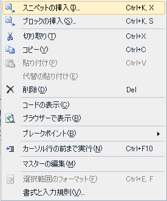
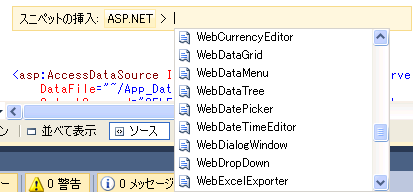

////

|metadata|
{
    "name": "markup-snippet-support",
    "controlName": [],
    "tags": ["API","Design Environment"],
    "guid": "18630360-c451-409f-b858-dfb6533034d9",  
    "buildFlags": [],
    "createdOn": "2010-06-03T15:12:11.246445Z"
}
|metadata|
////

= マークアップ スニペットのサポート

== マークアップ コード スニペット

弊社の新しいリリースは、Infragistics コントロールでマークアップ コード スニペットをサポートします。

== マークアップ スニペットの使用方法

希望する aspx フォームを右クリックし、[スニペットの挿入] > [ASP.NET] を選択し、ダブルクリックして希望のスニペットを選択します。

たとえば、WebDataTree™ をダブルクリックすると、以下のマークアップ コードが生成されます。

<ig:WebDataTree runat="server" Height="300px" Width="200px">

</ig:WebDataTree>  

時間節約機能としてコントロールごとのショートカットもあります。たとえば、"igdt" と入力して TAB を押すと、以下のような同じコードを受け取ります。