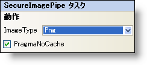

////

|metadata|
{
    "name": "secureimagepipe-smart-tag",
    "controlName": ["WebChart"],
    "tags": ["Design Environment"],
    "guid": "{C3E78067-487B-4B0F-8157-D1E7A8528D8B}",  
    "buildFlags": [],
    "createdOn": "2007-05-02T07:56:25Z"
}
|metadata|
////

= SecureImagePipe スマート タグ

Visual Studio 2005（.NET Framework 2.0）では、それぞれの {ProductName} コントロール/コンポーネントが固有のスマート タグを備えています。 コントロール/コンポーネントを選択するだけで、Smart Tag のアンカーが表示されます。このアンカーをクリックするとポップアップ パネルが表示され、そこからコントロール/コンポーネントの最もよく使用するプロパティや設定にすばやく簡単にアクセスできます。

SecureImagePipe スマート タグには、以下のセクションが含まれます。

* 動作 -- AllowPaging などの一般的なプロパティに簡単にアクセスできます。このセクションからテンプレートを編集することもできます。

各セクションの項目（たとえば、フィールド、ドロップダウン リスト、チェックボックス）およびプロパティ グリッドの項目の対応するプロパティの説明については以下を参照してください。

[options="header", cols="a,a,a"]
|====
|動作|説明|対応するプロパティ

|ImageType
|チャートをストリームとして読み込むのに使用するイメージ ファイル形式を指定できます。
| pick:[asp-net="link:{ApiPlatform}webui.ultrawebchart{ApiVersion}~infragistics.webui.ultrawebchart.secureimagepipe~imagetype.html[ImageType]"] 

|PragmaNoCache
|ブラウザにチャート画像の設定をキャッシュします。
| pick:[asp-net="link:{ApiPlatform}webui.ultrawebchart{ApiVersion}~infragistics.webui.ultrawebchart.secureimagepipe~pragmanocache.html[PragmaNoCache]"] 

|====