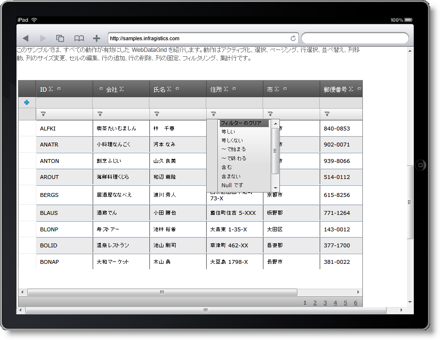
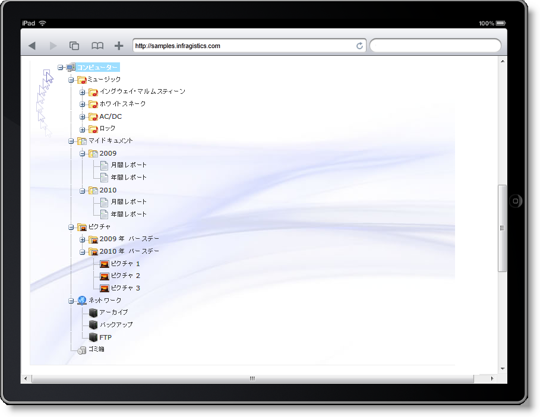

////
|metadata|
{
    "name": "touch-support-in-netadvantage-for-aspnet",
    "controlName": [],
    "tags": ["Application Scenarios","FAQ","Getting Started","How Do I"],
    "guid": "4ac8de04-66c0-4c4b-a062-159aae0d2135",
    "buildFlags": [],
    "createdOn": "2011-10-25T08:39:46.751839Z"
}
|metadata|
////

= {ProductName} でのタッチ サポート

== トピックの概要

== 目的

このトピックでは、{ProductName} コントロールのタッチ サポートについて説明し、このサポートの実装に伴って各コントロール機能に加えられた変更および制約に関する詳細を明らかにします。

== このトピックの構成

このトピックには次のセクションがあります。

* <<tablet_programming_overview,タブレット プログラミングの概要>>

** <<general_programming_requirements,タブレット プラットフォームの一般的なプログラミング要件>>
** <<event_handling,タブレット プラットフォームにおけるイベントの処理>>

* <<touch_support_overview,{ProductName} {ProductVersion} タッチ サポートの概要>>

** <<supported_controls,サポートされるコントロール>>
** <<touch_support_scope,タッチ サポートの範囲>>

* <<control_specific_information,タッチ サポートに関するコントロールに固有な情報>>

** <<wdg_whdg_touch_support,WebDataGrid および WebHierarchicalDataGrid のタッチ サポート>>
** <<wdt_touch_support,WebDataTree のタッチ サポート>>
** <<wdm_touch_support,WebDataMenu のタッチ サポート>>
** <<wvp_touch_support,WebVideoPlayer のタッチ サポート>>

* <<related_topics,関連トピック>>
* <<related_articles,関連記事>>

== はじめに

{ProductName} {ProductVersion} パックでは、対応プラットフォームが拡大し、タブレットもカバーされるようになっています。このパックでは、ドラッグ アンド ドロップを除いて ASP.NET コントロールと同じ機能が使用できるようになっています。

Infragistics タッチ サポートには、タブレットでのアプリケーションの実行に不可欠なスクロール機能も含まれます。スクロール可能なコントロール (<<supported_controls,「サポート対象コントロール」>>を参照) をデザインし直した結果、特別なスタイルを用意することで、クリック可能な領域が広がり、タブレット環境での要件に合わせたレンダリングが実装され、対応プラットフォームとの連携が取りやすくなりました。

== タブレット プログラミングの概要

== タブレット プラットフォームの一般的なプログラミング要件

タブレットは、ユーザーによるデバイスの操作方法が PC と異なります。ユーザーは指先だけでタブレットの画面に触れて画面の操作を行います。また、タブレットでは、Web ページのコンテンツを表示してユーザーの応答を取得するためのアーキテクチャーも異なります。どのようなサイトについてもタブレットプラットフォームで実行するためにはタブレットの要件に合わせてサイトをデザインしなおす必要があるのはこのためです。ほとんどの場合、タブレットで操作しやすいように新たにタッチ クライアント イベント (ontouchstart、ontouchmove、ontouchend、ontouchcancel) を導入してサイトのコンテンツをデザインしなおすことになります。個々の要件はブラウザーやプラットフォームによって異なります。

ここでは、タブレット プログラミングについて詳しく説明しません。詳細については、 link:http://developer.apple.com/library/safari/#documentation/AppleApplications/Reference/SafariWebContent/Introduction/Introduction.html[Safari における開発]を参照してください。

== タブレット プラットフォームにおけるイベントの処理

タブレットでコントロールを実行するには、こうしたプラットフォームに固有な各種イベント、つまり、以下のイベントをサポートする必要があります。

* 1 フィンガー イベント - 1 本の指を使用したとき、たとえば、ページをスクロールしたときやページ上の任意の場所をクリックしたときに発生するイベント
* 2 フィンガー イベント - 2 本の指を使用したとき、たとえば、ズームインやズームアウトを行ったときに発生するイベント
* オリエンテーション イベント - デバイスを回転させたときに発生するイベント

上記のようなタイプのエベントは、ユーザー インタラクションの性質と、タブレットでのユーザー インタラクションの認識方法を反映したものです。イベントやジェスチャーの処理に関する詳細は、Safari 開発者ライブラリーにある link:http://developer.apple.com/library/safari/#documentation/AppleApplications/Reference/SafariWebContent/HandlingEvents/HandlingEvents.html[イベントの処理]を参照してください。.

== {ProductName} {ProductVersion} タッチ サポートの概要

== サポートされるコントロール

{ProductName} スィートに含まれるコントロールはタブレット プラットフォームで使用可能なものです。このドキュメントでは、タブレット プラットフォームを完全にサポートするように改良された以下のコントロールについて簡単に説明します。

* WebDataGrid
* WebHierarchicalDataGrid
* WebDataTree
* WebDataMenu
* WebVideoPlayer

== タッチ サポートの範囲

こうしたコントロールが完全にサポートされるということは、つまり、次の条件が満たされているということです。

* そのコントロールがタブレット プラットフォームにおいて表示可能であること
* タッチに固有なイベントのすべてに対応していること
* 所定のサイズに収まること

タブレットには固有の制約があるため、ドラッグ アンド ドロップ動作はサポートされません。ドラッグ アンド ドロップ動作を伴うコントロールのなかには、コード ビハインドを使用してタブレット上で同じ効果を実現できるものもあります。たとえば、コード ビハインドで WebDataGrid の列を初めからグループ分けしておくことができますが、ランタイムで動的にグループ分けすることはできません。

== タッチ サポートに関するコントロールに固有な情報

以下の各ブロックでは、サポートされるコントロールごとにタッチサポートの詳細を明らかにします。

== WebDataGrid および WebHierarchicalDataGrid のタッチ サポート

*図 : iPad Safari ブラウザーに表示する WebHierarchicalGrid の実装*

WebDataGrid または WebHierarchicalDataGrid のいずれかは、上の写真に示すとおり、タブレット ブラウザーでも、PC ブラウザーの場合と同じように表示されます。ただし、こうしたコントロールのユーザー インターフェイス動作には若干の相違があります。

表 1 は、タブレットに固有なビヘイビアーをコントロール機能ごとにまとめて、いくつかの特殊なケースについて注意を喚起し、「ふつう」の PC ベース ブラウザー ビヘイビアーとの相違点を示したものです。

*表 1: タブレットにおける WebDataGrid/WebHierarchicalDataGrid 機能のビヘイビアー*

凡例:

image:images/workaround.png[]- PC の場合と同じように動作する機能。

image:images/workaround.png[]! - 動作に制限のある機能。

image:images/workaround.png
[]image:images/gsm.png[]- タブレット環境に固有な制限により、PC にの場合とは動作が若干異なる機能。

image:images/noworkaround.png[] - 使用できない機能。

image:images/noworkaround.png[] 
image:images/tobeUpdated.png[]- 使用できませんが、別の方法で実現可能な機能。

[options="header", cols="a,a,a"]
|====
|機能|機能レベル|動作説明

|アクティベーション
|image::images/workaround.png[]
|PC における場合と同じ。

|列の固定
|image::images/workaround.png[]
|PC における場合と同じ。機能イメージの列固定アイコンをクリックする必要があります。

|列の移動
|image::images/noworkaround.png[] 

image::images/tobeUpdated.png[]
|ドラッグ アンド ドロップに対応していないため、実行時には使用できませんが、コード ビハインドで設定できます。

|列サイズの変更
|image::images/noworkaround.png[] 

image::images/tobeUpdated.png[]
|ドラッグ アンド ドロップに対応していないため、実行時には使用できませんが、クライアントまたはサーバー コードで設定できます。

|ドラッグ アンド ドロップ
|image::images/noworkaround.png[]
|使用できません。

|コアの編集
|image::images/workaround.png[]
|PC における場合と同じ。(列の追加、更新、および削除)

|展開/縮小 (WebHiearchicalDataGrid のみ)
|image::images/workaround.png[] 

image::images/gsm.png[]
|指でタップしやすくするために、展開画像をはじめとした HTML TD 要素全体がリンクになっています。

|フィルタリング
|image::images/workaround.png[] 

!
|絞り込みの条件を入力すると、Safari のバグによりフィルターがフォーカスを失います。このため、指でタップしてフォーカスを取り戻す必要があります。このバグは、iOS4 およびそれ以前のバージョンに見られるものです。

|グループ分け
|image::images/noworkaround.png[] 

image::images/tobeUpdated.png[]
|ドラッグ アンド ドロップには対応していませんが、コード ビハインドを使用してグループ分け専用のグルーピング機能を実装しておくことは可能です。

|ページング
|image::images/workaround.png[] 

image::images/gsm.png[]
|PC における場合と同じ。ページング機能は使えますが、ページング アイコンを正確にタッチする必要があります。

|スクローリング
|image::images/workaround.png[]
|慣性サポートを含めたスクローリング機能が使用できます。

|選択 (単選択)
|image::images/workaround.png[]
|PC における場合と同じ。グリッドの行やセルにおいても、ツリー ノードにおいても単一選択が行えます。

|選択 (複数選択)
|image::images/noworkaround.png[]
|使用できません。

|並べ替え
|image::images/workaround.png[]
|PC における場合と同じ。並べ替えを行うためには列の見出しをタップする必要があります。

|集計
|image::images/workaround.png[]
|集計機能は使えます。HTML LI 要素の内側をクリックすると、チェックボックスのマークが外れて集計機能の動作状態 (有効/無効) が切り替わります。

|====

== WebDataTree のタッチ サポート

*図 : iPad のブラウザーに表示する WebDataTree の実装*

WebDataTree は、タブレット ブラウザーにおいても、PC ブラウザーにおける場合と同じように表示されますが、ツリーのユーザー インターフェイスには若干の相違点があります。表 2 は、タブレットに固有なビヘイビアーをコントロール機能ごとにまとめて、いくつかの特殊なケースについて注意を喚起し、「ふつう」の PC ベース ブラウザー ビヘイビアーとの相違点を示したものです。

*表 2: タブレットにおける WebDataTree 機能のビヘイビアー*

凡例:

image:images/workaround.png[] PC の場合と同じように動作する機能。

image:images/workaround.png[]! 動作に制限のある機能。

image:images/workaround.png[]image:images/gsm.png[] タブレット環境に固有な制限により、PC にの場合とは動作が若干異なる機能。

image:images/noworkaround.png[] 使用できない機能。

image:images/noworkaround.png[]image:images/tobeUpdated.png[] 使用できませんが、別の方法で実現可能な機能。

[options="header", cols="a,a,a"]
|====
|機能|機能レベル|説明

|アクティベーション
|image::images/workaround.png[]
|PC における場合と同じ。PC ブラウザーにおける場合と同じ動作。

|チェックボックス
|image::images/workaround.png[] 

image::images/gsm.png[]
|2 状態モードと 3 状態モードの動作モードが使用できます。

|ドラッグ アンド ドロップ
|image::images/noworkaround.png[]
|使用できません。

|展開/縮小
|image::images/workaround.png[]
|PC における場合と同じ。PC ブラウザーにおける場合と同じ動作。

|ノードの編集
|image::images/workaround.png[] 

image::images/gsm.png[]
|タブレットで WebDataTree が実行されているときにノードの編集を行うには、EnableOnSingleClickWhenActive を有効にします。これにより、ノードの編集が可能になります。ノードのキャプションをクリックすると、WebDataTree 内のノードを編集できるようになります。

|選択 (複数選択)
|image::images/noworkaround.png[] 

image::images/tobeUpdated.png[]
|複数選択はサポートされていないため、チェックボックスを使用して選択を行います。

|選択 (単選択)
|image::images/workaround.png[]
|PC における場合と同じ。

|====

== WebDataMenu のタッチ サポート

image::images/Touch_Support_in_NetAdvantage_for_ASPNET_03.png[]

*図 : iPad の Safari で WebDataMenu を表示したときの画像*

WebDataMenu は、タブレット ブラウザーにおいても、PC ブラウザーにおける場合と同じように表示されますが、メニューのユーザー インターフェイスには若干の相違点があります。表 3 は、タブレットに固有なビヘイビアーをコントロール機能ごとにまとめて、いくつかの特殊なケースについて注意を喚起し、「ふつう」の PC ベース ブラウザー ビヘイビアーとの相違点を示したものです。

*表 3: タブレットにおける WebDataMenu 機能の動作*

凡例:

image:images/workaround.png[] PC の場合と同じように動作する機能。

image:images/workaround.png[]! 動作に制限のある機能。

image:images/workaround.png[]image:images/gsm.png[]  タブレット環境に固有な制限により、PC にの場合とは動作が若干異なる機能。

image:images/noworkaround.png[]  使用できない機能。

[options="header", cols="a,a,a"]
|====
|機能|機能レベル|説明

|選択
|image::images/workaround.png[]
|PC における場合と同じ。PC ブラウザーにおける場合と同じ動作。

|スクローリング
|image::images/workaround.png[] 

image::images/gsm.png[]
|スクロール ボタンをタップすると、メニューがスクロールしはじめ、メニュー リストが終わるまでスクロールしつづけます。リストの途中でスクロールを止めたい場合には、ブラウザーの内側をタップしてスクロールを止める必要があります。

|クリックによるメニューのクローズ
|image::images/workaround.png[]
|PC における場合と同じ。PC ブラウザーにおける場合と同じ動作。

|アクティベーション
|image::images/workaround.png[]
|PC における場合と同じ。PC ブラウザーにおける場合と同じ動作。

|展開/縮小
|image::images/workaround.png[]
|PC における場合と同じ。PC ブラウザーにおける場合と同じ動作。

|サブメニューの展開/縮小
|image::images/workaround.png[] 

image::images/gsm.png[]
|サブメニューを備えた項目を 1 度タップすると、その項目のサブメニューが開き、もう 1 度タップすると、そのサブメニューにあるオプションが選択されます。

|サイズ変更
|image::images/workaround.png[] 

image::images/gsm.png[]
|PC における場合と同じ。画面のサイズが小さすぎてコンテンツ全体を表示しきれない場合はスクロール バーが表示されます。

|====

== WebVideoPlayer のタッチ サポート

WebVideoPlayer をモバイル デバイスで実行する場合、 link:http://modernizr.com/[Modernizr] JavaScript ライブラリが未定義でなければ、デバイスのデフォルトのビデオ プレーヤーコントロールを描画します。Modernizr ライブラリがページで利用できない場合、igVideoPlayer コントロールを描画します。この場合、デフォルト デバイス ビデオ プレーヤーよりタッチ機能が少ない場合があります。このため、Modernizr ライブラリが利用可能な場合に、igVideoPlayer はデフォルトのデバイス ビデオ プレーヤーに戻ります。

== 関連トピック

link:web-whats-new.html[新機能]

link:known-issues-known-issues-and-breaking-changes-revision-history.html[既知の問題]

link:webdatagrid-api-overview.html[WebDataGrid の概要]

link:webhierarchicaldatagrid-api-overview.html[WebHierarchicalDataGrid の概要]

link:webdatatree-api-overview.html[WebDataTree の概要]

link:webdatamenu-api-overview.html[WebDataMenu の概要]

== 関連記事

link:http://developer.apple.com/library/safari/#documentation/AppleApplications/Reference/SafariWebContent/HandlingEvents/HandlingEvents.html[イベントの処理]

link:http://modernizr.com/[Modernizr]