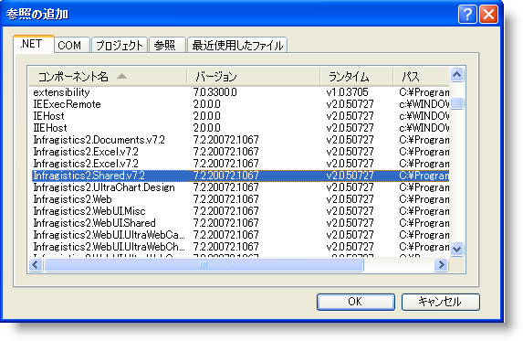

////
|metadata|
{
    "name": "web-adding-an-assembly-to-a-project",
    "controlName": [],
    "tags": ["FAQ","Getting Started"],
    "guid": "{95A46BFB-7D61-47F0-8F18-C6FB6D114BA2}",
    "buildFlags": [],
    "createdOn": "0001-01-01T00:00:00Z"
}
|metadata|
////

= アセンブリのプロジェクトへの追加

通常は、{ProductName} アセンブリ参照をプロジェクトに手動で追加する必要はありません。なぜならば、{ProductName} ツールをデザイン表面に配置すると、Visual Studio® が自動的に適切な参照をプロジェクトに追加するからです。ただし、プロジェクトにアセンブリへの参照を手動で追加する必要が生じることもあります。アセンブリは、Visual Studio プロジェクトに簡単に追加することができます。

*注：* アプリケーションで使用する {ProductName} アセンブリを配置する方法については、 link:web-deploying-your-application.html[アプリケーションの配備]を参照してください。

*アセンブリをプロジェクトに追加するには、以下の手順に従ってください。*

[start=1]
. ソリューション エクスプローラーで、Web サイトを右クリックして [参照の追加] を選択します。その代わりに、Website メニューから [参照の追加] を選択できます。

[start=2]
. 追加したいアセンブリを指定して OK をクリックします。アセンブリ参照が追加されます。

[参照の追加] ダイアログ ボックスでは、一度に複数の参照を選択して、追加できます。プロジェクトに複数の参照を追加する方法の詳細については、MSDN ライブラリで次のトピックを参照してください。

* link:http://msdn.microsoft.com/ja-jp/library/ez524kew.aspx[プロジェクト参照の管理]
* link:https://msdn.microsoft.com/en-us/library/7314433t(v=vs.71).aspx[プロジェクト参照の追加また削除] (英語)
* link:https://msdn.microsoft.com/ja-jp/library/wkze6zky.aspx[参照の追加ダイヤログで参照の追加また削除]