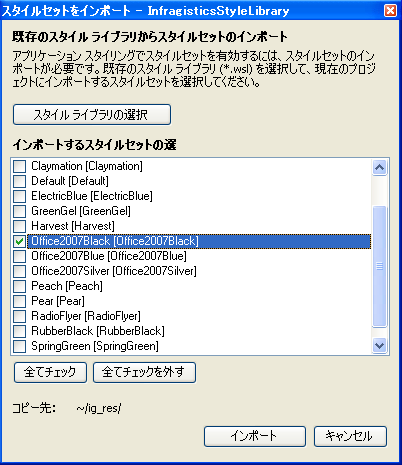

////

|metadata|
{
    "name": "web-enabling-application-styling-using-the-netadvantage-application-styling-configuration-tool",
    "controlName": [],
    "tags": ["Design Environment","Styling"],
    "guid": "{027AF003-843A-4C6C-BF59-A777C56A1E80}",  
    "buildFlags": [],
    "createdOn": "2006-07-12T11:48:09Z"
}
|metadata|
////

= Infragistics アプリケーション スタイリング構成ツールを使用してアプリケーション スタイリングを有効にする

*注:* アドインは Visual Studio 2015 以降廃止されました。Microsoft® Visual Studio® 2015 からプロジェクトに直接スタイルを適用する場合、Infragistics AppStyling Extension を使用できます。アドインのすべての機能は保持され、このトピックを参照に使用できます。拡張を実行するには、*ツール* のメニューを開き、Infragistics AppStyling Extension 16.2 を選択します。Microsoft® Visual Studio® の以前のバージョンをご使用の場合もアドインを使用できます。

2015.2 および 2015.1 用に個別の .vsix インストーラーがあります。

Microsoft® Visual Studio® のアドインである Infragistics Application Styling Configuration を使用して、デザインタイムにアプリケーションスタイリングを有効にできます。このアドインによって、ひとつのシンプルなコンソールからアプリケーションスタイリングのさまざまな側面を制御することができます。詳細は、 link:web-netadvantage-application-styling-configuration-tool.html[「Infragistics Application Styling Configuration ツール」]を参照してください。

*Infragistics Application Styling Configuration ツールを使用してアプリケーション スタイリングを有効にするには、次の手順に従ってください。*

[start=1]
. アプリケーション スタイリングを有効にしたいプロジェクトを開きます。

image::images/Web_Enabling_Application_Styling_Using_the_NetAdvantage_Application_Styling_Configuration_Tool_01.png[]

[start=2]
. [ツール] メニューで、Infragistics Application Styling Configuration を選択します。構成ツールが開きます。
[start=3]
. [このプロジェクトのアプリケーション スタイリングを有効にする] チェックボックスを選択して、アプリケーション スタイリングをオンにします。これによって、このチェックボックスの下にあるすべてのオプションを有効になります。
[start=4]
. [スタイルセットをインポート] をクリックします。[スタイルセットをインポート] ダイアログ ボックスが開きます。
[start=5]
. ダイアログ ボックスで、プロジェクトにインポートしたいスタイルセットを選択して、[OK] をクリックします。

*注：* [スタイルセットをインポート] ダイアログ ボックスに表示されたスタイルセットは、デフォルトのアプリケーション スタイリングのソース パスでの選択に使用できるものと同じです。このパスを変更する方法は、 link:web-netadvantage-application-styling-configuration-tool.html[「Infragistics Application Styling Configuration ツール」]を参照してください。

[start=6]
. [アプリケーション スタイルセット] ドロップダウン リストから、使用したい新たにインポートしたスタイルセットを選択します。
[start=7]
. [適用]、そして [OK] をクリックします。
[start=8]
. プロジェクトはアプリケーション スタイリングを使用するように構成され、選択したスタイルセットをすべての {ProductName} コンポーネントに適用します。