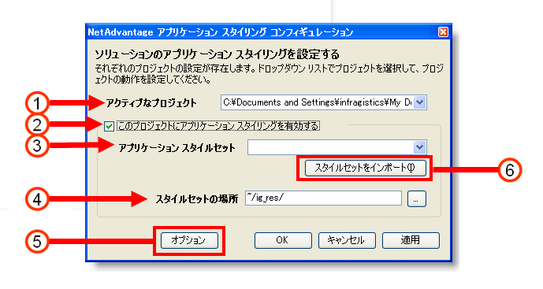
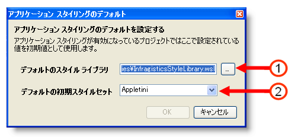

////

|metadata|
{
    "name": "web-netadvantage-application-styling-configuration-tool",
    "controlName": [],
    "tags": ["Design Environment","Styling"],
    "guid": "{88CB50AF-A6DC-4F17-B63A-F5DFC81A10C3}",  
    "buildFlags": [],
    "createdOn": "2006-01-12T08:39:53Z"
}
|metadata|
////

= Infragistics アプリケーション スタイリング構成ツール

*注:* アドインは Visual Studio 2015 以降廃止されました。Microsoft® Visual Studio® 2015 からプロジェクトに直接スタイルを適用する場合、Infragistics AppStyling Extension を使用できます。アドインのすべての機能は保持され、このトピックを参照に使用できます。拡張を実行するには、*ツール* のメニューを開き、Infragistics AppStyling Extension 16.2 を選択します。Microsoft® Visual Studio® の以前のバージョンをご使用の場合もアドインを使用できます。

2015.2 および 2015.1 用に個別の .vsix インストーラーがあります。

Infragistics Application Styling Configuration ツールは、Infragistics AppStylist™ for ASP.NET を使用して作成した Application Styling Framework™（ASF）スタイルセットライブラリを用いて、Microsoft® Visual Studio®  内から直接プロジェクトをスタイルするための便利な方法を提供します。

このツールは、Visual Studio 内からアクセス可能なアドインです。インストールした任意の ASF スタイルセット（一貫してテーマ化された CSS ファイルとグラフィック画像のライブラリ）を適用できます。{ProductName} 製品には、{ProductName} コントロール用のビジュアル デザイナによって作成された多数の事前に定義された ASF スタイルセットが含まれます。Infragistics AppStylist を使用すると、ビジュアル デザイナは ASP.NET アプリケーション用の追加の ASF スタイルセットを作成できます。

Infragistics Application Styling Configuration ツールを使用すると、[このプロジェクトのアプリケーション スタイリングを有効にする] チェックボックスを選択するとアプリケーションに表示する {ProductName} コントロールで ASF のサポートをオンまたはオフに切り替えることもできます。ASF デフォルト設定を構成することで構成ツールは時間を節約します。このデフォルト設定は Web アプリケーションの Web.Config ファイルに自動的に保存されます。

Infragistics Application Styling Configuration ツールの各オプションの説明は以下を参照してください。

[start=1]
. *アクティブなプロジェクトを選択*  -- アプリケーション スタイリングはプロジェクトごとに有効に設定されます。ご使用のソリューションに複数のプロジェクトが含まれている場合には、このドロップダウン リストを使用してプロジェクトを切り替えることができます。
[start=2]
. *このプロジェクトのアプリケーション スタイリングを有効にする* -- 指定したプロジェクトに対してアプリケーション スタイリングを有効にしたい場合にこのチェックボックスを選択します。このチェックボックスが選択されると、必要なコードが Web.Config ファイルに追加されます。
[start=3]
. *アプリケーション スタイルセットを選択* -- アプリケーション スタイリングが有効な場合に、プロジェクトが使用するスタイルセットを指定します。
[start=4]
. *スタイルセットのパス* -- アプリケーション スタイリングがローカル プロジェクトでスタイルセットのファイルを検索する場所を指定します。
[start=5]
. *オプション* -- [アプリケーション スタイリング オプション] ダイアログ ボックスが開きます。詳細は、「アプリケーション スタイリング オプション ダイアログ ボックス」を参照してください。
[start=6]
. *スタイルセットのインポート* -- スタイルセットをプロジェクトにインポートできます。これによって、[アプリケーション スタイルセット] ドロップダウン リストからスタイルセットを選択できます。

== アプリケーション スタイリング オプション ダイアログ ボックス

このダイアログ ボックスの各オプションの説明は以下を参照してください。

[start=1]
. *デフォルトのスタイル ライブラリ* -- Infragistics Application Styling Configuration ツールで [スタイルセットのインポート] ボタンをクリックした後でスタイルセットをプロジェクトにインポートできる場所を指定します。
[start=2]
. *デフォルトの初期スタイルセット* -- アプリケーション スタイリングが有効なプロジェクトに適用されるスタイルセットを指定します。このドロップダウン リストは [アプリケーション スタイルセット] ドロップダウン リストにあるスタイルセットを指定しません。