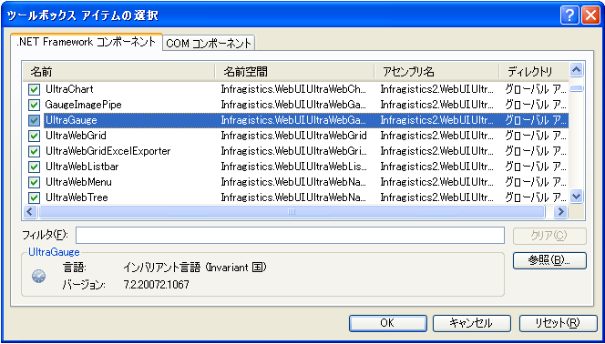
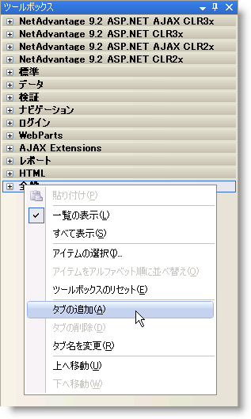

////
|metadata|
{
    "name": "web-netadvantage-web-client-aspnet",
    "controlName": [],
    "tags": ["Getting Started"],
    "guid": "{B5128545-997D-4005-9F8C-A9F8452E6F1A}",
    "buildFlags": [],
    "createdOn": "0001-01-01T00:00:00Z"
}
|metadata|
////

= {ProductName} 20{ProductVersion}

{ProductName} の使用を開始する前に、このセクションのトピックを最後まで読むと、製品の概要を理解することができます。

* <<ASP_Using_The_Help,ヘルプの使用>>
* link:web-application-styling-framework-asf.html[Application Styling Framework (ASF)]
* <<ASP_Installing_NetAdvantage,{ProductName} のインストール>>
* <<ASP_Running_Product_Samples,ASP.NET 製品サンプルの実行>>
* <<ASP_Get_Support,サポートについて>>

[[ASP_Using_The_Help]]

== ヘルプの使用

これらのセクションはヘルプをナビゲートしているときにユーザーを支援するために設計されています。以下のセクションは、ヘルプへの変更または新規追加が含まれています。

== ヘルプ機能

{ProductName} のコントロールとコンポーネントを理解し、使用するために必要な情報が {ProductName} のヘルプで提供されています。

注: {ProductName} をインストールしても、Help Center が自動的にインストールされなくなりました。{ProductName} の使い方に関するヘルプは、インストールされたヘルプまたはオンライン ヘルプを参照するか、ASP.NET のサンプル ブラウザーを参照してください。

=== タブ

インストールした {ProductName} のヘルプは、ヘルプ ウィンドウの左側ペインの下部に以下のタブが示されます。

** *目次* -- オンライン ヘルプのすべての項目のブックとページが示されます。いずれかのブックをダブルクリックして展開すると、その内容（下位のブックやページ）を見ることができます。[目次] タブには、ヘルプの構造と、トピックを簡単に移動するための方法が表示されます。
** *索引* -- ヘルプ内のトピックに関連したキーワードのリストが表示されます。何か単語を入力すると、入力した語に近い語に自動的にスクロールして移動します。[索引] タブから、ヘルプ内のすべてのキーワードのアルファベット順のリストを表示することができます。
** *ヘルプのお気に入り* -- [標準] ツールバーから [ヘルプのお気に入りに追加] ボタンを使用してブックマークを付けたヘルプ トピックまたは Web サイトのリストが表示されます。また、[標準] ツールバーの [検索の保存] ボタンを使用して保存した検索クエリを表示することもできます。

ヘルプ ウィンドウの右側のペインの上部には、次の 2 つのタブがあります。

** *ヘルプ トピック* -- ヘルプ トピックを表示します。
** *検索* -- ヘルプ内の特定の語を検索できます。このタブを使うと、検索した語の 1 つ以上が含まれるトピックのリストが生成され、[検索] タブの主要領域にトピックのリストが表示されます。

オンラインの {ProductName} ヘルプでは、左側のペインは [目次] と [検索] の 2 つのタブで構成されます。

=== フィルター

弊社は膨大なヘルプを提供しているので、インストールされた {ProductName} ヘルプにフィルターを提供し、探している情報が簡単に見つかるように配慮しています。フィルターによって、[目次] および [索引] タブに表示される結果を絞り込むことができます。

===== フィルターを適用するには、次の手順に従ってください。

左側のウィンドウ ペインの上で、[フィルター] ドロップダウン リストからフィルター項目を選択します。以下のタブに表示される結果は、指定したフィルターに基づいて自動的にフィルタリングされます:

** 目次
** インデックス

注:フィルターの適用後にヘルプを閉じると、このフィルターは次回にヘルプを開いた時に自動的に適用されます。

===== フィルターをクリアするには、次の手順に従ってください。

.. 左側のウィンドウ ペインの上で、[フィルター] ドロップダウン リストから [Infragistics ソフトウェア] を選択します。
.. ヘルプにそのコンテンツすべてが表示され、最後に適用されたフィルターをクリアします。

=== ナビゲーション可能なページ

ヘルプの各セクションには下位のすべてのセクションまたはトピックへのリンクが設定されており、必要な情報を簡単に検索することができます。

== インストールされたヘルプ フィルタ カテゴリー

2007 Volume 3 では、インストールされたヘルプの [目次] および [索引] ペイン上の [フィルター] ドロップダウン リストで使用可能なフィルターが改良され、フィルター数を最小限に抑えました。コントロールはカテゴリーに配置され、これらのカテゴリーがドロップダウン リストで使用可能となります。以下の表は使用可能なカテゴリーとどのカテゴリーにどのコントロール/フレームワークが属するのかを示します。

注: 一部のノードは、各カテゴリーの下にリストされるノードに加えて表示される場合があります。エクストラ ノードが発生します。エクストラ ノードの下のトピックが選択したカテゴリーに表示すべきノードの下にもあるからです。

[options="header", cols="a,a"]
|====
|カテゴリ|ASP.NET

|*Infragistics ソフトウェア*
|すべてのコンテンツが表示されます

|*アプリケーション スタイリング*
|
* Application Styling Framework 

* WebPageStyler 

|*チャートとゲージ*
|
* GaugeImagePipe 

* SecureImagePipe 

* WebChart 

* WebGauge 

|*コンテンツ レイアウトとコンテナー*
|
* WebDialogWindow 

* WebGroupBox 

* WebResizingExtender 

* WebSplitter 

* WebTab 

|*エディター*
|
* WebMonthCalendar 

* WebCurrencyEditor 

* WebDatePicker 

* WebDateTimeEditor 

* WebHtmlEditor 

* WebMaskEditor 

* WebNumericEditor 

* WebPercentEditor 

* WebSlider 

* WebTextEditor 

* WebUpload 

|*その他*
|
* WebImageButton 

* WebVideoPlayer 

|*グリッドとデータ プレゼンテーション*
|
* WebDropDown 

* WebDataGrid 

* WebHierarchicalDataGrid 

* WebHierarchicalDataSource  

* WebDocumentExporter 

* WebExcelExporter 

* WebWordExporter 

|*ライブラリとエンジン*
|
* Infragistics Excel Engine 

* Infragistics Document Engine 

* Infragistics Word ライブラリ 

* WebCalcManager 

|*ナビゲーション*
|
* WebImageViewer 

* WebDataMenu 

* WebExplorerBar 

* WebTab 

* WebDataTree 

|*スケジュール*
|
* WebCalendarView 

* WebDayView 

* WebMonthView 

* WebSchedule 

* WebScheduleInfo 

* WebScheduleOleDbProvider 

* WebScheduleSqlClientProvider 

|====

[[ASP_Installing_NetAdvantage]]

== {ProductName} のインストール

以下のトピックは、{ProductName} のインストールに関する重要なヒントと注意事項を説明します:

==== Windows Vista に {ProductName} をインストール

{ProductName} 2006 Volume 3（CLR 2.0）リリースから開始しましたが、Microsoft® Windows® Vista オペレーティング システムに {ProductName} をインストールできます。Vista への {ProductName} の正常なインストールについての重要な情報はさらに読み進んでください。

* Vista をサポートするのは Visual Studio 2005 以降のみで Visual Studio 2003 以前ではサポートされません。したがって、すべての CLR 1.x バージョンの  {ProductName} 製品は Vista ではサポートされません。ただし、スタンドアローン バージョンの Infragistics AppStylist® 製品は Vista にインストールできます。

==== {ProductName} のインストールのヒント

ソフトウェアのインストールは予定どおりにいかない場合があります。ユーザーごとにマシンの設定が異なることが分かっており、{ProductName} を可能な限りスムーズにインストールすることを支援するトラブルシューティングのリストを以下に提供します。

* {ProductName} をインストールするには、管理者としてログインする必要があります。このログインはシステム レジストリをアップデート可能であることが必要です。
* テンポラリ ファイルを含み、インストールに十分なスペースがあることを確認します。デフォルトで、Windows は C:\WINDOWS\Temp ディレクトリにテンポラリ ファイルを保存します。
* {ProductName} および任意の Infragistics のユーティリティ（例：ツールボックス ユーティリティなど）をインストールする間は、Microsoft® Visual Studio® をインストールして閉じておく必要があります。
* インストールはローカル ドライブから実行してください。ネットワーク ドライブからインストールした場合、問題が発生する場合があります。
* トライアル版の {ProductName} をすでにインストールしてある場合には、ソフトウェアをアンインストール/再インストールする必要はありません。インストーラ ファイル（Infragistics_20082_CLR2x.exe など）を適切なディレクトリ（{InstallPath} など）から実行することができ、インストール ウィザードによってプロンプトされたら CD-Key を挿入します。
* インストールの間にライセンス キーが無効というエラーが発生した場合、キーを正しく記入したことを最初に確認します。入力したキーが正しい場合、インストールをキャンセルし（試しにインストールしないでください）、コンピューターを再起動して、再度インストールします。
* ファイル名（すべてのパス情報を含む）は 256 文字を超えることはできません。これは Windows® の制限です。「8.3」表記を使用することで、弊社のインストーラはこれを内部で処理します。たとえば、「C:\Program Files\」は「C:\PROGRA~1\」として参照されます。{ProductName} をインストールするときに長すぎる目的のフォルダー名を提供すると、「ファイルが見つからないか壊れています」というエラー メッセージが表示される場合があります。
* このインストールでは、IIS を中止して再起動してから、ASP.NET のアセンブリ、スクリプトおよび仮想フォルダーをインストールします。これは DEVELOPER のインストール パッケージです。配備するためにこのインストールを使用することはできません。配備に関するトピックは、製品のヘルプを参照してください。
* {ProductName} の複数のコンポーネントを組み合わせてインストールしてから後でそのひとつを削除した場合、既知の問題を発生する可能性があります。これらの問題を解決するには、適切な {ProductName} 製品を再インストールしてください。
* IIS が Windows® Vista™ にインストールされる場合、{ProductName} インストーラを実行する前に特定の手順に従う必要があります。これらの手順は、Infragistics ナレッジ ベースの記事 link:http://devcenter.infragistics.com/Support/KnowledgeBaseArticle.aspx?ArticleID=9983[「Installing {ProductName} on Windows Vista」]に文書化されています。以下の手順を実行してから、{ProductName} を正常にインストールすることができます。
* Infragistics AppStylist for ASP.NET をインストールしており、インストールした Infragistics Style Library ($$*$$.isl) ファイルまたは Web Style Library ($$* $$.wsl) ファイルのいずれかをそれぞれ修正して、後で使用するために変更を保存したい場合には、変更を別ファイルで必ず保存してください。これによって、カスタマイズした .isl または .wsl ファイルが {ProductName} ホット フィックスによって上書きされたり、{ProductName} のアンインストール中に削除されないことが保証されます。

==== インストールの間にファイルがファイル システムに配置される場所

このトピックは、インストーラーに含まれるファイルとフォルダーがファイル システムに配置される場所を説明します。

===== Excel Engine および Document Engine アセンブリ

{InstallPath}\CLR2xCLR35\Bin

このフォルダーには、Excel Engine および Document Engine のアセンブリが含まれています。

===== Web プリセット

XP -- {InstallPathXP}\\{PlatformName}\Presets\CLR2xCLR35\Web

Vista \ Windows 7 -- {InstallPathVista}\\{PlatformName}\Presets\CLR2xCLR35\Web

このフォルダーには、すべての {ProductName} コントロールおよびコンポーネントのために Infragistics が提供するすべてのインボックス プリセットが含まれます。インターフェイスのエレメントおよびアプリケーション全体で広範なフォーマッティングおよび動作オプションを適用するためにプリセットを使用できます。

以下のとおり 3 つの異なるタイプのプリセットがあります。

* 外観 -- コントロールまたはコンポーネントの視覚的スタイリングの情報を含みます。
* 動作 -- コントロールまたはコンポーネントが動作する方法についての情報を含みます。
* 外観と動作 -- コントロールまたはコンポーネントの視覚的スタイリングとコントロールまたはコンポーネントの動作に関する情報を含みます。

===== Web スタイル

インストールの間に、「Just Me」または「All Users」をインストールするオプションが提供されます。選択に応じて、Templates、Palettes および Styles フォルダーが異なる領域に配置されます。

*XP で「Just Me」オプションが選択される場合*

C:\Documents and Settings\[USERID]\MyDocuments\Infragistics\20{ProductVersion}\\{PlatformName}\StyleLibraries

*XP で「All Users」オプションが選択される場合*

InstallPathXP\\{PlatformName}\StyleLibraries

*Vista の場合* {InstallPathVista}\\{PlatformName}\StyleLibraries

このフォルダーには、ASP.NET 内で使用可能なすべてのスタイルが含まれています。アプリケーションをスタイルするときにスタイルは Application Styling Framework（ASF）によって使用されます。

===== グローバル アセンブリ キャッシュ

C:\WINDOWS\assembly\

デフォルトでは、{ProductName} をインストールすると、コントロールのアセンブリは GAC にインストールされます。

{ProductName} のインストールの詳細は、ASP.NET ヘルプの「アプリケーションの配備」セクションを参照してください。

===== メインの Infragistics インストール フォルダー

{InstallPath}

このフォルダーとそのサブフォルダーイムに使用されるアセンブリだけでなくデザイン タイムに使用される ASP.NET アセンブリが含まれます。その他のファイルには、特定のコントロール（WinSpellChecker によって使用される辞書ファイル）によって依存されるファイルだけでなく、プロジェクト アップグレード ユーティリティなどのユーティリティ アプリケーションが含まれます。

==== ツールボックス ユーティリティの実行

{ProductName} ツールキットで使用可能なすべてのツールを Visual Studio .NET のツールボックスに最も簡単に追加する方法は、Create Visual Studio Toolbox Tab ユーティリティを実行することです。

===== ツールボックス ユーティリティを実行するには、次の手順に従ってください。

[start=1]
. 実行中の Visual Studio .NET のインスタンスをすべて閉じます。
[start=2]
. Windows の [スタート] メニューから次のようにクリックして、ユーティリティを指定します。

*CLR 4.0 :*

[スタート] > [すべてのプログラム] > [Infragistics] > [20{ProductVersion}] > [{PlatformName}] > [ユーティリティ] > [CLR 4.0 用のツールボックス タブの作成]

[start=3]
. このユーティリティが {ProductName} コントロールおよびコンポーネントを Visual Studio ツールボックスにインストールします。コントロールとコンポーネントのインストールは、インストールされている {ProductName} 製品によって異なります。たとえば、Infragistics Windows Forms製品のみがインストールされている場合は、Infragistics Windowsフォームのコントロールとコンポーネントのみがインストールされます。Infragistics Windows Forms と {ProductName} の両方の製品をインストールする場合は、ユーティリティはその両方の製品のコントロールとコンポーネントをインストールします。
[start=4]
. このユーティリティにより Windows Formsと ASP.NET の両製品のコントロールとコンポーネントがインストールされた場合は、Visual Studio でツールボックス内の任意の場所を右クリックし、[すべてのタブを表示] を選択すると、両方の製品のタブが表示されます。

注: Microsoft SQL Server 2005 または SQL Server Management Studio Express（CTP）がインストールされており、Create Visual Studio Toolbox Tab ユーティリティを実行する場合には、SQL Server がレジストリの設定を上書きするためエラーが発生します。この既知の問題と（警告の）回避策については、Infragistics 開発センターのナレッジ ベースの記事、 link:http://devcenter.infragistics.com/Support/KnowledgeBaseArticle.aspx?ArticleID=8624[Toolbox Utility Fails to Load (CLR 2.0)] を参照してください。

==== ツールボックス項目の選択ダイアログ ボックスの使用

{ProductName} コントロール/コンポーネントを Visual Studio .NET ツールボックスに追加するために「ツールボックス ユーティリティの実行」の代替え策として、[ツールボックス項目の選択] ダイアログ ボックスを手動で使用してツールを追加することができます。

===== {ProductName} のコントロールおよびコントロールを手動で追加するには、次の手順に従ってください。

[start=1]
. 新しいツールボックス タブを作成するには、ツールボックス内の任意の箇所を右クリックし、[タブの追加] を選択します。
[start=2]
. ツールボックスの下部の空のフィールドに、「Infragistics {ProductVersion}」と入力して ENTER キーを押します。
[start=3]
. 新たに追加されたタブをクリックします。
[start=4]
. ツールボックス内の任意の箇所を右クリックし、[項目の選択] を選択すると [ツールボックス項目の選択] ダイアログ ボックスが開きます。

[start=5]
. リストをスクロールして、ツールボックスに追加する {ProductName} のコントロールとコンポーネントに対応するチェックボックスを選択します。

注: WebResizingExtender コントロールをツールボックスに追加したい場合、Microsoft(R) ASP.NET 2.0 AJAX 拡張をすでにインストールしてあることを確認します。インストールしていないと、エラー メッセージが表示されます。ASP.NET 2.0 AJAX 拡張をインストールするには、以下のインストーラを実行できます。これは {ProductName} 製品のデフォルトのインストール ディレクトリに配置されます: {InstallPath}\ASPAJAXExtSetup.msi。

[start=6]
. [OK] をクリックします。

==== アセンブリを Bin フォルダーからドラッグ

{ProductName} コントロール/コンポーネントを Visual Studio .NET ツールボックスに追加するために「ツールボックス ユーティリティの実行」の代替え策として、Infragistics のアセンブリを Bin フォルダーから Microsoft® Visual Studio® ツールボックスにドラッグすることができます。

*Infragistics のアセンブリを Bin フォルダーから Visual Studio ツールボックスにドラッグするには、次の手順に従ってください。*

[start=1]
. Visual Studio IDE では、[表示] メニューでツールボックスを選択することによってツールボックスが確実に表示されます。
[start=2]
. ツールボックスで任意の場所を右クリックして ［タブの追加］ を選択します。

[start=3]
. 「{ProductName}」などの意味のある名前をタブに指定します。サフィックスとしてボリューム番号（例、8.1、7.3、7.2、7.1）を追加したい場合もあります。
[start=4]
. 作成したいすべてのタブで手順 2 と 3 を繰り返します。
[start=5]
. Windows エクスプローラーで、{ProductName} アセンブリがインストールされる BIN ディレクトリを指定します。アセンブリには、追加したい DLL が含まれます。

** ASP.NET -- {InstallPath}\CLR3.5\Bin

[start=6]
. Visual Studio ツールボックスに追加したい {ProductName} コントロール/コンポーネントを含む DLL を選択します。
[start=7]
. 手順 2 から 4 で作成した Visual Studio タブの上に DLL をドラッグします。

*注:* すべてのツールをツールボックスに同時に追加する場合、Visual Studio がすべてを追加するために数秒かかる場合があります。

[[ASP_Running_Product_Samples]]

== ASP.NET 製品サンプルの実行

{ProductName} 製品のサンプルを起動するために、[プログラム] メニューのショートカットを使用する場合、「ページが見つかりません」というエラーを受け取る場合があります。このエラーの原因は、ローカルの IIS サーバーがロードを完了する前にページがロードしようとすることです。

この問題を解決するには、以下のいずれかの手順を実行してください。

* IIS サーバーがロードを完了するまで待ってから、ページをリフレッシュします。画面の通知領域（右手下隅）にあるアイコンがあるかどうかでサーバーが実行中かどうかを確認できます。
* IIS サーバーをシャットダウンして、ショートカットを使用して {ProductName} サンプルを起動します。これによって問題が解決します。IIS サーバーは最初にロードされた後はロードに要する時間が短くなるからです。

IIS サーバーがすでに実行中の間にサンプルを読み込むために [プログラム] メニューのショートカットを使用する場合、問題が発生する場合があります。サーバーが既に実行しているポートと同じポートでリンクがサーバーを起動しようとするためです。この問題を解決するには、実行している現在のサーバーを停止します。

[[ASP_Get_Support]]

== サポートについて

{ProductName} のユーザーは、Infragistics によるサポート サービスを受けることができます。

== メンバー プロフィールの作成

link:http://jp.infragistics.com[Infragistics ウェブサイト]のトップメニューから登録者情報 > プロフィールへアクセスし [新規メンバー] ボタンをクリックして link:https://jp.infragistics.com/Membership/NewMemberSignUp.aspx?ReturnUrl=/Membership/Default.aspx?Panel=Downloads?id=REGHISTORY[新規アカウント]を作成してください。新規メンバー フィールドにお客様の最新の情報を入力してください。サポート部門は、お客様の情報に基づいて適切なサポート情報をお送りします。

== 製品キーの登録

メンバー プロファイルを作成したら、 link:http://jp.infragistics.com/Support/RegisterProduct.aspx[製品の登録]ページで製品キーを MemberID に登録します。。この登録により、当社の優れた技術サポート サービスを迅速に、簡単に受けることができます。MemberID はユーザー アカウントに紐付いています。登録を行ったユーザーは、登録した Infragistics 製品に対するサポートを受けることができます。

== MemberID 情報の取得

登録ユーザーは、1 日 24 時間、1 年 365 日、いつでも自分の link:https://jp.infragistics.com/Membership/Default.aspx?Panel=Downloads?id=REGHISTORY#Downloads[登録内容]へアクセスし、購入内容、発行された購読アップグレード、登録キーをオンラインで確認できます。MemberID を使用してログインすると、製品キー、購読サービスとステータスなどの詳細情報を確認できます。

== サポート

当社の link:http://www.infragistics.com/community/forums/default.aspx[コミュニティ サイト] では、多くの貴重な情報が提供されています。コミュニティサイトは、フォーラム、ナレッジベース、 サポート情報、技術関連記事、参照アプリケーションなどその他多くの情報を提供するためのサイトです。インフラジスティックス製品についての最新情報もご覧いただけます。

カスタマー サポート セクションでは、 link:http://jp.infragistics.com/support/default.aspx[サポート ポリシー]他、各種サポート連絡先をご確認いただけます。

注: 電話での技術サポートのご利用は、プライオリティ サポート (有料) が必要です。

Infragistics のいずれかの製品を登録したユーザーは、Infragistics の Web サイトから技術サポートを要求することができます。インシデントをログに記録したり、新しいサポート要求を開始するには、DevCenter にログオンして link:http://jp.infragistics.com/support/default.aspx[サポート要求を提出]し、MemberID を入力します。サンプル プロジェクトを添付する必要があると考える場合は、添付してください。

== 製品のライフ サイクル

Infragistics 製品のライフ サイクル情報は、PDF ファイルで提供されており、次の情報が記載されています。

* Infragistics ツールの名前とバージョン
* 製品保守 (バグ フィックス適用) 期間
* 製品サポート期間
* 製品の状態

link:http://download.infragistics.com/download/pubs/ProductLifeCycle.pdf[ここ]をクリックすると、PDF ファイルをダウンロードすることができます。

アカウント、製品の所有権、登録に関する問題は、 link:mailto:JapanSalesGroup@infragistics.com[JapanSalesGroup@infragistics.com] 宛てに電子メールでご連絡ください。その際には、ユーザー名と製品キー (お分かりの場合) を明記されると、迅速な対応が可能です。また、月曜～金曜 9:00～12:00、13:00～18:00 に 050-1745-6258 までお電話いただくことも可能です。