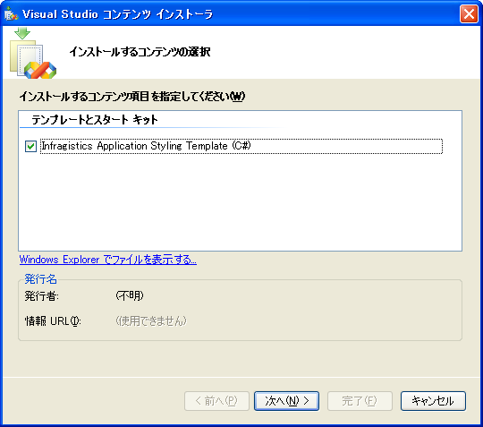
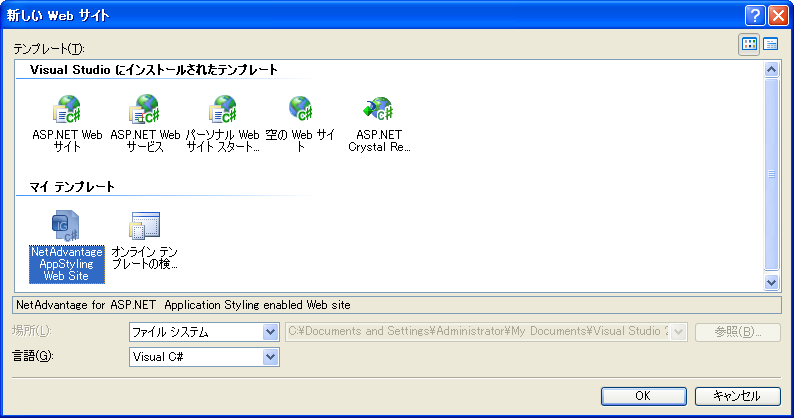
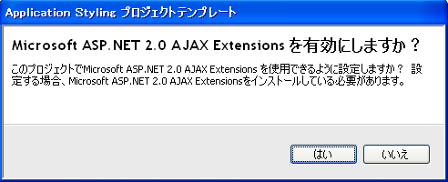

////

|metadata|
{
    "name": "web-using-application-styling-project-templates",
    "controlName": [],
    "tags": ["How Do I","Styling","Templating"],
    "guid": "{D682AE16-4866-415A-B691-CCA1F23A0067}",  
    "buildFlags": [],
    "createdOn": "0001-01-01T00:00:00Z"
}
|metadata|
////

= アプリケーション スタイリング プロジェクト テンプレートを使用

{ProductName} アプリケーション スタイリングは、Microsoft® Visual Studio® .NET 2005 でプロジェクト テンプレートを提供します。これらのプロジェクト テンプレートを使用して、アプリケーション スタイリング対応の空の Web サイトを作成できます。

*アプリケーション スタイリング プロジェクト テンプレートをインストールには、次の手順に従ってください。*

[start=1]
. 以下のデフォルトのショートカット パスからプロジェクト テンプレートにアクセスします:[スタート] > [すべてのプログラム] > Infragistics > {PlatformName} > Get Started > Visual Studio 2005 Starter Kits。
[start=2]
. HTML ページが開き、{ProductName} に含まれるすべてのスターター キットとプロジェクト テンプレートをリストします。ページの一番下には、アプリケーション スタイリング プロジェクト テンプレートのリンクがあります。
[start=3]
. C# または Visual Basic .NET プロジェクト テンプレートのいずれを使用したいかによって、適切なリンクをクリックします。
[start=4]
. Visual Studio Content Installer（.vsi）が起動します。

[start=5]
. インストール ウィザードで手順に従います。インストーラが終了すると、アプリケーション スタイリング プロジェクト テンプレートがインストールされます。

*アプリケーション スタイリング対応の Web サイトを作成するには、次の手順に従ってください。*

[start=1]
. Visual Studio .NET 2005 を開きます。
[start=2]
. [開始] ページで、[作成] の横にある Web サイトのリンクをクリックして Web サイトを作成します。[新しい Web サイト] ダイアログ ボックスが開きます。

[start=3]
. [新しい Web サイト] ダイアログ ボックスで、以下を実行します。

** [マイ テンプレート] で、最近インストールしたアプリケーション スタイリング プロジェクト テンプレートを選択します。
** [言語] ドロップダウン リストで、インストールしたテンプレートの言語を選択します。

[start=4]
. [OK] をクリックします。[アプリケーション スタイリング プロジェクト テンプレート] ダイアログ ボックスが開きます。

[start=5]
. Microsoft ASP.NET 2.0 AJAX 拡張と使用するために Web サイトを構成したいと考えて AJAX 拡張をすでにインストールしている場合に限り、このダイアログ ボックスで、[はい] をクリックします。そうでない場合には [いいえ] をクリックします。[はい] をクリックした場合には、Web サイトの web.config ファイルが更新されて、Default.aspx ページが ScriptManager を含みます。

*注：* AJAX 拡張を使用するように Web サイトを構成したいと考えており、AJAX 拡張がまだインストールされていない場合には、{ProductName} 製品のデフォルトのインストール ディレクトリに配置されている以下のインストーラを実行できます:{InstallPath}\ASPAJAXExtSetup.msi。

[start=6]
. このダイアログ ボックスが閉じると、プロジェクトがロードされるので、アプリケーション スタイリングで作業するために使用を開始できます。