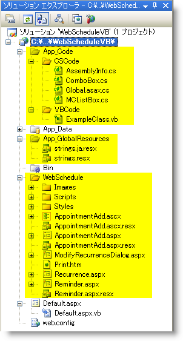
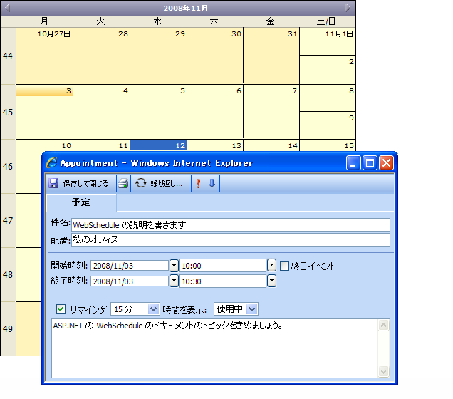

////

|metadata|
{
    "name": "web-webschedule-including-webschedule-dialog-forms-in-your-vb-net-web-site",
    "controlName": ["WebSchedule"],
    "tags": ["How Do I","Scheduling","Tips and Tricks"],
    "guid": "{8EE0A721-0E35-49EA-9BF4-D6C6D9229C75}",  
    "buildFlags": [],
    "createdOn": "0001-01-01T00:00:00Z"
}
|metadata|
////

= VB.NET Web サイトに WebSchedule ダイアログ フォームを含める

== 始める前に

さまざまな WebSchedule コントロールは、{ProductName} 製品ラインで提供される一連のポップアップ ダイアログ フォームに依存します。WebSchedule によって強化されたアプリケーションがこれらのフォームを表示するには、アプリケーションでアクセス可能にする必要があります。これを行うひとつの方法は、固有のアプリケーションにさまざまな WebSchedule プロジェクト ファイルを含めることです。

== 達成すること

このトピックを読めば、WebSchedule フォーム プロジェクト ファイルおよび関連する VB .NET Web サイトへの参照を正しく追加する方法を理解できます。 

*以下のコードの例の前提:*

* Default.aspx という名前のひとつの WebForm でファイル システム配備のために ASP.NET アプリケーションを既に構成済みであることを前提とします。
* Default.aspx には WebScheduleInfo™ のインスタンスに接続されている WebMonthView™ のインスタンスが含まれます。
* WebScheduleInfo はインボックス Microsoft© AccessDataSource™ コントロールを使用する WebScheduleOleDbProvider インスタンスに接続されます。
* アプリケーションには、WebSchedule のデータベースとして含まれる WebSchedule2.mdb Microsoft Access™ データベース ファイルと共に `App_Data` フォルダーもあります。WebSchedule2.mdb Microsoft Access データベースを使用するために WebSchedule を構成する方法についての詳細は、 link:webschedule-connecting-webschedule-to-a-database-in-visual-studio-2005.html[Visual Studio 2005 で WebSchedule をデータベースに接続]を参照してください。

== 以下の手順を実行します。

[start=1]
. WebSchedule フォルダーを見つけます。これは通常次の場所にあります:

`C:\Inetpub\wwwroot\aspnet_client\Infragistics\20XXXCLRXX\Forms\WebSchedule`

WebSchedule フォルダーおよびそのコンテンツをプロジェクトのフォルダーにコピーします。
[start=2]
. アプリケーションに `App_Code` フォルダーが存在しない場合、ソリューション エクスプローラーのアプリケーション ノードを右クリックしてメニューから [ASP.NET フォルダーの追加] を選択して `App_Code` を選択できます。アプリケーションに `App_Code` フォルダーが既に存在する場合があります。`App_Code` フォルダーはソース コード ファイルが置かれる特別な ASP.NET フォルダーです。
[start=3]
. WebSchedule コード ファイルは C# で書かれているので、コンパイラが VB.NET コード ファイルに対して予測しているように、VB.NET `App_Code` フォルダーにそれらをただ追加するということはできません。`App_Code` フォルダーに 2 つの新しいフォルダーを作成します。ひとつのフォルダーに CSCode と名前を付け、もうひとつのフォルダーに VBCode と名前を付けます。`App_Code` フォルダーに既に配置されている既存の VBCode フォルダーがある場合、それらのすべてを VBCode フォルダーに移動してください。以降に作成したすべての VB コード ファイルはこのフォルダーに移動されます。
[start=4]
. WebSchedule `App_Code` フォルダーから ComboBox.cs および MCListBox.cs ファイルをアプリケーションの `App_Code\CSCode` フォルダーに移動します。リソース ファイルをアプリケーションの `App_GlobalResources` フォルダーに移動します。
[start=5]
. `App_Code` フォルダーと同様、`App_GlobalResources` フォルダーがあることを確認します。確認できない場合、ソリューション エクスプローラーでアプリケーション ノードを右クリックしてメニューから [ASP.NET フォルダーの追加] を選択し、`App_GlobalResources` を選択します。既存のアプリケーションに `App_GlobalResources` フォルダーが既に存在する場合があります。
[start=6]
. WebSchedule `App_GlobalResources` フォルダーから strings.resx ファイルをアプリケーションの `App_GlobalResources` に移動します。`App_GlobalResources` フォルダーには、ローカライズのために分離および公開されるさまざまなリソースを表すファイルが含まれます。
[start=7]
. WebSchedule フォルダーから `Bin`、`App_Code`、および `App_GlobalResources` フォルダーを削除します。
[start=8]
. WebSchedule フォルダーから Forms.sln、FormsVS08.sln、FormsVS08.suo、Global.asax、Global.asax.cs、Global.asax.resx、licenses.licx、および Web.config ファイルを削除します。メインの WebSchedule ファイルはメイン アプリケーションに統合されているので、これらのファイルを不要となって、安全に削除できます。サンプル アプリケーションは以下の画像のようになるはずです。これらの手順で変更した項目は黄色で強調表示されています：

[start=9]
. {ProductName} コントロールを含む複数のフォームが追加されているため、適切な参照がアプリケーションに追加されていることも確認する必要があります。WebSchedule アプリケーションには次の参照が含まれます:

     Infragistics.WebUI.Shared.{ProductVersion}

     Infragistics2.WebUI.WebSchedule.{ProductVersion}

ソリューション エクスプローラーで Application ノードを右クリックして Property ページを選択します。[プロパティ ページ] ダイアログで、参照ノードを選択し、アプリケーションに追加される参照を確認します。これらの 4 つの参照がアプリケーションに存在しない場合、[追加] ボタンをクリックし、.NET タブの下のダイアログから必要とする参照を指定して選択し、[OK] ボタンをクリックします。これでアプリケーションは必要とするすべての参照を含んでいるはずです。アプリケーションに他の Infragistics コントロールが含まれている場合には、これらの参照が既に追加されている可能性があります。
[start=10]
. 既存の Web.Config ファイルの ConfigSections に以下の Infragistics セクションを追加します。

*XML の場合:*

----
<configuration>
 <configsections>
 <!--以下の行を追加します-->
 <section name="infragistics.web"
     type="System.Configuration.SingleTagSectionHandler,System, 
     Version=1.0.3300.0, 
     Culture=neutral, 
     PublicKeyToken=b77a5c561934e089" />
  <sectiongroup name="system.web.extensions"
      type="System.Web.Configuration.SystemWebExtensionsSectionGroup, System.Web.Extensions, 
      Version=3.5.0.0, 
      Culture=neutral, 
      PublicKeyToken=31BF3856AD364E35" >
   <sectiongroup name="scripting"
       type="System.Web.Configuration.ScriptingSectionGroup, System.Web.Extensions, 
       Version=3.5.0.0, 
       Culture=neutral, 
       PublicKeyToken=31BF3856AD364E35" >
   <!--簡素にするためにその他の構成メンバーは省略しました-->
   </sectiongroup>
  </sectiongroup>
</configsections>
<!--以下の行を追加します-->
<infragistics.web formsDirectory="~/WebSchedule" />
----

[start=11]
. VB.NET Web サイトには VB.NET コード ファイルと C# コード ファイルの両方が含まれる `App_Code` フォルダーがあるので、このマルチ言語のコード ファイルのサポートが機能するために Web.Config を更新することも必要となります。以下の CodeSubdirectories 要素を Web.Config に追加します。

*XML の場合:*

----
<compilation debug="true" strict=" explicit="true">
  <assemblies>
    <!—Assembly elements omitted for brevity  -->
  </assemblies>
  <!--以下の codeSubDirectories 要素を追加します-->
  <codeSubDirectories>
    <add directoryName="VBCode"/>
    <add directoryName="CSCode"/>
  </codeSubDirectories>
</compilation>
----

[start=12]
. アプリケーションを保存、コンパイル、および実行します。
[start=13]
. WebMonthView コントロールの日をダブルクリックします。
[start=14]
. すべてが正しく構成されている場合、予約ダイアログが表示され、新しい予約を入力できます（以下の画像で示すように）。

