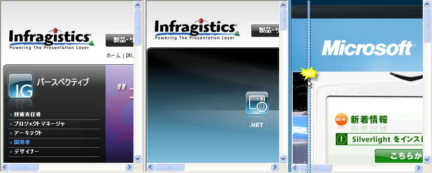

////

|metadata|
{
    "name": "web-whats-new-in-2008-volume-1",
    "controlName": [],
    "tags": ["FAQ","Getting Started"],
    "guid": "{A550E420-D9B0-4514-8894-AF66A40F70A8}",  
    "buildFlags": [],
    "createdOn": "2007-12-12T08:36:03Z"
}
|metadata|
////

= 2008 Volume 1 の新機能

{ProductName} 2008 Volume 1 リリースには、ASP.NET コントロールとコンポーネントの機能をこれまで以上に活用するための、多くの強力な新しい特長や機能が追加されています。

== Visual Studio 2008 のフルサポート

2008 Volume 1 リリースでは、Visual Studio 2008 が完全にサポートされています。{ProductName} コントロールおよびコンポーネントは完全にテストされ、Visual Studio 2008 開発環境で動作することが確認されています。.NET Language Integrated Query (LINQ) などの新技術とも互換性があります。

== 新しい WebDialogWindow コントロール

WebDialogWindow™ は、最近のブラウザではポップアップ ブロッカーの多くを無視することができる、シンプルな 
 セクションとして HTML ページに表示されますが、エンド ユーザーに対しては以前と同様にポップアップ ウィンドウのように表示されます。この鋭いユーザーインターフェイス コントロールによって、ダイアログ ボックスの機能を Web 用の ASP.NET アプリケーションに簡単に追加することができます。ダイアログ ボックスのコンテンツ領域は、
 タグ自体ですが、アプリケーションが必要とする HTML マークアップまたは ASP.NET コンテンツを含むことができます。WebDialogWindow は、モーダル（ユーザーはダイアログ ボックスを操作および閉じる必要があります。残りのページの操作は中断されます）またはモードレス ダイアログボックス（モーダルではない。ユーザーは残りのページを自由に操作します）のいずれかとして表示されることをサポートします。

全ての {ProductName} AJAX Framework コントロールと同様に、WebDialogWindow は弊社の Application Styling Framework™ (ASF) にシームレスに統合します。業界標準の CSS ベースのプロパティを使用すると、この ASP.NET ダイアログ ウィンドウ コントロールの外観を手動でスタイルして既存のスタイル シートを活用できます。

この ASP.NET ダイアログ コントロールのその他の主要な機能のいくつかは以下のとおりです。

* *モード* - WebDialogWindow によってダイアログがモーダル、モードレス（非モーダル）ダイアログのいずれで動作するのかを設定できます。これによって、アプリケーションのフローの制御を向上することができます。
* *ヘッダー* - WebDialogWindow はカスタマイズ可能なヘッダー領域を表示します。この領域にキャプション テキスト、デスクトップ アプリケーションに表示される閉じる、最小化、最大化の各ボタンなどのスタンバイを含むいくつかのボタンを配置できます。
* *リサイズ* - デスクトップ上のリサイズ可能なダイアログと全く同じように、エンド ユーザーはランタイムに WebDialogWindow をリサイズすることができます。
* *位置* - WebDialogWindow を表示したいページの開始位置に表示されます。
* *ウィンドウの状態* - WebDialogWindow は、ウィンドウの外観を最小化、元に戻す、最大化するのいずれをユーザーが実行したのかを記憶します。

image::images/Web_Whats_New_2008_1_New_WebDialogWindow_Control_01.png[]

== 関連トピック

link:webdialogwindow-about-webdialogwindow.html[WebDialogWindow について]

link:webdialogwindow-getting-started-with-the-webdialogwindow.html[WebDialogWindow で開始]

link:webdialogwindow-using-webdialogwindow.html[WebDialogWindow の使用]

== 新しい WebImage ビューア コントロール

WebImageViewer™ は ASP.NET のスライド画像表示コントロールで、多数の画像を表示するためのスマートで使いやすい Web インターフェースをエンド ユーザーに提供し、またナビゲーション コントロールの役割も果たすことができます。WebImageViewer はクリックしたときにサイト上のさまざまなリソースにリンクできる画像のリストを連続的に繰り返す機能をエンド ユーザーに提供します。画像のリストは単一のプロパティ設定によって水平にまたは垂直の方向に簡単に向けることができます。製品、従業員のレコード、または写真や画像を持っており、Web アプリケーション内で公開したいその他のアセットのリストをエンド ユーザーがナビゲートできるようにする必要がある時に、この ASP.NET コントロールは優れた候補を作成します。迅速な反応性と優れたユーザー エクスペリエンスが、{ProductName} AJAX Framework および Microsoft ASP.NET AJAX Extensions によって可能となった最適化されたデザインによってもたらされます。

ASP.NET のためのこの画像表示コントロールにある主要な機能は以下のとおりです。

* *画像の方向* - 画像のリストは垂直方向（横切って）または水平方向（上下）に向けることができます。
* *アニメーションの円滑なスクロール* - カスタムの構成可能なアニメーション動作によってスクロールした時に画像をどのようにアニメートするのかを決定します。一度に 1 ページ上の複数の画像をスクロールする、一度に 1 画像をスクロールする、または連続した円滑なスクロール効果を使用することができます。
* *データ バインディング* - WebImageViewer は、画像、クリックされた時のターゲット URL、マウスが上に置かれた時に表示すべきツール チップのテキストにアクセスするために使用するファイル パスを持つカスタムのデータ モデルにデータ バインドすることができます。
* *ナビゲーション* - Web アプリケーションで視覚的に魅力的で画像主導のナビゲーションが必要な時には、エンド ユーザーにリソースを公開するために WebImageViewer を使用することができます。ターゲット URLのリソース コンテンツは、同じページに、名前が指定されたフレーム内、または新しいウィンドウに表示されます。

== 関連トピック

link:webimageviewer-about-webimageviewer.html[WebImageViewer について]

link:webimageviewer-getting-started-with-the-webimageviewer.html[WebImageViewer を使用した作業の開始]

link:webimageviewer-using-webimageviewer.html[WebImageViewer の使用]

== 新しい WebSplitter コントロール

WebSplitter™ コントロールは、Web アプリケーション内でコンテンツを分離および整理するための優れた方法を提供します。WebSplitter はコンテンツ ペイン内に含まれているコンテンツをリサイズ、展開、縮小する機能をエンド ユーザーに提供します。Web アプリケーションをデザインする方法によっては、WebSplitter の方向を Horizontal または Vertical に変更することができます。垂直に向けると、コンテンツ ペインはひとつのペインの左右、つまりあるペインの横に配置されます。スプリットバーは上から下に引かれてペインの間に配置されます。スプリット バーを左右にクリック アンド ドラッグすると、ペインの幅を調整することができます。水平方向に向けると、ペインは上から下に配置されます。スプリット バーもペイン間に配置され、左から右に引かれます。

この ASP.NET スプリッタ バー コントロールの主要な機能は以下のとおりです。

* *方向* - ページでスプリッタバーを水平または垂直の方向に向けます。
* *リサイズ動作* - ユーザーがスプリッタ バーをクリック アンド ドラッグするとリアルタイムでコンテンツ ペインをリサイズすることができます。または低速のクライアントではユーザーがマウスのドラッグを完了してスプリッタ バーをリリースするまでリサイズを保留することができます。
* *展開/縮小* - ボタンをスプリッタ バーに表示します。このボタンによってボタンが表すコンテンツ ペインをユーザーがスプリッタのいずれかの側に展開または縮小することを可能にします。
* *コンテンツ ペイン* - コンテンツ ペイン テンプレートに任意のコンテンツを配置します。これにはユーザー コントロール、ASP.NET コントロール、リテラル マークアップ コンテンツ、またはユーザー インターフェースが必要とするその他のコンテンツなどがあります。

== 関連トピック

link:websplitter-about-websplitter.html[WebSplitter について]

link:websplitter-getting-started-with-the-websplitter.html[WebSplitter を使用した作業の開始]

link:websplitter-using-websplitter.html[WebSplitter の使用]

== WebGrid と Webcombo は ITypedList をサポートするようになった

WebGrid™ コントロールおよび WebCombo™ コントロールは、ITypedList インターフェースをサポートするようになりました。WebCombo および WebGrid の列生成プロセスの間に ITypedList インターフェイスによって公開されるメソッドを利用できるようになりました。たとえば、ITypedList インターフェイスの GetItemProperties() メソッドを使用することによって、オブジェクトはバインド操作に公開したいプロパティに関する情報をパブリッシュできます。

WebGrid コントロールおよび WebCombo コントロールは、列情報を決定するために ITypedList インターフェイスを実装するタイプがバインドされており、適切なインターフェイス メソッドを呼び出す時を検出することができます。