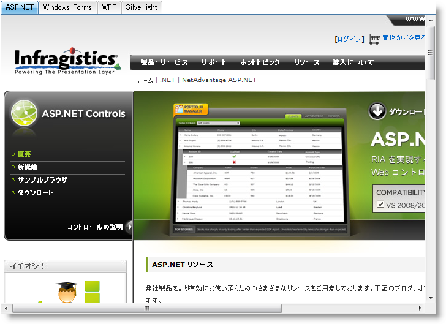

////
|metadata|
{
    "name": "web-whats-new-in-2010-volume-1",
    "controlName": [],
    "tags": ["FAQ","Getting Started"],
    "guid": "{59AB9A26-DF2E-4543-9BFE-D905E754D0AB}",
    "buildFlags": [],
    "createdOn": "2010-01-03T23:50:50Z"
}
|metadata|
////

= 2010 Volume 1 の新機能

{ProductName} 2010 Volume 1 リリースには {ProductName} AJAX フレームワーク上に構築された以下の新しいコントロールおよび機能が含まれています。

== 新しい AJAX 圧縮

{ProductName} 10.1 に搭載される新しい AJAX 圧縮モジュールは、{ProductName} AJAX フレームワークに基づいて任意の {ProductName} AJAX コントロールを使用する時にサーバーによって生成される Ajax レスポンスを圧縮します。ブラウザーはクライアントでレスポンスを解凍し、さらに処理します。

この機能をオンにすると、以下の利点を直ちに入手できます。

* *帯域幅* – レスポンスが GZIP されると、Ajax レスポンスによって使用される帯域幅は自動的に少なくなります。帯域幅の容量が改善して、ネットワークを停滞させることなくいつでもより多くのユーザーにサービスを提供することが可能になります。
* *速度* – レスポンス サイズが小さくなると、サーバーからの Ajax リクエストのラウンド トリップはそれに応じて小さくなります。

以下の表はページングを有効にして 26 列、2155 行の WebDataGrid コントロールを使用した時に AJAX 圧縮から取得されるパフォーマンス ゲインを示します。

=== 圧縮なし

[options="header", cols="a,a,a"]
|====
|WebDataGrid ページ サイズ|レスポンス サイズ（KB）|ラウンド トリップ時間（秒）

|20
|50.6
|1.18

|50
|81.1
|1.14

|100
|140.9
|1.23

|200
|261.8
|1.4

|500
|627.7
|2.13

|1000
|1228.8
|4.32

|====

=== 圧縮あり

[options="header", cols="a,a,a"]
|====
|WebDataGrid ページ サイズ|レスポンス サイズ（KB）|ラウンド トリップ時間（秒）

|20
|7.4
|1.19

|50
|10.2
|1.19

|100
|15.8
|1.19

|200
|27.4
|1.29

|500
|62.5
|1.51

|1000
|121
|2.12

|====

== 関連トピック

link:about-ajax-compression.html[Ajax 圧縮について]

== 新しい WebTab コントロール

WebTab™ コントロールは {ProductName} AJAX コントロールの広範なリストへの新たな追加です。WebTab コントロールの新しいデザインによってネーティブの AJAX 機能を使用して効率的で拡張性の高いタブ レイアウト コントロールとなっています。

すべての {ProductName} AJAX コントロールのように、WebTab は Infragistics® Application Styling Framework にシームレスに統合します。CSS ベースのプロパティを使用すると、既存のスタイルシートを利用することによって、WebTab コントロールを手動でカスタマイズできます。

WebTab の機能のいくつかは以下の通りです。

* *ハイパフォーマンス* -- 軽量のマークアップと最適化されたコードがパフォーマンスを向上します。
* *標準への適合* -- CSS 2 および XHTML 1.0 に準拠します。
* *コンテンツ ペイン* -- テンプレート領域またはターゲット URL としてコンテンツ ペインをサポートします。
* *タブの移動* --単一行でタブを移動できます。
* *タブの向き* -- 水平または垂直のいずれかに向けることができます。
* *表示モード* -- 単一行または複数行タブを表示できます。
* *ロードオンデマンド* -- 初期ロードの間すべてのコンテンツをフェッチできるわけではありません。選択されたタブのコンテンツだけです。
* *ネーティブの AJAX サポート* - {ProductName} AJAX コントロールは Microsoft® ASP.NET AJAX Extensions 上に構築されているので、ほとんどの WebCurrencyEditor の機能は AJAX を使用して実行されます。これによりフル ページ ポストバックを排除します。

== 関連トピック

link:webtab-about-webtab.html[WebTab について]

link:webtab-using-webtab.html[WebTab の使用]

== 新しい WebExplorerBar コントロール

WebExplorerBar™ コントロールは {ProductName} AJAX コントロールの広範なリストへの新たな追加です。WebExplorerBar の新しいデザインは Windows Explorer バーにある機能と非常に似た機能を提供します。WebExplorerBar は階層的なデータモデルを表示するために使用することも可能ですが、ナビゲーション コントロールとして使用することも可能です。WebExplorerBar をアプリケーションに統合するときに多くの可能性が存在します。

すべての {ProductName} AJAX コントロールのように、WebExplorerBar は Infragistics® Application Styling Framework にシームレスに統合します。CSS ベースのプロパティを使用すると、既存のスタイルシートを利用することによって、WebExplorerBar コントロールを手動でカスタマイズできます。

WebExplorerBar の機能のいくつかは以下の通りです。

* *ハイパフォーマンス* - 軽量のマークアップと最適化されたコードがパフォーマンスを向上します。
* *標準への適合* - CSS 2 および XHTML 1.0 に準拠します。
* *ロードオンデマンド* - 初期のページ ロード時にデータ ソース全体を最初にレンダリングするのではなく、初期のページ ロード時に少量のデータのみを送信するロードオンデマンド機能を有効にすることができます。後続のグループ拡張は AJAX コールバックを起動し、これにより追加のグループが取得およびロードされます。これは 1 回の試行で大きいデータ ソース全体をロードすることよりも劇的なパフォーマンスの改善を提供します。
* *テンプレート* - 究極的な柔軟性のために WebExplorerBar 要素をテンプレート化できます。グループをテンプレート化することもでき、WebExplorerBar でデータがロードされない時のためにテンプレートを提供することも可能です。
* *グループの編集* - WebExplorerBar グループを編集することも可能です。エンドユーザーはダブルクリックするか F2 を押して特定のグループで編集モードを起動できます。
* *アニメーション* - WebExplorerBar グループ拡張はアニメートして発生できます。プロフェッショナルのアニメーション効果を Web アプリケーションに簡単に追加することができるように、シンプルなプロパティ設定を介して多くのプリセット アニメーション オプションが公開されています。
* *クライアント サイド オブジェクト モデル* - WebExplorerBar は、サーバー側のラウンド トリップを伝統的に必要とする多くのイベントに応答するために処理可能なプロパティ、メソッド、さらにはイベントさえ公開する広範なクライアント サイド オブジェクト モデルを提供します。このタイプのアーキテクチャは、アプリケーションで使用されると非常に高速で対応に優れたエンドユーザー エクスペリエンスを促進します。
* *その他に多数機能があります!*

== 関連トピック

link:webexplorerbar-about-webexplorerbar.html[WebExplorerBar について]

link:webexplorerbar-getting-started-with-webexplorerbar.html[WebExplorerBar で開始]

link:webexplorerbar-using-webexplorerbar.html[WebExplorerBar の使用]

== WebHierarchicalDataGrid Outlook GroupBy 機能

== Outlook GroupBy

WebHierarchicalDataGrid™ の Outlook GroupBy 機能によってエンドユーザーはより多くの読みやすくまたナビゲート可能な表示にデータをグループ化できます。この機能は、データをグループ化するためにエンドユーザーが列をドラッグできるセクションをコントロールの上または下に表示します。

列がグループ化されると、コントロールは一意のグループ化された値ごとにグループ化された行を作成します。それぞれのグループ化された行は、デフォルトでグループ内の項目の値および数を表示し、その中にネストされたデータ行を表示するために展開できます。WebHierarchicalDataGrid は Groupby 領域に列ヘッダーを表示してデータの GroupBy レイアウトを示します。

image::images/WebHierarchcialDataGrid_AboutOutlookGroupby_01.png[]

== 関連トピック

link:webhierarchicaldatagrid-outlook-groupby.html[Outlook GroupBy]

link:webhierarchicaldatagrid-about-outlook-groupby.html[Outlook GroupBy について]