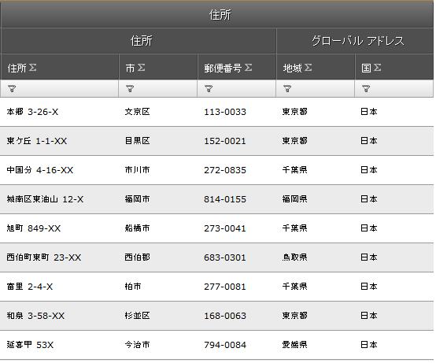
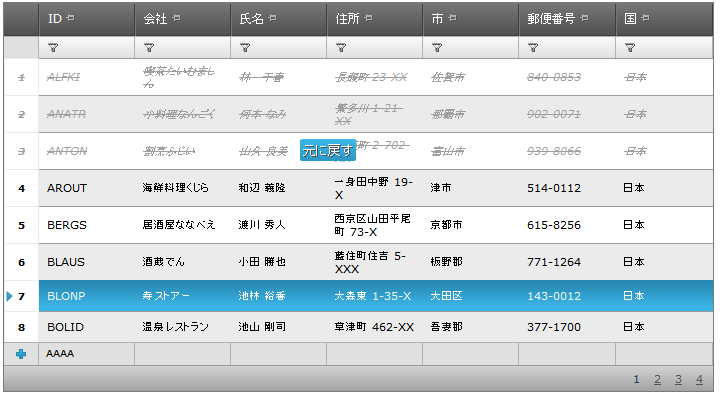
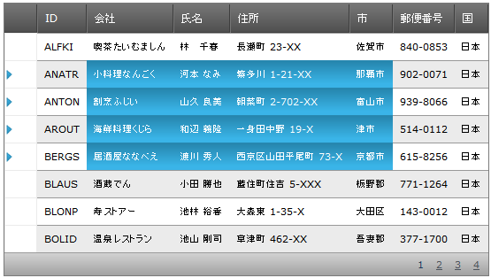

////

|metadata|
{
    "name": "web-whats-new-in-2011-volume-2",
    "controlName": [],
    "tags": ["FAQ","Getting Started"],
    "guid": "71bcfa06-7faf-4d45-b2c8-6b0f610caf66",  
    "buildFlags": [],
    "createdOn": "2011-10-25T11:51:15.2370924Z"
}
|metadata|
////

= 2011 Volume 2 の新機能

== トピックの概要

== 目的

このトピックでは、インフラジスティックス {ProductName} 11.2 で導入された新しい機能とコンポーネントの概要を紹介します。

== このトピックの構成

このドキュメントには次のセクションが含まれています。

<<One,新機能とコンポーネント>>

<<Two,WDG-WHDG Word エクスポーター>>

<<Three,WebDataGrid 複数列ヘッダー>>

<<Four,WDG-WHDG 一括更新>>

<<Five,IButtonControl を実装する WebImageButton>>

<<Six,Excel 形式のコピーと貼り付け>>

<<Seven,タッチ サポート Aikido>>

[[One]]
== 新機能とコンポーネント

[[Two]]
== WDG-WHDG Word エクスポーター

リリース 11.2 からは、グリッド データを MS Word® ファイルにエクスポートできるようになってます。新しい WebWordExporter™ コントロールでは、インフラジスティックスの DataGrid (WebDataGrid™ または WebHierarchicalDataGrid™) のデータをエクスポートできます。

== *関連トピック*

link:webwordexporter-getting-started-with-webwordexporter.html[WebWordExporter のセットアップ]

link:webwordexporter-about-webwordexporter.html[WebWordExporter について]

[[Three]]
== WebDataGrid 複数列ヘッダー

WebDataGrid で複数列ヘッダーをサポートすることになりました。ここでは、複数レベルのヘッダーをグリッドに構成し、データ列を親ヘッダーにグループ化できます。複数列のビヘイビアーは、列のサイズ変更、列の移動、並べ替え、フィルタリングに適しています。

== *関連トピック*

link:webdatagird-multi-column-headers.html[WebDataGrid 複数列ヘッダーの構成]

[[Four]]
== WDG-WHDG 一括更新

Editing Core Behavior の Batch Update モードでは、サーバーで行を逐一編集しなくても、行の変更または更新、挿入または削除ができます。データはすべてクライアントで編集され、最初にポストバックするときにサーバーに保存されます。Batch Update モードの主な機能は以下の通りです。

* 複数の行を一度に変更する
* サーバーに送信する前に変更されたデータを元に戻す
* 集計が有効な場合にクライントで動的な再計算をする
* クライアント側イベント
* 行の更新、追加、および削除にサーバー イベントを使用する

== *関連トピック*

link:webdatagrid-batch-updating.html[WDG 一括更新]

link:webhierarchicaldatagrid-batch-updating.html[WHDG 一括更新]

[[Five]]
== IButtonControl を実装する WebImageButton

WebImageButton™ は IButtonControl インターフェイスを実装します。これは System.Web.UI.WebControls.IButtonControl プロパティおよびイベントを使用して検証し、フォームを送信する場合にさらにメリットがあります。

== *関連トピック*

link:http://msdn.microsoft.com/en-us/library/system.web.ui.webcontrols.ibuttoncontrol.aspx[IButtonControl インターフェイス]

[[Six]]
== Excel 形式のコピーと貼り付け

クリック アンド ドラッグし WebDataGrid または WebHierarchicalDataGrid のいずれかで 1 つまたは複数のセルおよび行を選択します。標準のキーボード ショートカットを使用してこれらの項目をクリップボードにコピーし、Excel® または別の WebDataGrid か WebHierarchicalDataGrid に貼り付けます。

== *関連トピック*

link:webdatagrid-clipboard.html[クリップボード]

[[Seven]]
== タッチ サポート Aikido

新しい {ProductName} Volume 2 がタブレット プラットフォームで使用できるようになりました。{ProductName} がサポート タッチ イベントを制御できるようになり、コントロールは一般的なタブレット型サイズに合うよう設計し直されています。

== *関連トピック*

link:touch-support-in-netadvantage-for-aspnet.html[{ProductName} でのタッチ サポート]