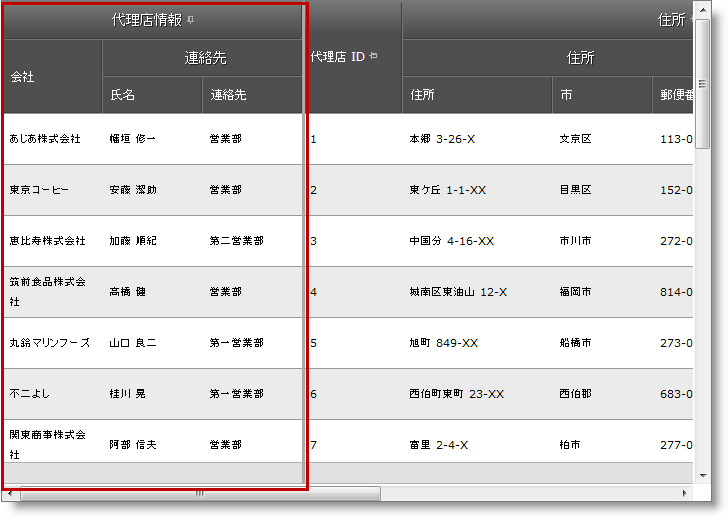
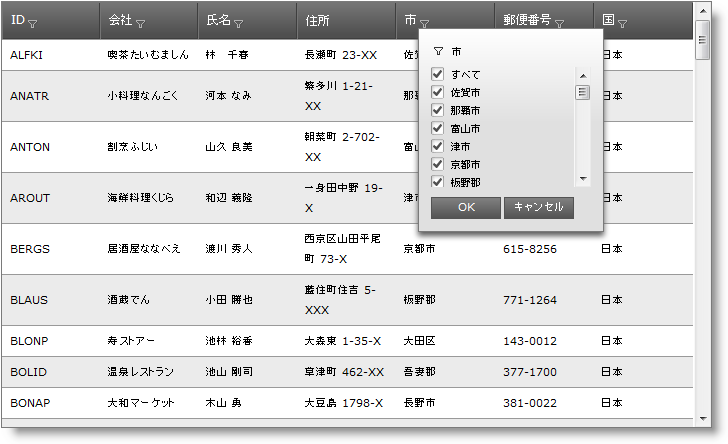
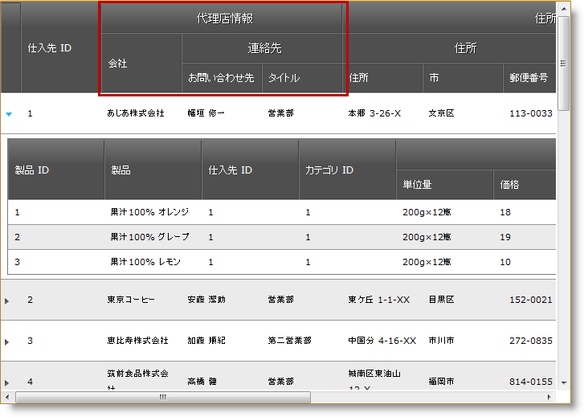
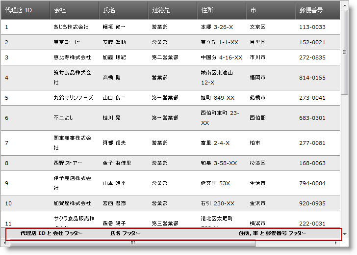
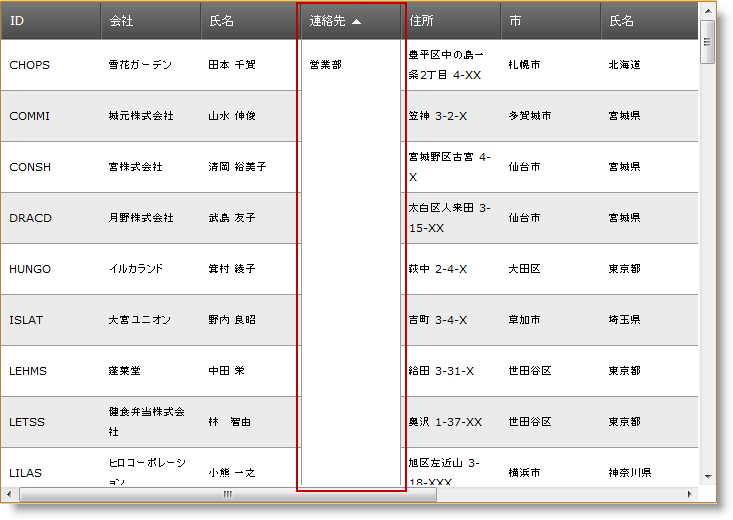

////

|metadata|
{
    "name": "web-whats-new-in-2012-volume-1",
    "controlName": [],
    "tags": ["Breaking Changes","Getting Started","How Do I"],
    "guid": "8f585554-e735-424e-b848-4ef7b026e29b",  
    "buildFlags": [],
    "createdOn": "2012-04-16T13:20:01.8759479Z"
}
|metadata|
////

= 2012 Volume 1 の新機能

== トピックの概要

=== 目的

このトピックでは、{ProductName} 12.1® で導入された新しい機能の概要を紹介します。

== 新規機能

=== 新機能の概要

以下の表は、{ProductName} 12.1 の新機能の概要を示しています。概要表の後に、その他の詳細が続きます。

[options="header", cols="a,a"]
|====
|機能|説明

|<<multi_column_headers_and_column_fixing,WebDataGrid 複数列ヘッダーおよび列固定>>
|_WebDataGrid_ 複数列ヘッダーが、列固定動作と機能するようになりました。

|<<wdg_whdg_excel_style_filtering,WebDataGrid / WebHierarchicalDataGrid Excel スタイルのフィルタリング [CTP]>>
|Excel スタイル フィルタリングは、列の一意の値を含むチェックボックス リストからの検索条件を選択するオプションを提供します。

|<<whdg_multi_column_headers,WebHierarchicalDataGrid 複数列ヘッダー>>
|_WebHierarchicalDataGrid_ は複数列ヘッダーをサポートするようになりました。

|<<wdg_whdg_multi_column_footers,WebDataGrid / WebHierarchicalDataGrid 複数列フッター>>
|複数列フッター機能によって、複数列のフッターを結合できます。

|<<wdg_whdg_cell_merging,WebDataGrid / WebHierarchicalDataGrid セル結合>>
|セルの結合機能を使用すると、列に同じ値を持つセルを視覚的に結合できます。

|<<touch_support,タッチ サポート>>
|すべての ASP.NET コントロールでタッチ サポートが利用できるようになりました。

|====

[[multi_column_headers_and_column_fixing]]

=== WebDataGrid 複数列ヘッダーおよび列固定

_WebDataGrid_   複数列ヘッダーが、列固定動作と機能するようになりました。個々の列またはグループ化された列を固定できますが、グループ内の列は固定できません。

==== 関連サンプル:

* link:{SamplesURL}/samples/webdatagrid/display/multicolumnheaderswithcolumnfixing/default.aspx?cn=data-grid&sid=f1d006c8-dda8-4f36-b96f-897569f1df6f[列固定が可能な複数列のヘッダー]

[[wdg_whdg_excel_style_filtering]]

=== WebDataGrid/WebHierarchicalDataGrid Excel スタイルのフィルタリング [CTP]

Excel スタイル フィルタリングは、列の一意の値を含むチェックボックス リストからの検索条件を選択するオプションを提供します。リスト項目のサブセットまたはすべての項目を選択できます。

==== 関連サンプル:

* link:{SamplesURL}/samples/webdatagrid/organization/excelstylefiltering/default.aspx?cn=data-grid&sid=28d09818-7853-46fb-ba0a-a930e003aa83[フィルタリング - Excel スタイル (WebDataGrid)]
* link:{SamplesURL}/samples/webhierarchicaldatagrid/organization/excelstylefiltering/default.aspx?cn=hierarchical-data-grid&sid=9119c46b-1735-4bab-8bcd-4041270e59fe[フィルタリング - Excel スタイル (WebHierarchicalDataGrid)]

[[whdg_multi_column_headers]]

=== WebHierarchicalDataGrid 複数列ヘッダー

_WebHierarchicalDataGrid_   が複数列ヘッダーをサポートするようになり、複数レベルのヘッダーをグリッドで構成し、データ列を親ヘッダーにグループ化できます。

==== 関連トピック:

* link:webhierarchicaldatagrid-configuring-multi-column-headers.html[WebHierarchicalDataGrid 複数列ヘッダーの構成 ]

[[wdg_whdg_multi_column_footers]]

=== WebDataGrid/WebHierarchicalDataGrid 複数列フッター

複数列フッター機能によって、複数列のフッターを結合できます。

==== 関連トピック:

* link:webdatagrid-configuring-multi-column-footers.html[複数列フッターの構成 (WebDataGrid)]
* link:webhierarchicaldatagrid-configuring-multi-column-footers.html[複数列フッターの構成 (WebHierarchicalDataGrid)]

[[wdg_whdg_cell_merging]]

=== WebDataGrid/WebHierarchicalDataGrid セル結合

_WebDataGrid_   および  _WebHierarchicalDataGrid_   コントロールのセルの結合機能を使用すると、値が同じセルを視覚的に結合できます。

*注:* _WebDataGrid_   の場合、セルの結合は並べ替え動作に結合します。

*注:* _WebHierarchicalDataGrid_   の場合、セルの結合は、行動による並べ替えまたはグループ化に結合します。

==== 関連トピック:

* link:webdatagrid-cell-merging-overview.html[セル結合の概要 (WebDataGrid)]
* link:webdatagrid-enabling-cell-merging.html[セル結合の有効化 (WebDataGrid)]
* link:webhierarchicaldatagrid-cell-merging-overview.html[セル結合の概要 (WebHierarchicalDataGrid)]
* link:webhierarchicaldatagrid-enabling-cell-merging.html[セル結合の有効化 (WebHierarchicalDataGrid)]

[[touch_support]]

=== タッチ サポート

ASP.NET コントロールをタッチ プラットフォーム ブラウザで開くと、クライアント上でタッチ イベントを処理することによって、コントロールは、ユーザーが作業するときに適切に反応します。前のリリースからのこの変更点に加え、 _WebVideoPlayer_   は、タッチ プラットフォーム ブラウザ上での実行時に特別な動作を追加します。

_WebVideoPlayer_   をモバイル デバイスで実行する場合、Modernizr JavaScript ライブラリが未定義でなければ、デバイスのデフォルトのビデオ プレーヤー コントロールを描画します。何らかの理由で  _Modernizr_   ライブラリがページで利用できない場合、 _igVideoPlayer_   コントロールを描画します。この場合、デバイスのデフォルト ビデオ プレーヤーよりタッチ機能が少ない場合があります。このため、 _Modernizr_   ライブラリが利用可能な場合に、 _igVideoPlayer_   はデフォルトのデバイス ビデオ プレーヤーに戻ることができません。

==== 関連トピック:

* link:touch-support-in-netadvantage-for-aspnet.html[{ProductName} でのタッチ サポート]