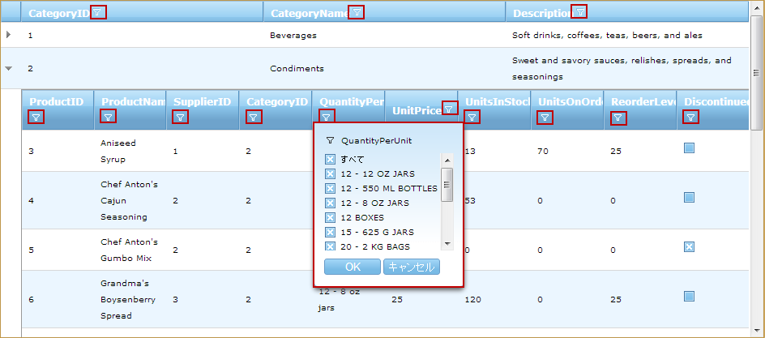

////

|metadata|
{
    "name": "web-whats-new-in-2012-volume-2",
    "controlName": [],
    "tags": ["Design Environment","Editing","Filtering","Grids"],
    "guid": "6bc11c24-edcf-4448-9737-65f3a068c27f",  
    "buildFlags": [],
    "createdOn": "2012-09-21T17:17:19.8856067Z"
}
|metadata|
////

= 2012 Volume 2 の新機能

== トピックの概要

==== 機能の概要

このトピックでは、{ProductName} 2012 Volume 2　の新しい機能の概要について紹介します。

== 新機能

==== 機能の概要

以下の表に、{ProductName} 2012 Volume 新機能の概要を示します。詳細情報については、以下の概要の下をご覧ください。

[options="header", cols="a,a"]
|====
|機能|説明

|<<_Ref326155173, _WebDataGrid_™/ _WebHierarchicalDataGrid_™ ジェネリック データ ソースを完全サポートする列の自動生成>>
|_WebDataGrid_ / _WebHierarchicalDataGrid_ はジェネリック コレクションのある列の自動生成を完全サポートします。

|<<_Ref326155174, _WebMaskEditor_™ クライアント側で入力マスクの動的な取得および設定>>
|_WebMaskEditor_ クライアント側オブジェクト モデルに入力マスクを設定または入力する方法が 2 つあります。

|<<_Ref326155175, _WebDataGrid_ / _WebHierarchicalDataGrid_ の Excel スタイル フィルタリング>>
|WebDataGrid/WebHierarchicalDataGrid の Excel スタイル フィルタリングで、Microsoft® Excel® ワークシートのフィルタリング規則を使用してグリッド データをフィルターします。この機能では、フィルター条件に一致するデータをより小さいサブセットに分割し、一致を表示します。

|Metro ユーザー インターフェイス (UI) は、Microsoft Visual Studio® 2012 のデザイン タイム ダイアログおよびアイコンをサポートします。
|12.2 バージョンより {ProductName} では、 Visual Studio 2012 でデザイン タイム ダイアログおよびアイコンで Metro UI をサポートします。

|====

[[_Ref326155173]]

=== WebDataGrid™/WebHierarchicalDataGrid™ ジェネリック データ ソースを完全サポートする列の自動生成

link:web-webdatagrid-webdatagrid.html[*_WebDataGrid*_] および link:web-webhierarchicaldatagrid.html[_*WebHierarchicalDataGrid_* ] ではジェネリック コレクションで列自動生成を完全にサポートします。 _WebDataGrid_  / _WebHierarchicalDataGrid_   は、 _link:http://msdn.microsoft.com/en-us/library/system.collections.ienumerable.aspx[IEnumerable]_  データ ソースが空の場合も自動的に列を生成します。グリッドがバインドされるコレクションでオブジェクト型を使用して列を自動的に生成します。12.2 以前は、列を正しく生成するためにデータ ソースで使用可能なレコードが最低 1 レコード必要でした。

[[_Ref326155174]]

=== WebMaskEditor クライアント側で入力マスクの動的な取得および設定

_WebMaskEditor_   クライアント側オブジェクト モデルは、入力マスクを設定または入力するためのメソッドを提供します。` link:webtexteditor~infragistics.web.ui.webmaskeditor~inputmask.html[get_inputMask()]` および ` link:webtexteditor~infragistics.web.ui.webmaskeditor~inputmask.html[set_inputMask()]` です。マスクを動的に変更する必要がある場合、 _WebMaskEditor_   を設定するためにサーバーに要求をする必要がありません。

==== 関連トピック:

* link:configuring-and-retrieving-input-masks-dynamically.html[サーバー側およびクライアント側で  _WebMaskEditor_  マスクの取得または設定]

[[_Ref326155175]]

=== WebDataGrid/WebHierarchicalDataGrid の Excel スタイル フィルタリング

_WebDataGrid_  / _WebHierarchicalDataGrid_   の Excel スタイル フィルタリングで、Microsoft Excel ワークシートのフィルタリング規則を使用してグリッド データをフィルターします。この機能では、フィルター条件に一致するデータをより小さいサブセットに分割し、一致を表示します。

以下は、 _WebDataGrid_   (上) および  _WebHierarchicalDataGrid_   (下) の Excel スタイル フィルタリング機能の画像です。

image::images/Whats_New_ASP.NET_2012_Volume_2_1.png[]

==== 関連トピック:

* link:webdatagrid-excelstylefiltering-overview.html[Excel スタイル フィルタリング概要  _(_ WebDataGrid)]
* link:webhierarchicaldatagrid-excelstylefiltering-overview.html[Excel スタイル フィルタリング概要  _(WebHierarchicalDataGrid)_ ]

[[_Ref326941914]]

=== トピック

このトピックについては、以下のトピックもあわせてご参照ください。

[options="header", cols="a,a"]
|====
|トピック|目的

| link:configuring-and-retrieving-input-masks-dynamically.html[入力マスクを動的に設定および取得 ( _WebMaskEditor_ )]
|このトピックは _WebMaskEditor_™ 入力マスクをクライアント側で動的に取得および設定する方法を説明します。

| link:webdatagrid-excelstylefiltering-overview.html[Excel スタイル フィルタリング概要 _(_ WebDataGrid)]
|このトピックでは、 _WebDataGrid_ コントロールの仮想化機能について説明します。

| link:webhierarchicaldatagrid-excelstylefiltering-overview.html[Excel スタイル フィルタリング概要 _(WebHierarchicalDataGrid)_ ]
|このトピックでは、 _i_ WebHierarchicalDataGrid コントロールの仮想化機能について説明します。

|====