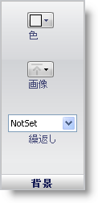

////

|metadata|
{
    "name": "webappstylist-background-pane",
    "controlName": ["WebAppStylist"],
    "tags": ["Styling","Theming"],
    "guid": "{773B7433-8086-4EDA-AAAD-40C05C586C77}",  
    "buildFlags": [],
    "createdOn": "0001-01-01T00:00:00Z"
}
|metadata|
////

= 背景ペイン

Background プロパティは、ロールの背景をどのように表示するかを決定します。

*Color* -- ドロップダウン ボタンをクリックすると、カラー ピッカーが開きます。Custom、Web、System、Office XP、Office 2003、VS 2005、および Office 2007 などのいくつかの事前に定義されたセットから色を選択できます。 [デフォルト] ボタンをクリックして、デフォルト値に色を戻すことができます。赤いスラッシュの付いた白いボックスをクリックして、背景を透明に設定します。カラー ホイールをクリックして [カスタム カラー] ダイアログ ボックスを開きます。または、Eyedropper ツールを使用して、画面上に現在表示されている色を選択できます。

*Image* -- 背景として固有の画像を使用したい場合には、ドロップダウン メニューからファイルを選択します。CreateGradient を選択して、グラデーション エディタを開きます。このエディタで、ゼロから新しい画像を作成できます。画像で高さと幅、グラデーションの色、方向およびその他の機能を設定します。カスタム グラデーションを作成する方法の詳細は、 link:webappstylist-creating-a-gradient-background.html[「グラデーション背景を作成」]を参照してください。

*Repeat* -- 背景に表示する画像を選択した場合、このプロパティは画像が繰り返す（Windows デスクトップの背景のようなタイル）、繰り返さない、x に繰り返す（水平方向のみに繰り返す）、または y に繰り返す（垂直方向のみに繰り返す）のいずれかを決定します。

