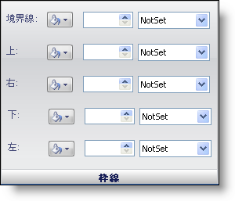

////

|metadata|
{
    "name": "webappstylist-border-pane",
    "controlName": ["WebAppStylist"],
    "tags": ["Styling","Theming"],
    "guid": "{B43892AF-3312-41DE-9E1B-929B0DD2FFBF}",  
    "buildFlags": [],
    "createdOn": "0001-01-01T00:00:00Z"
}
|metadata|
////

= 境界線ペイン

Border プロパティは、すべての境界線、上、右、下、左の境界線それぞれを含み、ロールの境界線をどのように表示するかを決定します。

*Border* -- 左手のドロップダウンのカラー ピッカーを使用して、境界線の色を変更します。中央のボックスは、境界線の重さを調整します。境界線の重さはピクセルで決定されます。右手のドロップダウン リストによって、境界線のタイプを選択できます。Double、Groove、Inset、None を含み多くの境界線スタイルから選択します。

*Top* -- Border に似ていますが、上の境界線のみに影響します。

*Right* -- Border に似ていますが、右の境界線のみに影響します。

*Bottom* -- Border に似ていますが、下の境界線のみに影響します。

*Left* -- Border に似ていますが、左の境界線のみに影響します。

