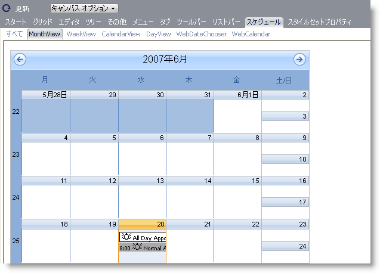
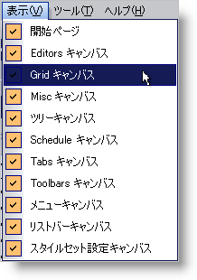
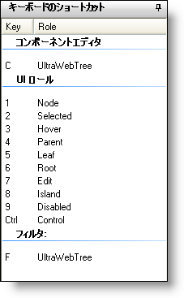

////
|metadata|
{
    "name": "webappstylist-canvas",
    "controlName": ["WebAppStylist"],
    "tags": ["Styling","Theming"],
    "guid": "{DC8FF44B-B68B-4E63-8FC4-D83A29AC1F87}",
    "buildFlags": [],
    "createdOn": "0001-01-01T00:00:00Z"
}
|metadata|
////

= キャンバス

キャンバスは、スタイルが実際の Web アプリケーションでどのように表示されるのかを視覚的に示します。ロールの外観プロパティに対するすべての変更は、キャンバス領域に反映されます。キャンバスは 9 つのタブ付き領域に分かれています (キャンバスでない [開始] ページとスタイルセット プロパティを入れると 11)。各領域にはひとつのコントロールまたはコントロール セットが表示されます。

たとえば、以下の Schedule キャンバスは月表示 (大) を表示します。ただし、[キャンバス] タブの下にあるいずれかのタブを選択することによって、WeekView、CalendarView などのその他の WebSchedule コンポーネントを表示できます。[すべて] タブを選択して、ひとつのキャンバスにあらゆる WebSchedule コンポーネントを表示することもできます。

以下のリンクをクリックすると、各キャンバス内にどのコントロールが含まれているのかを確認できます。

* link:webappstylist-personalizing-your-style-libraries.html[スタイル ライブラリのカスタマイズ]
* link:webappstylist-schedule.html[スケジュール]  
* link:webappstylist-webdatagrid.html[WebDataGrid]
* link:webappstylist-webdatamenu.html[WebDataMenu]
* link:webappstylist-webdatatree.html[WebDataTree]
* link:webappstylist-webdialogwindow.html[WebDialogWindow]
* link:webappstylist-webdropdown.html[WebDropDown]
* link:webappstylist-webexplorerbar.html[WebExplorerBar]
* link:webappstylist-webhierarchicaldatagrid.html[WebHierarchicalDataGrid]
* link:webappstylist-webimageviewer.html[WebImageViewer]
* link:webappstylist-webprogressbar.html[WebProgressBar]
* link:webappstylist-websplitter.html[WebSplitter]
* link:webappstylist-webslider.html[WebSlider]
* link:webappstylist-webtab.html[WebTab]
* link:webappstylist-webtexteditors.html[WebTextEditors]

== 表示するキャンバスの指定

キャンバスを任意に組み合わせて一度に表示できます。デフォルトで、Infragistics AppStylist for ASP.NET はすべてのキャンバス (または現在のスタイルセットに含まれるキャンバスのみ) を表示します。キャンバスを非表示にしたい場合には、キャンバスの右上隅にある「x」ボタンをクリックするだけです。キャンバスを表示したい場合は、[表示] メニューをクリックします。

強調表示されたチェックボックスがキャンバス名の横に表示されない場合には、そのキャンバスはワークスペースには表示されていません。キャンバス名をクリックして、ワークスペースに追加します。

== キーボード ショートカット

キャンバスの各項目の上にマウスを移動すると、[キーボード ショートカット] ウィンドウ (デフォルトでキャンバスの右側) にロール情報が表示されます。

[キーボード ショートカット] ウィンドウは以下の 2 つの項目に分かれています。

* キー - キーボードで対応するキーを押すと、特定のコントロール、ロールを起動するか、コントロールでフィルタリングします。
* ロール - 最初に対応するコンポーネントを常に表示し、次にこのオブジェクトが果たすことができるロールをリストします。コントロールでフィルタリングするオプションも含まれています。フィルタリングの基準となるコントロールは、常に対応するコンポーネントです。

キーボード ショートカットはナビゲーションの極めて重要な部分です。特定のロールの名前は分からなくてもどのように表示されるかが分かる場合には、馴染みのあるオブジェクトの上にマウスを移動し、ロールを見つけ出す際にキーボード ショートカットを使用できます。