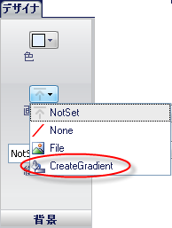
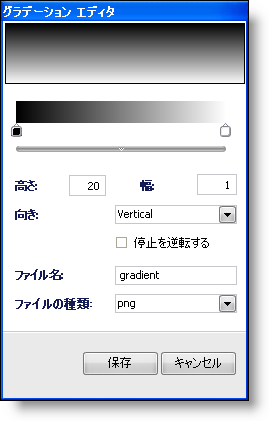
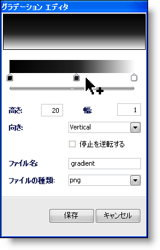
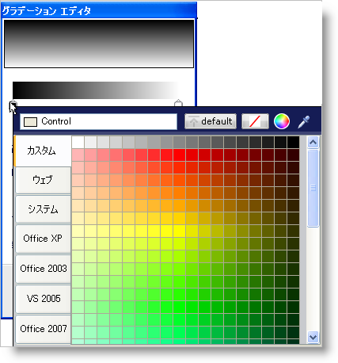
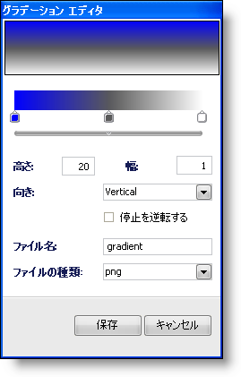
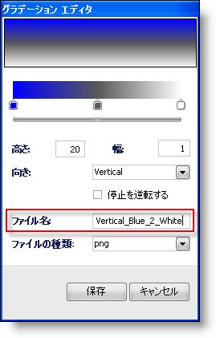
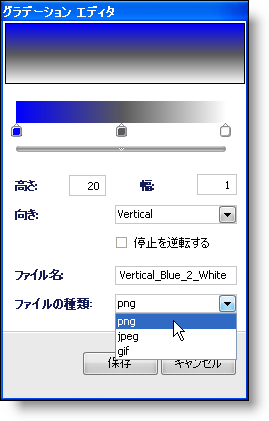
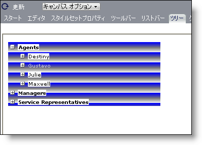

////

|metadata|
{
    "name": "webappstylist-creating-a-gradient-background",
    "controlName": ["WebAppStylist"],
    "tags": [],
    "guid": "{8CDDEAF1-622D-444B-BF6C-4705142E44E1}",  
    "buildFlags": [],
    "createdOn": "0001-01-01T00:00:00Z"
}
|metadata|
////

= グラデーション背景を作成

Web アプリケーションのひとつの非常に重要なエレメントはグラデーション背景です。グラデーションを使用すると、視覚的な魅力だけでなく、アプリケーションに深さを追加します。Infragistics AppStylist for ASP.NET のデフォルトの機能にふくまれているのが、グラデーションエディタで、ほとんどすべての種類のグラデーションの作成を支援することができます。以下の手順は、任意の UI ロールのためにグラデーション背景を作成するプロセスを説明します。

[start=1]
. スタイル エクスプローラでロール ツリーを使用して、グラデーション背景に適用したい UI ロールにナビゲートします。この詳細なガイドのために、WebTree コントロール UI ロールを使用します。
[start=2]
. 適切な UI ロールを選択したら、デザイナの背景ペインに [画像] ドロップダウン ボタンがあります。ドロップダウン矢印をクリックして、ドロップダウン リストから CreateGradient を選択します。

[グラデーション エディタ] ダイアログ ボックスが表示します。

デフォルトで、黒と白の 2 つのストップがあります。これよりも多くのストップを追加して、クリックしてこれらのストップの色を変更できます。
[start=3]
. 黒のストップと白のストップの間をクリックして、3 番目のストップを作成します。マウスのカーソルが＋記号のポインタに代わり、別のストップを追加できることを示します。

[start=4]
. 左のストップをクリックします。カラー ピッカーが表示します。

カラー ピッカーから青を選択します。プレビューに変更が反映されます。

[start=5]
. Height、Width、Orientation はそのままにしておきます。ただし、Orientation を Horizontal に設定すると、Height および Width プロパティはそれに対応して変更したい場合があります（水平方向のグラデーションを 1 ピクセル幅にしかしない場合、グラデーションは全く表示されません）。
[start=6]
. [ファイル名] フィールドで、「Vertical_Blue_2_White」などの分かりやすい名前をグラデーションに指定します。

[start=7]
. [ファイル タイプ] ドロップダウン リストで、グラデーションの書式設定を選択します。PNG、JPEG、および GIF から選択できます。今は PNG を選択しておきます。

[start=8]
. [保存] をクリックして、[グラデーション エディタ] ダイアログ ボックスを閉じます。
[start=9]
. WebTree キャンバスを表示している場合には、新しいグラデーションが適用されることがすぐに分かります。

