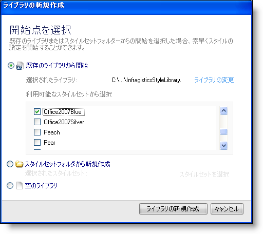
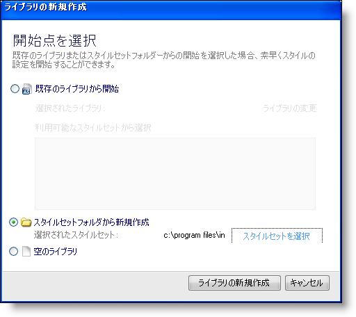
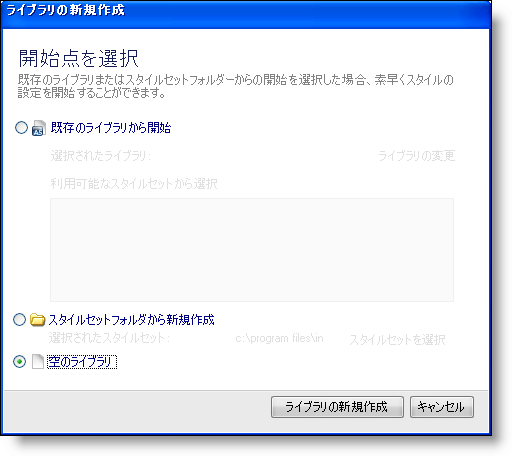
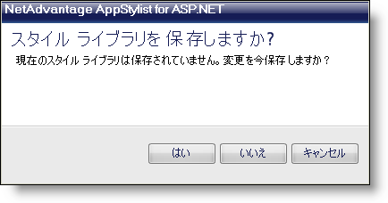

////

|metadata|
{
    "name": "webappstylist-creating-a-style-library",
    "controlName": ["WebAppStylist"],
    "tags": ["How Do I","Styling","Theming"],
    "guid": "{97D1A4BD-3C8E-4B4B-A183-3F788954EAB8}",  
    "buildFlags": [],
    "createdOn": "0001-01-01T00:00:00Z"
}
|metadata|
////

= スタイル ライブラリの作成

ひとつ以上のアプリケーションに複数のスタイル ライブラリを作成する必要がある場合、新しいスタイル ライブラリを作成する必要があります。Infragistics AppStylist for ASP.NET を起動したばかりの場合には、[開始] ページが表示されます。[開始] ページの [最近のファイルを開く] セクションで、[新しいライブラリを作成] ボタンをクリックして、新しいスタイル ライブラリを作成できます。この方法を使用したくない場合は、以下の手順に従ってください。

*新しいスタイル ライブラリを作成するには、次の手順に従ってください。*

[start=1]
. [ファイル] メニューで、[新しいスタイル ライブラリ...] をクリックします（Ctrl+N を押すことで、新しいスタイル ライブラリを作成することも可能です）。[新しいライブラリを作成] ダイアログ ボックスが表示されます。
[start=2]
. [新しいライブラリを作成] ダイアログ ボックスは新しいスタイル ライブラリを作成するための 3 つの経路を提供します。

.. *[既存のライブラリから開始]* -- このオプションを選択することで、既存のライブラリに基づいて新しいスタイル ライブラリを作成することができます。[ライブラリの変更] をクリックすると、[ファイルを開く] ダイアログ ボックスが開きます。スタイル ライブラリを検索して、[開く] をクリックしてスタイル ライブラリを選択できます。スタイル ライブラリ内に含まれるスタイルセットは、以下のボックスに表示されます。ボックスからスタイルセットのすべて、一部を選択、またはいずれも選択しないで、[ライブラリの作成] をクリックします。

.. *[スタイルセット フォルダから開始]* -- このオプションを選択することで、既存のスタイルセットに基づいて新しいスタイル ライブラリを作成することができます。[スタイルセットの選択] をクリックすると、[Infragistics AppStylist フォルダ ブラウザ] ダイアログ ボックスが開きます。以前に作成したスタイルセットが存在するフォルダが見つかるまで、ツリーをナビゲートします。[OK] をクリックして新しいスタイル ライブラリの基盤としてそのフォルダを設定します。フォルダが有効でない場合、ダイアログ ボックスが開きフォルダが有効でないことを通知します。有効なスタイルセット フォルダを選択したら、[ライブラリの作成] をクリックして、スタイルセットに基づいて新しいスタイル ライブラリを作成します。

.. *ブランク ライブラリ* -- このオプションを選択することで、ゼロから新しいスタイル ライブラリを作成できます。[ライブラリの作成] をクリックして、デフォルトのスタイルセットを含む新しいスタイル ライブラリを作成します。このデフォルトのスタイルセットには、各コンポーネントの基本スタイルが含まれます。完全にブランクのスタイルセットを希望する場合は、新しいスタイルセットを作成する必要があります。詳細は、 link:webappstylist-creating-a-styleset.html[「スタイルセットの作成」]を参照してください。

[start=3]
. 現在のスタイル ライブラリに保存されていない変更がある場合、ダイアログ ボックスが開いて、保存するかどうかを尋ねます。

** [はい] をクリックすると、これまでに保存されていない新しいスタイル ライブラリの場合には、[新規保存] ダイアログ ボックスが開きます。そうでない場合には、Infragistics AppStylist が現在のスタイル ライブラリを保存して閉じて、新しいスタイル ライブラリを作成します。スタイル ライブラリの保存に関する詳細は、 link:webappstylist-saving-your-work.html[「作業の保存」]を参照してください。
** [いいえ] をクリックすると、現在のスタイル ライブラリに対する保存されていない変更が破棄され、新しいスタイル ライブラリが作成されます。
** [キャンセル] をクリックすると、新しいスタイル ライブラリの作成が中止されて、現在のスタイル ライブラリでの作業を続行できます。

[start=4]
. 新しいスタイル ライブラリが作成され、デフォルトのスタイルセットを使用してコンポーネントのスタイリングを開始する、または link:webappstylist-creating-a-styleset.html[スタイルセットを作成する]ことができます。