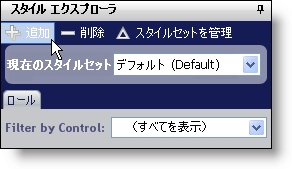
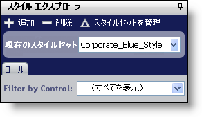

////

|metadata|
{
    "name": "webappstylist-creating-a-styleset",
    "controlName": ["WebAppStylist"],
    "tags": ["Styling","Theming"],
    "guid": "{E43FC544-0120-4DFA-AA13-590AD8075EA7}",  
    "buildFlags": [],
    "createdOn": "0001-01-01T00:00:00Z"
}
|metadata|
////

= スタイルセットの作成

ひとつのスタイル ライブラリに、任意の数の {ProductName} コントロールに適用される複数のスタイルセットを含むことができます。WebGrid™ 専用のスタイルセットを作成することもできますが、WebGrid と WebTree™ の両方に適用されるスタイルセットを作成することもできます。以下の手順では、簡単なスタイルセットを作成してスタイル ライブラリに追加します。

*新しいスタイルセットを作成するには、次の手順に従ってください。*

[start=1]
. スタイル エクスプローラの一番上にあるツールバーで [新規追加] をクリックします。

[スタイルセット マネージャ] ダイアログ ボックスが表示されます。

image::images/WebAppStylist_Creating_a_StyleSet_02.png[]

[start=2]
. スタイルセットのスタイルセット名を「Corporate_Blue_Style」などのより分かりやすい名前に変更します。スタイルセットが特定のコントロール/コンポーネントのみに適用されるようにしたい場合、このスタイルセットに含みたくないコントロール/コンポーネントのチェックボックスの選択を解除します。

*注：* コントロール/コンポーネントの選択を解除すると、Infragistics AppStylist for ASP.NET はこれらの特定のコントロール/コンポーネント用のスタイル シートを作成しません。既存のスタイルセットを修正している場合、スタイルをいったん削除すると、関連付けられたスタイル シートとすべての画像が削除されます。

[start=3]
. [OK] をクリックして、スタイルセットをスタイル ライブラリに追加します。

特定のコントロール/コンポーネントの削除を選択した場合、警告ダイアログ ボックスが表示されます。[はい] をクリックして、スタイルセットからコントロール/コンポーネントを削除します。基本的にはデフォルトのスタイル シートと画像を削除します。[いいえ] または [キャンセル] をクリックして、[スタイルセット マネージャ] ダイアログ ボックスに戻ります。

「Corporate_Blue_Style」スタイルセットが [アクティブ スタイルセット] ドロップダウン リストに表示されます。

