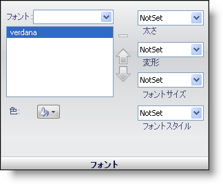

////

|metadata|
{
    "name": "webappstylist-font-pane",
    "controlName": ["WebAppStylist"],
    "tags": ["Styling","Templating"],
    "guid": "{941C36D6-E4CC-405F-8547-F287B818589D}",  
    "buildFlags": [],
    "createdOn": "0001-01-01T00:00:00Z"
}
|metadata|
////

= フォント ペイン

Font プロパティは、ロールのフォントをどのように表示するかを決定します。

*Font* -- ドロップダウン ボタンをクリックすると、システムの全フォントのリストが表示されます。フォントを選択すると、フォント リストにそのフォントが追加されます。複数のフォントを追加して、上および下矢印を使用してリストで順番を並べ替えることができます。マイナス（-）記号をクリックすると、フォントがリストから削除されます。

*Color* -- カラー ピッカーから色を選択すると、フォントの色が変わります。

*Font Weight* -- このプロパティはフォントを太字に設定します。より太くしたり細くすることもできます。

*Font Variant* -- このプロパティを使用すると、すべての小文字が小さい大文字で表示されます。

*Font Size* -- フォントのサイズを、XX-小から XX-大までに設定します。

*Font Style* -- このプロパティはフォントを斜体に設定します。oblique にすることもできます。

