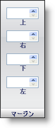

////

|metadata|
{
    "name": "webappstylist-margin-pane",
    "controlName": ["WebAppStylist"],
    "tags": ["Styling","Theming"],
    "guid": "{E3537488-9431-4406-BDC7-7D3992BE2D4E}",  
    "buildFlags": [],
    "createdOn": "0001-01-01T00:00:00Z"
}
|metadata|
////

= マージン ペイン

Margin プロパティは、ロールのマージンがどのように表示するのかを決定します。マージンは、エレメントの外側の端と境界線の間に配置されます。

*Top* --  要素の上部の外側の端と要素の境界線の間の距離をピクセルで表す正の整数を入力します。スピン ボタンを使用して、1 ピクセルずつマージンを増やす/減らします。

*Right* -- Top に似ていますが、右のマージンのみに影響します。

*Bottom* -- Top に似ていますが、下のマージンのみに影響します。

*Left* -- Top に似ていますが、左のマージンのみに影響します。

