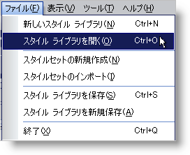
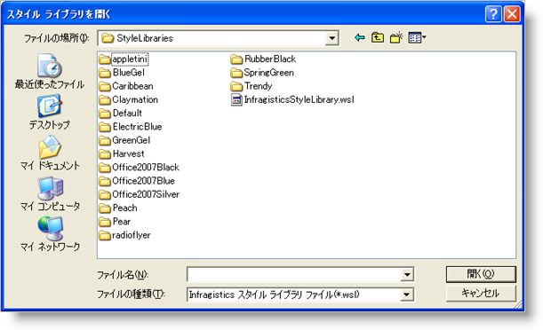

////

|metadata|
{
    "name": "webappstylist-opening-a-saved-style-library",
    "controlName": ["WebAppStylist"],
    "tags": ["Persistence"],
    "guid": "{5EAD7845-A30E-44A6-9723-FBBA1E1FBDAB}",  
    "buildFlags": [],
    "createdOn": "0001-01-01T00:00:00Z"
}
|metadata|
////

= 保存されたスタイル ライブラリを開く

保存されたスタイル ライブラリを開くことができる方法は 3 つあります。[ファイル] メニューから [スタイル ライブラリを開く...] メニューを使用することができます。または最近スタイル ライブラリを使用した場合には、[開始] ページの [最近のファイルを開く] セクションだけでなく、[ファイル] メニューの [最近使用したファイル] セクションに表示されます。

*[ファイル] メニューから保存したスタイル ライブラリを開くには、次の手順に従ってください。*

[start=1]
. [ファイル] メニューで、[スタイル ライブラリを開く...] をクリックします。

[スタイル ライブラリを開く] ダイアログ ボックスが開きます。

[start=2]
. スタイル ライブラリを保存したフォルダを指定します。
[start=3]
. ロードしたいファイルを選択して [開く] をクリックします。スタイル ライブラリが Infragistics AppStylist for ASP.NET にロードされます。