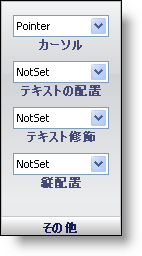

////

|metadata|
{
    "name": "webappstylist-other-pane",
    "controlName": ["WebAppStylist"],
    "tags": ["Styling","Theming"],
    "guid": "{A103C29D-CBA5-4E73-AA6D-B302464D1684}",  
    "buildFlags": [],
    "createdOn": "0001-01-01T00:00:00Z"
}
|metadata|
////

= その他のペイン

Other プロパティはその他のプロパティです。

*Cursor* -- ドロップダウン リストからさまざまなカーソルを選択します。これに含まれるカーソルとしては pointer、progress、text、wait、hand が挙げられます。

*Text-Align* -- 要素のテキストを左、中央、右、両端揃えのいずれかに配置します。

*Text-Decoration* -- このプロパティを Overline、Line-through、および Underline にそれぞれ設定することで、要素のテキストの上部、テキスト上、下部のいずれに線を表示するのかを選択します。

*Vertical-Align* -- 要素の上部または下部にテキストを垂直に配置する、上付き文字または下付き文字としてテキストを表示する、またはその他の配置の技法を使用します。

