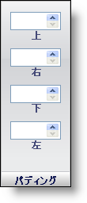

////

|metadata|
{
    "name": "webappstylist-padding-pane",
    "controlName": ["WebAppStylist"],
    "tags": ["Styling","Theming"],
    "guid": "{32906748-D077-4E81-8AD1-B32E4A9E3523}",  
    "buildFlags": [],
    "createdOn": "0001-01-01T00:00:00Z"
}
|metadata|
////

= パディング ペイン

Padding プロパティは、ロールのパディングがどのように表示するのかを決定します。パディングは、要素の境界線と内側の端の間に配置されます。

*Top* --  要素の境界線と要素の上部内側の端の間の距離をピクセルで表す正の整数を入力します。スピン ボタンを使用して、1 ピクセルずつマージンを増やす/減らします。

*Right* -- Top に似ていますが、右のパディングのみに影響します。

*Bottom* -- Top に似ていますが、下のパディングのみに影響します。

*Left* -- Top に似ていますが、左のパディングのみに影響します。

