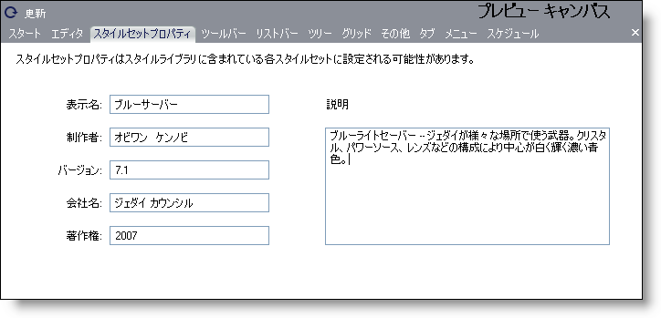

////

|metadata|
{
    "name": "webappstylist-personalizing-your-style-libraries",
    "controlName": ["WebAppStylist"],
    "tags": ["Styling","Theming"],
    "guid": "{51F9FA1F-B004-48A6-9F6B-1CA79A9F0D9F}",  
    "buildFlags": [],
    "createdOn": "0001-01-01T00:00:00Z"
}
|metadata|
////

= スタイル ライブラリのパーソナライズ

プレビュー キャンバス領域の [スタイルセット プロパティ] タブによって、固有の個人情報で固有のスタイル ライブラリにタグを付けることができます。各スタイル ライブラリ内に含まれる各スタイルセットをパーソナライズすることができます。この情報には、名前、著作権年、または希望する場合にはエンド ユーザー ライセンス契約までも含めることができます。

スタイルセットをパーソナライズするには、プレビュー キャンバス領域の [スタイルセット プロパティ] タブをクリックします。

* *表示名* -- このフィールドは、現在のスタイル ライブラリの名前を識別します。
* *制作者* -- このフィールドに名前、およびスタイル ライブラリを作成した人物を特定するその他の名前の両方またはいずれか一方を入力します。
* *バージョン* -- スタイル ライブラリの現在のバージョンを入力します。このフィールドはブランクにしておくことができます。
* *会社*  -- 会社のためにスタイルセットを作成している場合には、会社名をここに入力します。そうでない場合には、このフィールドはブランクにします。
* *著作権* -- このフィールドには、他の著作権を表すテキストとともに、著作権の年または年の期間を入力します。
* *説明* -- スタイルセットの説明、使用する色、またはスタイルセットを使用または修正する人への特別な指示を提供します。