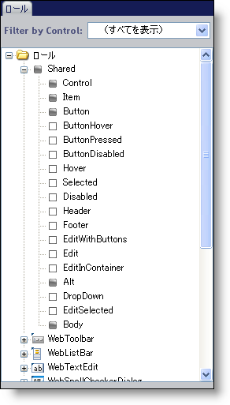
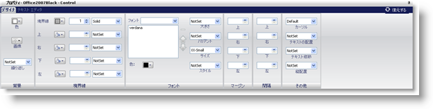

////

|metadata|
{
    "name": "webappstylist-roles",
    "controlName": ["WebAppStylist"],
    "tags": ["Styling","Theming"],
    "guid": "{3694B613-571B-4A94-9A04-DDD1052ABF9A}",  
    "buildFlags": [],
    "createdOn": "0001-01-01T00:00:00Z"
}
|metadata|
////

= ロール

ロール ツリーは、アプリケーション スタイリングが提供するさまざまなタイプのロールをナビゲートするときに役立ちます。これらのロールは、ロールそれぞれに Web アプリケーションの見栄えに影響を及ぼす可能性がある何らかの外観の変更が含まれているため、Web アプリケーションのスタイリングにおいて極めて重要な役割を果たします。

== UI ロールと CSS

UI ロールは、ユーザー インタフェース（Web ページ自体）で果たすロールにちなんで名前が付けられています。UI ロールには、ボタン、ラベル、またはユーザーが Web サイトで見ることができるその他のグラフィカルな要素が含まれる場合があります。実際には、各 UI ロールはカスケード スタイル シート（CSS）ファイルでクラスとして定義されます。そしてひとつのコントロールに対するすべての UI ロールが CSS ファイル全体を構成します。すべての CSS ファイルが一緒になってスタイルセットになります。

== カスケードの効果

CSS ファイルは、要素、クラス、そして ID で構成されます。アプリケーション スタイリングはクラスのみに関係します。各クラスは、Web ページ上の特定の要素がどのように表示され動作するのかを指定します。この要素はテーブル全体、そのテーブルの行、またはその行のセルのいずれかにすることができます。CSS ファイルのクラスは、これらのクラスがファイル内にあるのと同じ順番で Web ページに適用されます。最初のクラスが適用され、それに続いて、2 番目、3 番目というように、最後のクラスまで適用されます。複数のクラスが同じロール上の同じプロパティを修正している場合、適用される最後のクラスが「優先します」。たとえば、WebGrid ノードを展開すると、表示される順番で各ロールが適用されます。これらは CSS ファイルではクラスの単に表現であるからです。

== ロール ツリー

CSS ファイルにおけるカスケードの性質により、UI ロールは継承によってロール ツリーで一意に分類できます。Roles ノードを最初に展開すると、Shared ノードが表示されます。Shared ノード内の任意のロールに対して外観変更を行うと、すべての UI ロールはこれらのスタイルを使用します。これらのスタイルがコントロールに最初に適用されるからです（CSS ファイルのトップに向けて）。ただし、その他の任意のコントロール ノードを展開して任意のロールを修正したら、これらの修正は、Shared に適用されたいかなるスタイルに優先します。修正されたプロパティのみが無効にされます。すべての未修正のプロパティは Shared から継承されます。

UI ロールをクリックすると、スタイル エクスプローラの下にあるプロパティ パネルには、タブの付いたインタフェースが表示し、グラフィカルなデザイナまたはエディタを使用してプロパティを修正するためのオプションを提供します。

