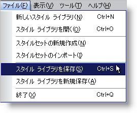
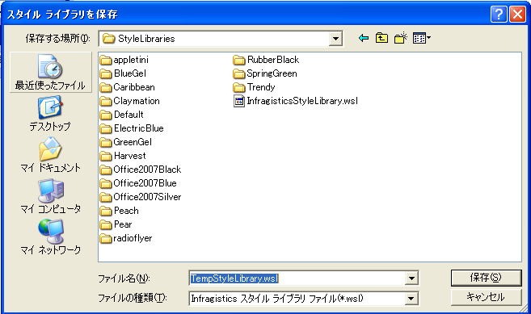
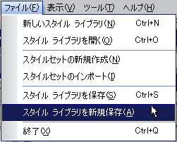

////

|metadata|
{
    "name": "webappstylist-saving-your-work",
    "controlName": ["WebAppStylist"],
    "tags": ["Persistence"],
    "guid": "{ABF90932-D9D9-4828-BE88-A2AB7D23C4EA}",  
    "buildFlags": [],
    "createdOn": "0001-01-01T00:00:00Z"
}
|metadata|
////

= 作業の保存

開発者に作業を渡す前のスタイリング プロセスの最終手順は、スタイル ライブラリを Web Style Library（.wsl) として保存することです。このファイルには十分にフォーマットした XML ドキュメントのすべてのスタイルセット情報が含まれています。

*新しいスタイル ライブラリを保存するには、次の手順に従ってください。*

[start=1]
. [ファイル] メニューで、[スタイル ライブラリを保存...] をクリックします。

[新規保存] ダイアログ ボックスが開きます。

[start=2]
. スタイル ライブラリに名前を指定して、保存するフォルダを選択します。
[start=3]
. [保存] をクリックします。

*既存のスタイル ライブラリを保存するには、次の手順に従ってください。*

[start=1]
. [ファイル] メニューで、[スタイル ライブラリを保存...] をクリックします。Infragistics AppStylist for ASP.NET がスタイル ライブラリを保存します。保存されたスタイル ライブラリでの作業を続行する、または link:webappstylist-opening-a-saved-style-library.html[保存されたスタイル ライブラリを開く]ことによって、異なるスタイル ライブラリで作業をすることができます。
[start=2]
. 保存していない変更を別のスタイル ライブラリとして保存したい場合は、[ファイル] メニューで、[スタイル ライブラリを新規保存...] をクリックします。

[新規保存] ダイアログ ボックスが開いて、スタイル ライブラリを別名で保存することができます。