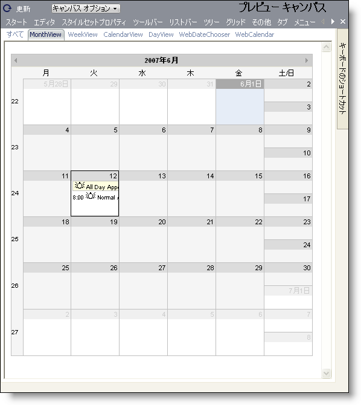

////

|metadata|
{
    "name": "webappstylist-schedule",
    "controlName": ["WebAppStylist"],
    "tags": ["Scheduling","Styling","Theming"],
    "guid": "{B9C69036-E78C-481D-8441-996197803D64}",  
    "buildFlags": [],
    "createdOn": "0001-01-01T00:00:00Z"
}
|metadata|
////

= スケジュール

Schedule キャンバスに WebSchedule コンポーネントを伴うすべてのスタイリング修正を表示します。このキャンバスには、ユーザー固有の Web アプリケーションで遭遇する可能性がある、複数の一般的な構成で WebSchedule コンポーネントが表示されます。WebSchedule キャンバスで以下のコントロール/コンポーネントを見つけることができます。

* WebMonthView
* WebCalendarView
* WebDayView
* WebDateChooser
* WebCalendar

