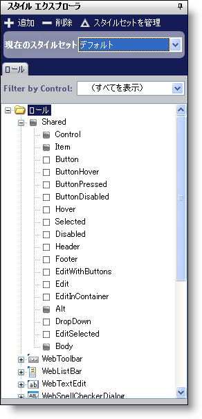

////

|metadata|
{
    "name": "webappstylist-style-explorer",
    "controlName": ["WebAppStylist"],
    "tags": ["Styling","Theming"],
    "guid": "{7366683B-B388-4C86-99FD-2F6DEEFC196A}",  
    "buildFlags": [],
    "createdOn": "0001-01-01T00:00:00Z"
}
|metadata|
////

= スタイル エクスプローラ

スタイル エクスプローラはその名前が意味するとおりの機能でユーザーを支援します。すなわち共有およびコントロール固有のスタイルを探索します。スタイル エクスプローラによって、すべてのスタイルを追加、削除および管理することができ、ほとんどのこれらの操作で必要なのはマウスをワンクリックするだけです。

[新規追加] ボタンをクリックして、スタイルセット マネージャを開きます（スタイルセット マネージャの詳細は link:webappstylist-creating-a-styleset.html[「スタイルセットの作成」]を参照してください）。スタイルセット マネージャは、新しいスタイルセットをすでに作成した状態で開きます。[削除] ボタンをクリックして、現在のスタイル ライブラリから選択したスタイルセットを即座に削除します。[スタイルセットを管理] をクリックすると、再度 link:webappstylist-styleset-manager-dialog-box.html[スタイルセット マネージャ]を開きますが、今回は新しいスタイルセットは作成されません。

スタイル エクスプローラで、[ロール] タブを使用して共有ロールとコントロール固有のロールをナビゲートすることも可能です。

link:webappstylist-roles.html[[ロール]] タブの下で、メインの Roles ノードを持つツリーを見つけることができます。コントロールでツリーをフィルタリングして、ひとつのコントロールに基づいてロールのみを表示することができます。ツリーの最初の子ノードは Shared で、残りのノードは各スタイル可能なコントロール固有です。Shared ノードのロールはすべてのコントロールに適用されます。ただし、コントロールの特定のノードでコントロール固有のロールを設定することによって、これらのスタイルを無効にすることができます。これらのロールはそれぞれ、ロール名の左側にそのロールに関連付けられた画像を持っています。この画像は、そのロールがスタイルされたかどうかを示します。画像が黒の四角の場合、ロールはスタイルされており、スタイル シートに関連付けられたクラスを持っています。画像が空の四角の場合、タイル シートに関連付けられたクラスはありません。

コントロールがスタイルセットで使用可能かどうかによって、コントロール固有のノードがぼかし表示になります。ノードがぼかし表示の場合、そのコントロールに関連付けられた CSS ファイルが現在ないことを意味しており、スタイルセットが Web サイトに適用されたときにスタイルされません。スタイルセットにコントロール固有のスタイルを含むことの詳細は、 link:webappstylist-styleset-manager-dialog-box.html[「スタイルセット マネージャ ダイアログ ボックス」]を参照してください。

