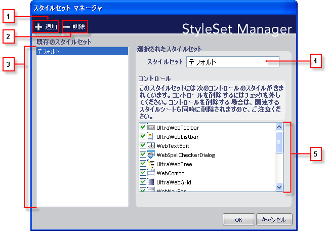

////

|metadata|
{
    "name": "webappstylist-styleset-manager-dialog-box",
    "controlName": ["WebAppStylist"],
    "tags": [],
    "guid": "{07B559D5-A095-4A2E-A9C2-5422AA0CF525}",  
    "buildFlags": [],
    "createdOn": "0001-01-01T00:00:00Z"
}
|metadata|
////

= スタイルセット マネージャ ダイアログ ボックス

スタイルセット マネージャを使用して、便利な 1 個所からすべてのスタイルセットを管理します。スタイルセット マネージャは、現在のスタイル ライブラリにスタイルセットを追加および削除するだけでなく、その他の複数のタスクを実行することができます。以下は、[スタイルセット マネージャ] ダイアログ ボックスのスクリーンショットで、各オプションの説明を表示しています。

[start=1]
. *新規追加* – このボタンをクリックして、新しいスタイルセットを作成し現在のスタイル ライブラリに追加します。ボタンをクリックすると、新しいスタイルセットが作成され「新しいスタイルセット #」 という名前が指定されます（[新規作成] ボタンを使用してスタイルセットを作成するたびに「#」は自動的に増えます）。
[start=2]
. *削除* – [削除] をクリックして、スタイル ライブラリから選択したスタイルセットを永久に削除します。[スタイルセットを削除] ダイアログ ボックスには、選択したスタイルセットを削除したいかどうかを尋ねるメッセージが表示されます。[はい] をクリックしてスタイルセットを削除します。[いいえ] をクリックしてスタイルセットを保持します。
[start=3]
. *既存のスタイルセット* – 現在のスタイル ライブラリに存在するすべてのスタイルセットがこのリストに表示されます。
[start=4]
. *スタイルセット名* – このテキスト ボックスには、選択したスタイルセット名が表示されます。このテキスト ボックスを使用して、スタイルセット名を編集します。
[start=5]
. *コントロール* – ひとつまたは複数のコンポーネントに適用されるスタイルセットを作成できます。デフォルトで、すべてのコントロールは新しいスタイルセットに含まれます。コントロールの選択を解除すると、そのコントロール、関連付けられた CSS ファイルがスタイル ライブラリから削除されます。既存のスタイルセットからコントロールの選択を解除するときに気を付けてください。これらの関連付けられた CSS ファイルは永久に削除されます。