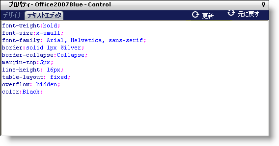

////

|metadata|
{
    "name": "webappstylist-text-editor",
    "controlName": ["WebAppStylist"],
    "tags": [],
    "guid": "{4BA91221-E721-49B6-8B23-E63B714C1322}",  
    "buildFlags": [],
    "createdOn": "0001-01-01T00:00:00Z"
}
|metadata|
////

= テキスト エディター

CSS を熟知している Web デザイナはテキスト エディターのほうが快適かもしれません。テキスト エディターは AutoComplete 機能を持った強力な CSS エディターです。このエディターは、どのプロパティを入力しているのかを認識して可能な設定を提供します。必要なのはポップアップ リストから設定を選択するだけです。[更新] をクリックするか、キーボードで F5 を押すと、現在のキャンバスが更新されます。

テキスト エディターは、任意の CSS プロパティを入力できるためデザイナより強力です。テキスト エディターは、CSS ファイルにこれらのプロパティを記述し、Web ブラウザー自体がそれを認識します。デザイナは認識しない任意のプロパティを無視します。

