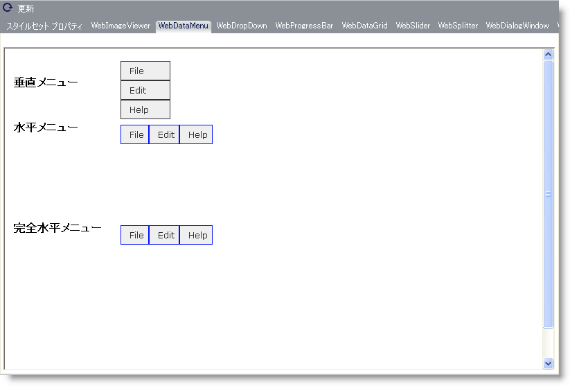

////

|metadata|
{
    "name": "webappstylist-webdatamenu",
    "controlName": ["WebAppStylist"],
    "tags": ["Navigation","Styling","Theming"],
    "guid": "{CC8AA933-C2DB-4B6C-97E9-815F44D174A8}",  
    "buildFlags": [],
    "createdOn": "0001-01-01T00:00:00Z"
}
|metadata|
////

= WebDataMenu

WebDataMenu キャンバスに WebDataMenu コントロールを伴うすべてのスタイリング修正を表示します。WebDataMenu キャンバスで以下のコントロールを見つけることができます。

* WebDataMenu

