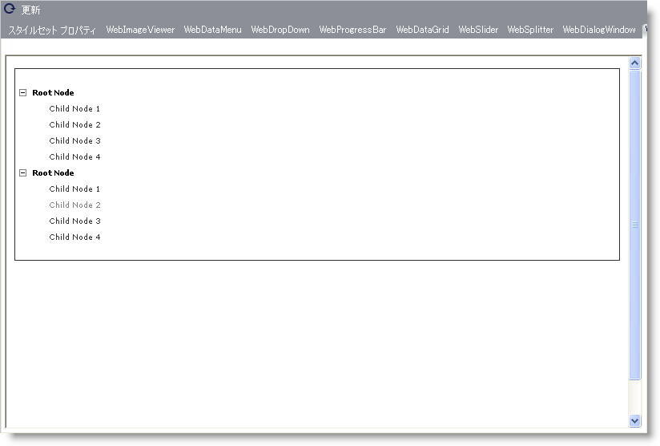

////

|metadata|
{
    "name": "webappstylist-webdatatree",
    "controlName": ["WebAppStylist"],
    "tags": ["Styling","Theming"],
    "guid": "{94AB56EB-3E65-4647-BB8C-DADC5EDDC282}",  
    "buildFlags": [],
    "createdOn": "0001-01-01T00:00:00Z"
}
|metadata|
////

= WebDataTree

WebDataTree キャンバスに WebDataTree コントロールを伴うすべてのスタイリング修正を表示します。WebDataTree キャンバスで以下のコントロールを見つけることができます。

* WebDataTree

