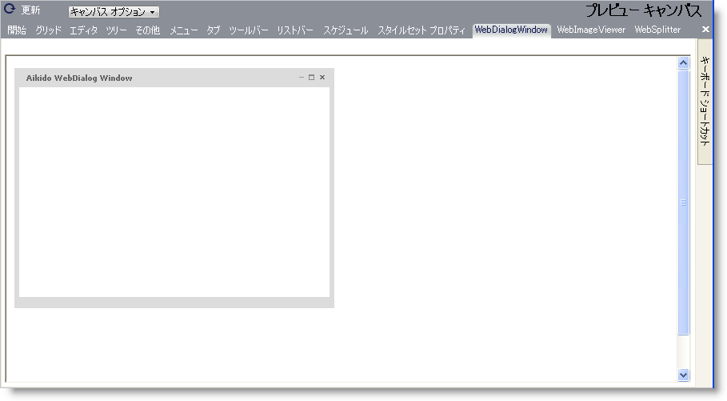

////

|metadata|
{
    "name": "webappstylist-webdialogwindow",
    "controlName": ["WebAppStylist"],
    "tags": ["Styling","Theming"],
    "guid": "{C725EF6A-87AB-4921-8312-F546E46627F0}",  
    "buildFlags": [],
    "createdOn": "0001-01-01T00:00:00Z"
}
|metadata|
////

= WebDialogWindow

WebDialogWindow キャンバスに WebDialogWindow コントロールを伴うすべてのスタイリング修正を表示します。キャンバスはデフォルト スタイルで WebDialogWindow コントロールを表示します。WebDialogWindow キャンバスで以下のコントロールを見つけることができます。

* WebDialogWindow

