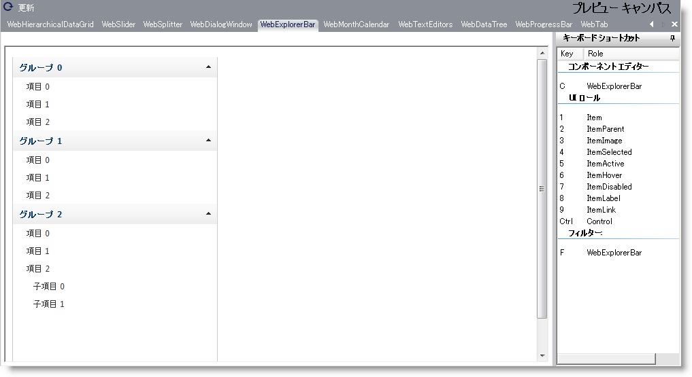

////

|metadata|
{
    "name": "webappstylist-webexplorerbar",
    "controlName": [],
    "tags": ["Styling","Theming"],
    "guid": "{24AD8FD9-A7F1-448B-8295-19BCA4D9EA2C}",  
    "buildFlags": [],
    "createdOn": "2010-04-03T14:44:09Z"
}
|metadata|
////

= WebExplorerBar

WebExplorerBar キャンバスに WebExplorerBar コントロールを伴うすべてのスタイリング修正を表示します。WebExplorerBar キャンバスで以下のコントロールを見つけることができます。

* WebExplorerBar

