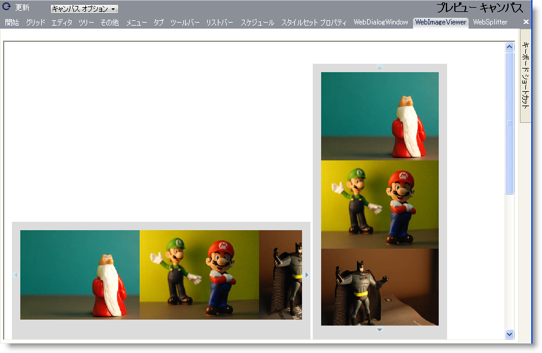

////

|metadata|
{
    "name": "webappstylist-webimageviewer",
    "controlName": ["WebAppStylist"],
    "tags": ["Styling","Theming"],
    "guid": "{D8FEB433-3280-4D61-BDAD-FAD8D9E16EFA}",  
    "buildFlags": [],
    "createdOn": "0001-01-01T00:00:00Z"
}
|metadata|
////

= WebImageViewer

WebImageViewer キャンバスに WebImageViewer コントロールを伴うすべてのスタイリング修正を表示します。キャンバスは水平および垂直方向で WebImageViewer コントロールを表示します。WebImageViewer キャンバスで以下のコントロールを見つけることができます。

* WebImageViewer

