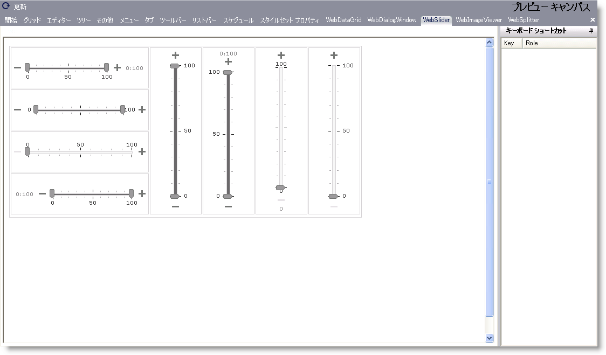

////

|metadata|
{
    "name": "webappstylist-webslider",
    "controlName": ["WebAppStylist"],
    "tags": ["Editing","Styling","Theming"],
    "guid": "{EF3DBD9A-6A2B-41FD-8E3D-A90693A7FC2F}",  
    "buildFlags": [],
    "createdOn": "0001-01-01T00:00:00Z"
}
|metadata|
////

= WebSlider

WebSlider キャンバスに WebSlider コントロールを伴うすべてのスタイリング修正を表示します。キャンバスはデフォルト スタイルで WebSlider コントロールを表示します。WebSlider キャンバスで以下のコントロールを見つけることができます。

* WebSlider

