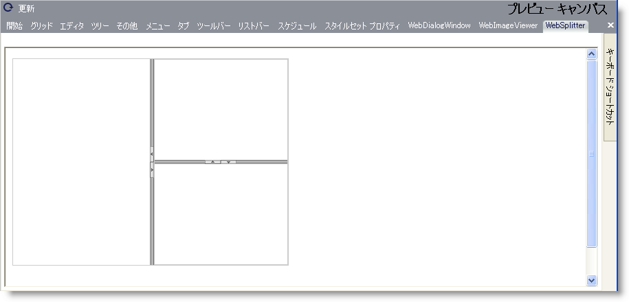

////

|metadata|
{
    "name": "webappstylist-websplitter",
    "controlName": ["WebAppStylist"],
    "tags": ["Styling","Theming"],
    "guid": "{A5D1FA5B-CEF8-40D6-9AD8-C15FE24B9E2C}",  
    "buildFlags": [],
    "createdOn": "0001-01-01T00:00:00Z"
}
|metadata|
////

= WebSplitter

WebSplitter キャンバスに WebSplitter コントロールを伴うすべてのスタイリング修正を表示します。キャンバスは別の WebSplitter コントロール内でネストされている WebSplitter コントロールを表示します。WebSplitter キャンバスで以下のコントロールを見つけることができます。

* WebSplitter

