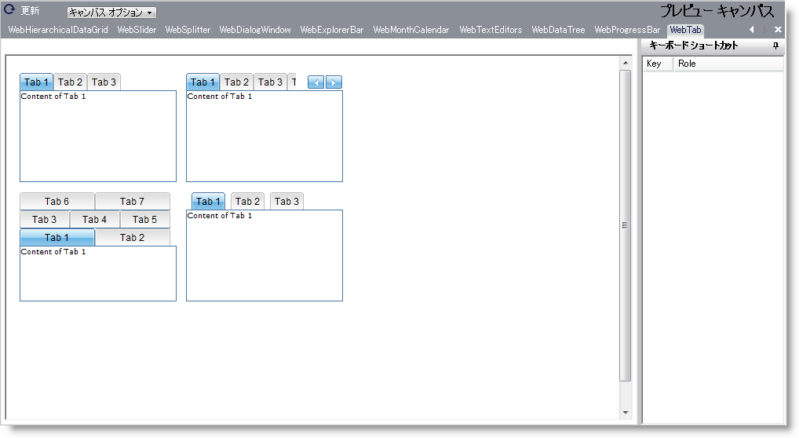

////

|metadata|
{
    "name": "webappstylist-webtab",
    "controlName": [],
    "tags": ["Styling","Theming"],
    "guid": "{A5A9EA21-3D28-4825-B9D7-147431EC471C}",  
    "buildFlags": [],
    "createdOn": "2010-04-03T14:45:50Z"
}
|metadata|
////

= WebTab

WebTab キャンバスに WebTab コントロールを伴うすべてのスタイリング修正を表示します。WebTab キャンバスで以下のコントロールを見つけることができます。

* WebTab

