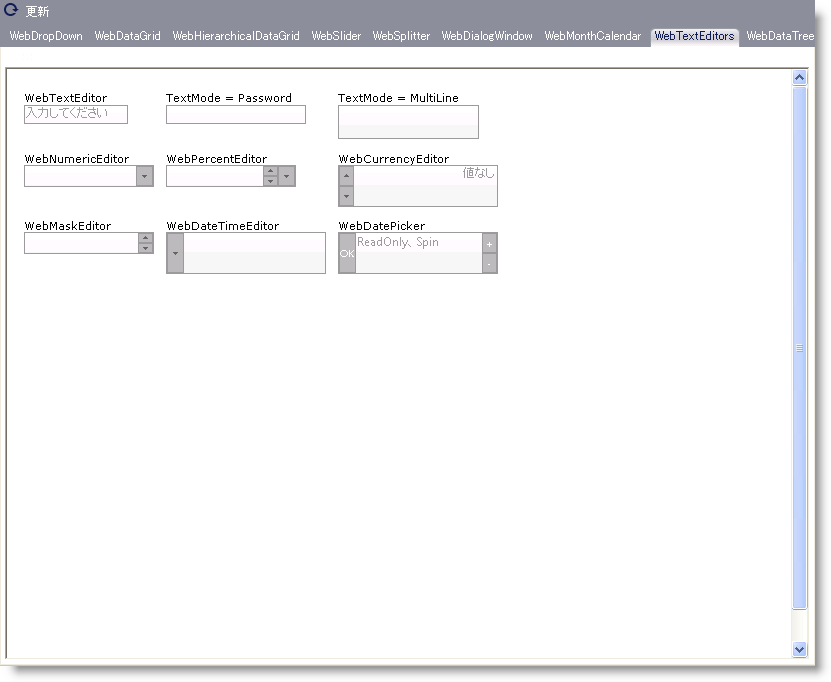

////

|metadata|
{
    "name": "webappstylist-webtexteditors",
    "controlName": ["WebAppStylist"],
    "tags": ["Editing","Styling","Theming"],
    "guid": "{425DB28C-7841-4F7D-9C64-17A9C67CDE22}",  
    "buildFlags": [],
    "createdOn": "0001-01-01T00:00:00Z"
}
|metadata|
////

= WebTextEditors

WebTextEditors キャンバスに WebTextEditors コントロールを伴うすべてのスタイリング修正を表示します。WebTextEditors キャンバスで以下のコントロールを見つけることができます。

* WebTextEditors

