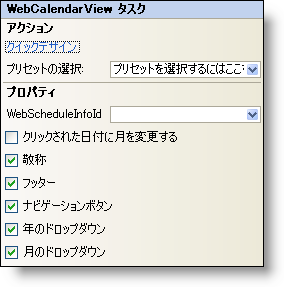

////
|metadata|
{
    "name": "webcalendarview-smart-tag",
    "controlName": ["WebSchedule"],
    "tags": ["Design Environment","Scheduling"],
    "guid": "{5011A638-0712-43DB-B71D-81D9C1436362}",
    "buildFlags": [],
    "createdOn": "2005-04-11T00:00:00Z"
}
|metadata|
////

= WebCalendarView スマート タグ

Visual Studio 2005（.NET Framework 2.0）では、{ProductName}の個々のコントロール／コンポーネントにはスマートタグがあります。コントロールやコンポーネントを選択するだけで、スマート タグのアンカーが表示されます。このアンカーをクリックするとポップアップ パネルが表示され、そこからコントロール/コンポーネントの最もよく使うプロパティや設定にすばやく簡単にアクセスできます。

WebCalendarView™ のスマートタグには次のセクションが含まれています。

* アクション -- よく使うタスク（クイック デザイナーへのアクセス、プリセットのロードなど）を実行できます。
* [プロパティ] -- よく使うプロパティ (Titleなど) への容易なアクセスを提供します。

各セクションの項目（フィールド、ドロップダウン リスト、チェックボックスなど）の説明と、各項目が対応するプロパティ グリッドのプロパティについては、以下の表を参照してください。

[options="header", cols="a,a"] 

|==== 

|アクション|説明

|クイック デザイン
|［クイック デザイン］をクリックすると、クイック デザイナーが表示されます。これは、コントロールを右クリックしてコンテキスト メニューから ［クイック デザイン］ を選択するのと同じです。

|プリセットの選択
|「ここをクリック」リンクをクリックして、UltraWebTab のプリセットを素早く選択します。これは、クイック デザイナーを開いて ［プリセット］ を展開してから ［プリセットの管理］ をクリックするのと同じです。

|====

[options="header", cols="a,a,a"]
|====
|プロパティ|説明|対応するプロパティ

|WebScheduleInfoID
|WebScheduleの各ビューは、WebScheduleInfoが適切に機能する必要があります。WebフォームにすでにWebScheduleInfoがある場合、WebScheduleInfoIDドロップダウンに表示されます。
| link:{ApiPlatform}webui.webschedule{ApiVersion}~infragistics.webui.webschedule.webscheduleviewbase~webscheduleinfo.html[WebScheduleInfoID]

|クリックされた日付に月を変更する
|次の月/前の月の日付が選択されると、表示月を自動的に変更します。
| link:{ApiPlatform}webui.webschedule{ApiVersion}~infragistics.webui.webschedule.webcalendarview~changemonthtodateclicked.html[ChangeMonthToDateClicked]

|タイトル
|タイトルの表示/非表示を切り替えます。
| link:{ApiPlatform}webui.webschedule{ApiVersion}~infragistics.webui.webschedule.webscheduleviewbase~captionheadervisible.html[CaptionHeaderVisible]

|フッター
|フッターの表示/非表示を切り替えます。
| link:{ApiPlatform}webui.webschedule{ApiVersion}~infragistics.webui.webschedule.webcalendarview~footervisible.html[FooterVisible]

|ナビゲーションボタン
|カレンダー上部にある月のナビゲーションボタンの表示/非表示を切り替えます。
| link:{ApiPlatform}webui.webschedule{ApiVersion}~infragistics.webui.webschedule.webscheduleviewbase~navigationbuttonsvisible.html[NavigationButtonsVisible]

|年のドロップダウン
|年のドロップダウンの表示/非表示を切り替えます。
| link:{ApiPlatform}webui.webschedule{ApiVersion}~infragistics.webui.webschedule.webcalendarview~yeardropdownvisible.html[YearDropDownVisible]

|月のドロップダウン
|月のドロップダウンの表示/非表示を切り替えます。
| link:{ApiPlatform}webui.webschedule{ApiVersion}~infragistics.webui.webschedule.webcalendarview~monthdropdownvisible.html[MonthDropDownVisible]

|====