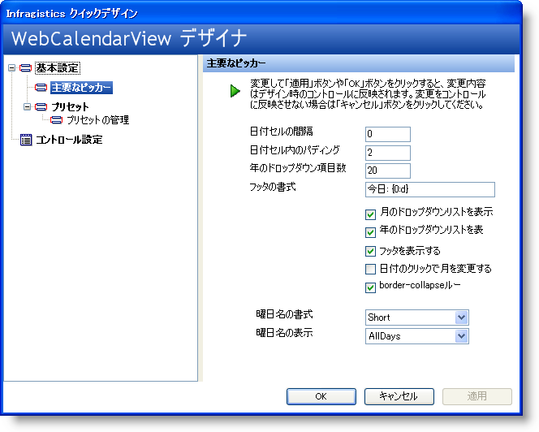
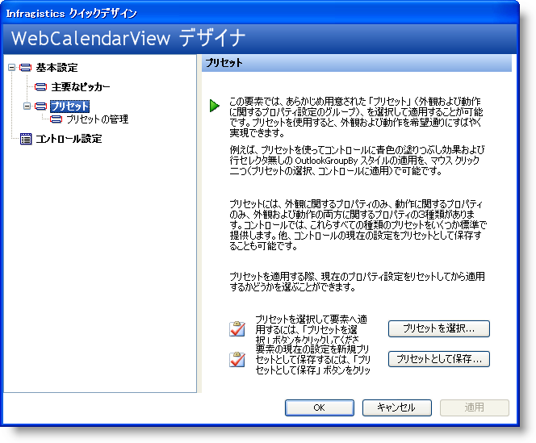
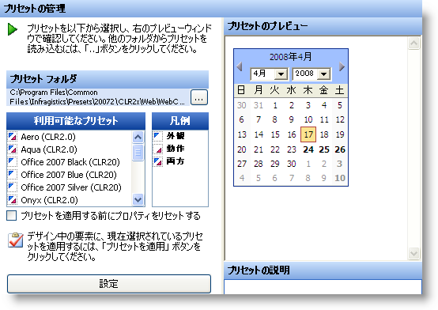
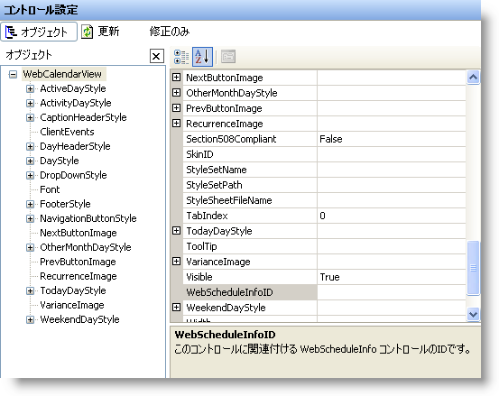
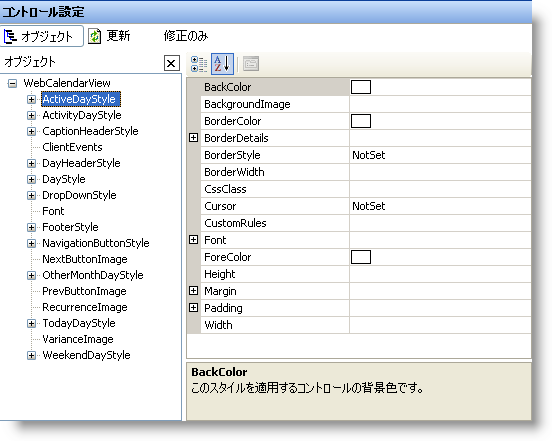

////

|metadata|
{
    "name": "webcalendarview-using-webcalendarviews-designer",
    "controlName": ["WebCalendarView"],
    "tags": ["Getting Started"],
    "guid": "{DF861567-90FC-49AD-AC19-B4AAA332DA67}",  
    "buildFlags": [],
    "createdOn": "0001-01-01T00:00:00Z"
}
|metadata|
////

= WebCalendarView のデザイナの使用

== 始める前に

WebSchedule コントロールはユーザー フレンドリなクイック デザイナが添付されており、コントロールの外観と機能を簡単に設定できます。各コントロールには、機能ピッカー、プリセット、プリセットの管理、コントロール設定などのオプションと同様のレイアウトオプションがあります。これらのオプションは、コントロールに対応する機能がない場合に限り使用できません。

このトピックでは、WebCalendarView のクイック デザイナを使用する方法を説明します。これには、デザイナを使用してコントロールにプリセットを適用する方法や、[機能ピッカー] を使用して標準的な機能を設定する方法が含まれます。

== 次の手順を実行します。

[start=1]
. *新しい ASP.NET プロジェクトを作成します。*

[start=2]
. *コントロールをフォームに追加します。*

デザイナ ビューで Web フォームを開いて、ツールボックスから WebCalendarView コントロールをフォームにドラッグします。
[start=3]
. *WebCalendarView のデザイナを開きます。*

このコントロールを右クリックして、クイック デザインを選択します。これで WebCalendarView のデザイナが起動します。

*注：* 以下のスクリーンショットは実際のサイズよりも小さいですが、ウィンドウを水平方向にスクロールせずにスクリーンショットをトピックに表示できるように切り取ることができます。

[start=4]
. *[機能の選択] がロードされます。*

WebCalendarView デザイナは [機能の選択] が選択された状態でロードされます。[機能ピッカー] は、コントロールをリストしているプロパティ全体をスクロールすることなく、都合のいいところでコントロールの標準的な機能プロパティのいくつかを素早く簡単に設定することができるように設計されています。設定できる多数の機能としては、 pick:[asp-net="link:{ApiPlatform}webui.webschedule{ApiVersion}~infragistics.webui.webschedule.webcalendarview~cellspacing.html[CellSpacing]"] 、 pick:[asp-net="link:{ApiPlatform}webui.webschedule{ApiVersion}~infragistics.webui.webschedule.webcalendarview~dropdownyearsnumber.html[DropDownYearNumber]"] 、 pick:[asp-net="link:{ApiPlatform}webui.webschedule{ApiVersion}~infragistics.webui.webschedule.webcalendarview~daynameformat.html[DayNameFormat]"] 、 pick:[asp-net="link:{ApiPlatform}webui.webschedule{ApiVersion}~infragistics.webui.webschedule.webcalendarview~changemonthtodateclicked.html[ChangeMonthToDateClicked]"] 、および  pick:[asp-net="link:{ApiPlatform}webui.webschedule{ApiVersion}~infragistics.webui.webschedule.webcalendarview~monthdropdownvisible.html[MonthDropDownVisible]"]  が挙げられます。
[start=5]
. *リセット ノードを選択します。* 対象となる次のノードは [プリセット] ノードです。このノードを選択すると、以下を表示するようにデザイナを変更します。

[start=6]
. *既存のプリセットを選択するか、固有のプリセットを選択します。*

[プリセット] ページには、{ProductName} の既存のプリセットのいずれか、またはユーザー自身でコントロールをスタイルした場合にはユーザー固有のプリセットを選択するオプションが提供されています。

[プリセットを選択] ボタンをクリックすると、[プリセットの管理] ノードに移動します。この代わりに、[プリセット] ノードを展開して [プリセットの管理] ノードを選択することができます。
[start=7]
. *プリセットを管理します。*

[プリセットの管理] 領域では、{ProductName} の事前に定義されたプリセットのいずれかを選択することができます。[利用可能なプリセット] ボックスからプリセットをひとつ選択することによって、[プリセットのプレビュー] は選択したプリセットを適用して WebCalendarView を表示するように変更します。

Onyx プリセットを選択して、[プリセットの管理] がどのように変わるのかを確認します。

[start=8]
. *プリセットを適用するかどうかを選択します。*

このプリセットを使用したい場合には、[プリセットを適用] ボタンをクリックします。プリセットを適用すると、ダイアログ ボックスが開いて、外観と動作に関連したすべてのプリセットプロパティを、プリセットを適用する前のデフォルトにリセットするかどうかを尋ねます。保持したくないスタイリングの変更を行った場合にこれは役に立ちます。[はい] または [いいえ] をクリックした後、WebCalendarView デザイナを閉じる前にダイアログボックスの左下隅にある [適用] ボタンを必ずクリックしてください。

*注：* コントロールでその他の設定を定義する前にプリセットを適用することが役に立つことが分かります。

[start=9]
. *[コントロール設定] 領域を確認します。* Visual Studio .NET の [プロパティ] ダイアログ ボックスに表示されるとおりに、[コントロール設定] 領域が WebCalendarView のプロパティ ダイアログ ボックスの右側の領域に表示されます。

[start=10]
. *主要なスタイリングオブジェクトのいくつかで作業をします。*

[コントロール設定] 領域が Visual Studio .NET の [プロパティ] ダイアログ ボックスの上にある利点のひとつは、この領域の中央で、使用したい主要なスタイリング オブジェクトのいくつかを取得する場合に便利なことです。 pick:[asp-net="link:{ApiPlatform}webui.webschedule{ApiVersion}~infragistics.webui.webschedule.webcalendarview~activedaystyle.html[ActiveDayStyle]"]  を選択すると、ウィンドウの右手にある [プロパティ] 領域が特定のスタイルのプロパティを表示するように変わります。

[start=11]
. *変更を適用します。*

WebCalendarView デザイナの任意の領域で変更を行う場合には、コントロールに実際に変更が適用されるように、デザイナを閉じる前に左下隅にある [適用] ボタンを必ずクリックしてください。この作業を実行しない場合には、ダイアログボックスが表示して、デザイナを終了する前に変更を保存するかどうかを尋ねます。使用可能なさまざまなプロパティのいくつかを使用して単にブラウザする場合は、[いいえ] をクリックしてください。

== 復習

この詳細なガイドは、WebCalendarView のクイック デザイナとこのデザイナが提供する利点に対する理解が深まることを目的としています。

== 関連トピック

pick:[asp-net="link:{ApiPlatform}webui.webschedule{ApiVersion}~infragistics.webui.webschedule_namespace.html[WebSchedule 名前空間]"]

pick:[asp-net="link:{ApiPlatform}webui.webschedule{ApiVersion}~infragistics.webui.webschedule.webcalendarview.html[WebCalendarView クラス]"]

pick:[asp-net="link:{ApiPlatform}webui.webschedule{ApiVersion}~infragistics.webui.webschedule.appointment.html[Appointments クラス]"]